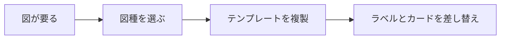
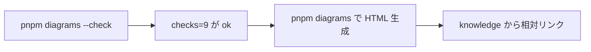
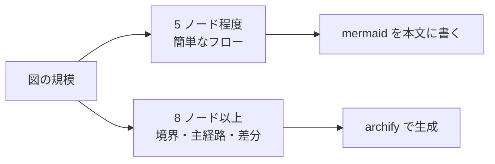

# 構成図生成 (archify) の要件

内部の挙動と実装判断は [10_spec/archify-diagrams.md](../10_spec/archify-diagrams.md) にある。ここには外から観測できることだけを書く。

## 背景

knowledge の図が大きくなると mermaid では読めなくなる。ノードが 8 個を超えたあたりから線が交差し、境界を描けず、どれが主経路か分からない。
かといって作図ツールで手描きすると、図と本文がずれても誰も気づかない。図も本文と同じく検証できる必要がある。

## 外部要求 (EARS)

| ID | 型 | 要求 |
|---|---|---|
| REQ-DIA-01 | ユビキタス | 図生成は、図の正を型付き JSON として受け取り、HTML を出力すること |
| REQ-DIA-02 | ユビキタス | 図生成は、利用者に対して `pnpm diagrams` という単一の入口を提供すること |
| REQ-DIA-03 | イベント駆動 | 図の生成を要求されたとき、図生成は、出力の前にその図を検証すること |
| REQ-DIA-04 | 望ましくない挙動 | もし検証に 1 件でも error があるならば、図生成は、HTML を出力せず、診断内容を示して終了コード 1 で終わること |
| REQ-DIA-05 | イベント駆動 | 検証に通ったとき、図生成は、入力と同じ場所に HTML を出力し、通過したチェック数を利用者に伝えること |
| REQ-DIA-06 | 望ましくない挙動 | もし図生成に必要な環境が整っていないならば、図生成は、対処方法を示し、何も出力せずに終了コード 1 で終わること |
| REQ-DIA-07 | ユビキタス | 図生成は、外部への更新チェック通信を行わないこと |
| REQ-DIA-08 | オプション | 検証だけを行う場合、図生成は、`--check` により HTML を書かずに判定のみ返すこと |
| REQ-DIA-09 | オプション | 対象を絞る場合、図生成は、引数で指定した JSON だけを扱うこと |
| REQ-DIA-10 | ユビキタス | 完成した図は、JSON と HTML が `knowledge/diagrams/` に並び、knowledge の本文から相対パスでリンクされていること |

## ハッピーパス

図種を決めて JSON を用意するまで。

検証して成果物にするまで。

mermaid と archify の使い分け。

## 適用範囲外

archify 自身がスコープ外と明記しているもの。ここに当てない。

- Mermaid の自動パース、汎用オートレイアウト、ホスティング共有、WYSIWYG 編集
- 稼働中インフラの検査。書かれていないことは描かない (fail closed)
- 見た目の良し悪しの判定。検証は決定的な検査だけで、読みやすさは人が見る
- locale は en と zh-CN のみ。ラベルは入力した文言がそのまま出るので日本語は書ける

## 受け入れ条件

- `pnpm diagrams --check <file>` が `ok: ... checks=9` を返す
- 生成 HTML をブラウザで開き、ラベルの重なりと主経路が目で追える
- JSON は `knowledge/diagrams/<slug>.<kind>.json`、HTML は同じ場所に置き、knowledge の本文から相対パスでリンクした
