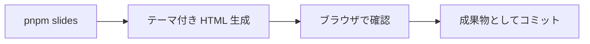

# スライド生成 (Marp) の要件

内部の挙動と実装判断は [10_spec/marp-slides.md](../10_spec/marp-slides.md) にある。ここには外から観測できることだけを書く。

## 背景

knowledge は読み物として書いてある。人に説明するときは同じ内容を別の形にしたいが、スライドを別ツールで作ると本文と二重管理になって必ずずれる。
正は markdown 1 本のままにして、そこから配布形式を生成したい。

## 外部要求 (EARS)

| ID | 型 | 要求 |
|---|---|---|
| REQ-SLD-01 | ユビキタス | スライド生成は、`slides/*.md` の markdown を入力とし、HTML を出力すること |
| REQ-SLD-02 | ユビキタス | スライド生成は、利用者に対して `pnpm slides` という単一の入口を提供すること |
| REQ-SLD-03 | イベント駆動 | 変換を要求されたとき、スライド生成は、リポジトリ共通のテーマを適用した、単体で開ける HTML を出力すること |
| REQ-SLD-04 | イベント駆動 | HTML を出力したとき、スライド生成は、その HTML から元の markdown を辿れるようにすること |
| REQ-SLD-05 | ユビキタス | スライドは、元にした knowledge かドキュメントを `derived_from` で辿れること |
| REQ-SLD-06 | ユビキタス | スライド生成は、独自 frontmatter と Marp のディレクティブが同居した markdown を受け付けること |
| REQ-SLD-07 | 望ましくない挙動 | もし変換に必要な環境が整っていないならば、スライド生成は、対処方法を示し、何も出力せずに終了コード 1 で終わること |
| REQ-SLD-08 | 望ましくない挙動 | もし一部の変換に失敗したならば、スライド生成は、失敗したファイルを示したうえで残りを処理し、終了コード 1 で終わること |
| REQ-SLD-09 | オプション | 対象を絞る場合、スライド生成は、引数で指定した markdown だけを変換すること |

## ハッピーパス

markdown を用意するまで。

HTML にして配るまで。

## 適用範囲外

- 編集可能な PPTX は作れない。`--pptx` は各スライドを画像にする。代替は [marpx のメモ](../../../inbox/marpx-editable-pptx-from-marp.md)
- 図は表か箇条書きにする。mermaid のコードブロックは描画されない
- HTML 出力だけならブラウザ不要。PDF / PPTX / 画像出力は Chromium が要る

## 受け入れ条件

- `pnpm slides` が終了コード 0 で HTML を生成する
- ブラウザで開いてページ番号が右下に出る (`paginate` が効いている)
- テーマが当たっている
- 生成 HTML は成果物としてコミットする
