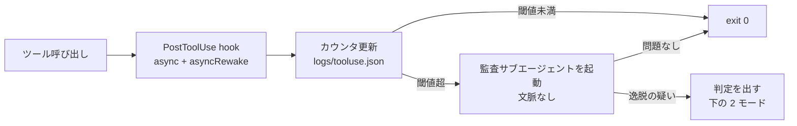

# ツール使用回数を閾値にして、文脈を持たない監査サブエージェントを背景で走らせる

## 思いつき

セッションが長くなるほど、エージェントは最初の依頼から静かにずれる。ずれたことに気づけないのは、
逸脱を正当化した理屈がそのままコンテキストに残っていて、自己点検の材料が汚染されているから。
点検役はそのコンテキストを持たないほうがよい。

そこで、ツール使用回数などを外部ファイルに記録しておき、閾値を超えたら**セッションの文脈を一切持たない**
サブエージェントを背景で起こす。渡すのは次の 3 つだけにする。

- 最初のユーザー依頼 (transcript の先頭のユーザーメッセージ)
- リポジトリのルール (CLAUDE.md、.claude/rules/)
- 直近 N 件のツール呼び出しの要約 (どのファイルを触ったか、どのコマンドを打ったか)

「これは元の依頼に沿っているか」「ルールに違反していないか」だけを判定させ、怪しければ
止めるかユーザーに確認するよう強く勧告する。判断の理屈は渡さない。結論と行動だけ渡す。

## 実装の当て

hooks リファレンス (2026-09 時点) を見る限り、次の構成なら組める。

- **カウンタ**: `PostToolUse` か `PostToolBatch` の `command` hook。stdin の JSON から `session_id` を取り、
  セッションごとのカウンタファイルを更新する。ここはローカル完結なので速い
- **背景実行**: `async: true` を付ける。async な hook には timeout が効かないので、監査に何秒かかっても
  セッションは止まらない。**ただし `asyncRewake: true` にすると timeout は効く** (公式に明記。既定 600 秒)。
  助言モードで asyncRewake を使うなら、hook 自体は監査プロセスを起こして即終了させ、判定は別経路で返すか、
  `timeout` を監査の所要時間より長く明示する。`async` / `asyncRewake` は `command` type にしか無い。
  `type: "agent"` の hook は同期で、既定 timeout 60 秒。監査役をこちらで書くとセッションが待たされる。
  監査本体は `command` hook から `claude -p` のようなヘッドレス実行を子プロセスで起こす形になる

## 助言モードと停止モード

逸脱を見つけたあとの強さは設定で選べるようにする。用途 (見ている人がいるか、失敗の巻き戻しが利くか) で変わるので、
片方に決め打ちしない。

| | 助言モード | 停止モード |
|---|---|---|
| 伝え方 | `asyncRewake: true` で `exit 2`。stderr が system reminder として本体に渡る | 監査役が判定ファイルを書き、次の `PreToolUse` hook がそれを見て `exit 2` |
| 止まるか | 止まらない。本体の判断に委ねる | 次のツール呼び出しが確実に止まる |
| 遅延 | 無し (背景で走る) | 無し (`PreToolUse` 側はファイルの有無を見るだけ) |
| 向き | 人が見ているセッション、誤検知を許せる場面 | 無人の長時間セッション、書き込みを含む作業 |

停止モードの要点は、**判定の生成と判定の適用を分ける**こと。監査役 (遅い、LLM を呼ぶ) は背景に置いたまま、
`logs/audit-verdict.json` のようなファイルに結論と理由を書く。ゲート側の `PreToolUse` hook は
そのファイルの有無を見て中身を stderr に出して `exit 2` するだけで、ローカル完結で速い。
[hook はタイムアウトすると素通りする](hook-timeout-fails-open.md) の回避策 1 と 6 にそのまま沿う。
LLM を同期パスに置かずに fail-closed のゲートが作れる。

決めていないこと。

- **判定ファイルをいつ消すか。** 止めた時点で消すと、本体が理由を読んでユーザーに確認して続行できる。
  ユーザーが消すまで残すとロックが強くなるが、エージェント自身が消せてしまう
  ([ガードの設定と hook 自身をエージェントから守る](protect-guard-config-from-the-agent.md) と同じ問題)
- **何を止めるか。** 全ツールを止めると状況確認もできなくなる。`Edit|Write|Bash` だけ matcher で止め、
  読み取りは通すほうが、本体がユーザーに説明する材料を集められる
- **モードの置き場所。** settings.json に書くとエージェントが書き換えられる。環境変数か managed settings に寄せる

## ここが弱い

- **PostToolUse 側だけではゲートにならない。** async hook はツール呼び出しを止められず、
  `PostToolUse` はそもそもツールが走った後に発火する。`exit 2` は事後の警告でしかない。
  止めたいなら上の停止モード、つまり `PreToolUse` を噛ませる形にする必要がある
- **助言が効くかは未実測。** system reminder は指示ではなく背景情報として扱われる。
  「強く助言する」が本当に効くのかは試さないと分からない。効かないなら停止モードに倒す
- **カウンタも監査プロンプトもエージェントが編集できる。** ワーキングツリーの中にあるファイルは全部そう。
  protected paths、permissions.deny、ConfigChange hook の手当てが要る。
  カウンタと判定ファイルの置き場所 (このリポジトリなら `logs/`) を
  permissions.deny か protected paths の対象にする。置き場所を決めるだけでは守れない
- **transcript は遅れる。** hook が受け取る `transcript_path` のファイルは非同期に書かれ、直近のやり取りが
  まだ入っていないことがある。「最初のユーザー依頼」を取るには十分だが、「直近 N 件」の材料には向かない。
  ツール呼び出しの要約はカウンタ更新のときに hook 自身が積んでおくほうが確実
- **閾値の置き方が未知。** ツール回数だけでよいのか、経過時間・コンパクション回数・編集したファイル数を
  混ぜるのか。ツール回数だけだと、探索が多い読み取り中心の作業で誤検知が増えそう。
  コンパクション (`PostCompact`) を起点にするほうが「文脈が薄れた」という本来の懸念に近いかもしれない
- **コストが読めない。** 閾値を跨ぐたびにモデルを 1 回呼ぶ。長いセッションで何回鳴るかを測っていない

## 試すなら

1. まず観測だけ。`PostToolUse` の async hook でカウンタと直近ツール履歴を貯め、閾値超で
   ログを吐くだけにする。何回鳴るかを見る
2. 次に監査を足す。文脈なしのヘッドレス実行で判定させ、結果をログに出す。まだ本体には伝えない。
   人間が後から読んで、判定が当たっていたかを確かめる
3. 当たるようになってから助言モード (`asyncRewake`) を付ける
4. 助言が無視されるなら停止モード (判定ファイル + `PreToolUse`) を足す

## 昇格の目安

これが揃ったら type を `note` から変える (.claude/rules/knowledge-authoring.md「note を昇格させる」)。ファイルは動かさない。

- [ ] type を決めた → 課題と解決の組なので `pattern` になる見込み
- [ ] sources に一次情報がある → hooks リファレンスはある
- [ ] applies_to に検証したバージョンがある
- [ ] 実際に試して verified_at を書ける → 上の「試すなら」の 1〜4 を通す
