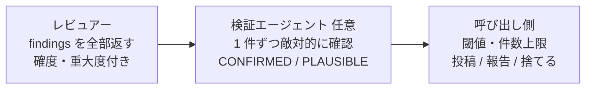

# レビューエージェントは判定せず確度と重大度を付けた findings を返し、閾値と投稿は呼び出し側が持つ

## 課題

レビュー役のエージェントに「本当に問題のものだけ報告せよ」と指示すると、2 つの問題が同時に起きる。

- **怪しいが確信のない指摘が黙って消える。** 消した判断はどこにも残らないので、取りこぼしだったかを後から検証できない。
  レビュアーが自分で棄却の閾値を持つと、その閾値はプロンプトの文言に埋まり、用途 (人が見ている・無人・投稿先が取り消せるか) ごとに調整できない
- **自由文の講評は後工程に渡せない。** 投稿・件数上限・重複排除・修正ループのどれも、指摘が 1 件ずつ機械的に区切れていることを前提にする。
  「全体としてよく書けているが〜」の文章は人間も読み飛ばす

さらに投稿先が取り消せない (GitHub の提出済みレビューは削除できない) 場合、誤検知を「投稿してから消す」で処理する設計が成立しない。

## 解決

責務を 3 つに分け、レビュアーは最初の 1 つだけを持つ。

1. **レビュアーは固定スキーマの findings を返す。** 1 件ごとに次を持たせる。
   - `file` と `line` (行を指せない指摘は `line` なしで返す。捨てない)
   - `summary`: 欠陥の主張を 1 文で。根拠や影響は混ぜない
   - `failure_scenario`: この入力・状態でこう壊れる、という具体的なシナリオ。**必須**にする。シナリオが書けない指摘は「感想」なので、それ自体が確度の低さを表す
   - `category`: correctness / security / convention など短い分類
   - `severity` と `confidence`: 段階値。レビュアーはここに迷いを表現し、**自分では捨てない**
2. **レビュアーは投稿しない。** findings をファイル (JSON) に書いて返すだけにする。承認の所在を呼び出し側の 1 箇所に集める
3. **呼び出し側が閾値を持つ。** 確度と重大度の組で「投稿する・サマリに回す・捨てる」を振り分け、1 回あたりの件数上限を投稿の前に効かせる。
   閾値は呼び出し側のつまみになるので、レビュアーのプロンプトを変えずに厳しさを調整できる。
   Claude Code 組み込みの `/code-review` の effort level がこの形で、low は高確度の少数だけ、high 以上は不確かなものも含めて広く返す
4. **任意で検証段を挟む。** レビュアーの発見と、その真偽の確認を別のエージェントに分ける。検証役は finding 1 件だけを受け取り、
   敵対的に再現を試みて CONFIRMED / PLAUSIBLE の verdict を付ける。発見側は取りこぼしを恐れず広く拾え、検証側は 1 件に集中できる。
   Claude Code の Workflow がこの「review → 各 finding を parallel に verify」を標準パターンとして示している

## 適用条件

- 効く: 投稿先が取り消せない (GitHub レビュー、通知が飛ぶ discussion)。非対話で修正ループに findings を流す。
  レビュアーを複数 (関心事ごと) 走らせて結果を合流させる。閾値を用途で変えたい
- 効かない: 人間が 1 対 1 で読む単発のレビュー。件数が数件で、講評を読んでそのまま直す方が速い。この場合は構造化のコストが見合わない
- レビュアー自身の隔離 (読み取り専用、経緯を渡さない、強いモデル) は別の関心事。組み合わせて使う

## トレードオフ

- 得る: 棄却の判断が記録に残り、閾値を後から動かせる。後工程 (投稿・上限・重複排除・検証) が全部 findings 単位で書ける。
  誤検知の抑制を「レビュアーの自制」から「呼び出し側の振り分け」に移せる
- 失う: findings の件数が増え、呼び出し側に振り分けのコードが要る。検証段を足すとトークンと時間がおよそ 2 倍になる。
  `failure_scenario` を必須にすると、シナリオを無理に作文する指摘が混ざる。確度の低さで拾えるが、ゼロにはならない

## 関連

- [敵対的レビューは独立コンテキストの読み取り専用サブエージェントに切り出す](adversarial-review-in-isolated-subagent.md)。レビュアー側の隔離と回数上限。この pattern はその出力の受け渡し部分を切り出したもの
- [エージェントからインラインレビューコメントを投稿するときのプロバイダ制約](../workflow/inline-review-comment-provider-constraints.md)。呼び出し側が findings を投稿するときの制約と、行を指せない指摘の縮退
- [rules を固定フォーマットの唯一の正にし、レビューは関心事ごとのサブエージェントが横断的に読む](../rule/rules-as-single-source-for-authoring-and-review.md)。レビュアーを関心事ごとに分けると findings の合流が要る
- [エージェントに任せる操作と人間承認が要る操作の線引きは可逆性で決める](../workflow/reversibility-decides-who-acts.md)。投稿が取り消せないから呼び出し側に寄せる、という判断の一般形
