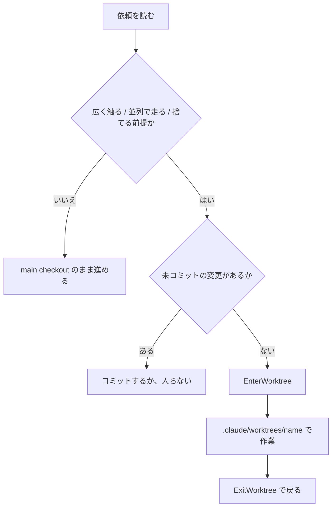

# 並列で走らせるエージェントは git worktree で隔離すべき

## 課題

同じ作業ツリーで複数のエージェントを同時に走らせると編集が衝突する。サブエージェントを 3 つ並べて
別々のモジュールを直させたつもりでも、片方が依存をインストールしてロックファイルを書き換え、
もう片方はテストの実行中に足元のファイルが変わる。git の状態はチェックアウトに 1 つしか無いので、
`git status` も `git stash` も互いに干渉する。

メインエージェント側にも同じことが起きる。作業が長くなると「別セッションで並行して別件を進めたい」に
なるが、同じチェックアウトで 2 セッション開けば、片方のコミット前の変更をもう片方が読む。

衝突しなくても待ちが生まれる。マージリクエストのレビュー待ちの間に同じチェックアウトでブランチを
切り替えて次の作業に移ると、積み上げたセッションの文脈と作業ツリーが食い違う。切り替えのたびに
エージェントに状況を説明し直すことになる。

さらに厄介なのは、**隔離が要るかどうかを起動時には決められない**こと。「この 1 行を直して」で始まった
依頼が、依存を全部差し替える話に化けることがある。起動フラグで隔離を決める設計は、判断材料が
一番少ない時点に判断を置いている。

## 解決

作業の単位ごとに git worktree を割り当てる。worktree は独立した作業ディレクトリとブランチを持ち、
`.git` (履歴・リモート) だけを共有する。入口は 3 つあり、誰が決めるかが違う。

| 入口 | 決める人 | 隔離の単位 |
|---|---|---|
| `EnterWorktree` ツール (「worktree で作業して」) | セッション中のメインエージェント | セッション全体。途中から |
| サブエージェントの frontmatter `isolation: worktree` | 定義を書いた人 | そのサブエージェント |
| `claude --worktree <name>` | 起動する人 | セッション全体。最初から |

### 依頼を読んでからエージェントが決める

重さが分かるのは依頼を読んだ直後のメインエージェントなので、判断もそこに置く。

`EnterWorktree` は `.claude/worktrees/` の下に新しく作る場合と、そこの既存 worktree へ移る場合は
**承認を求めない**。確認が入るのは `.claude/worktrees/` の外へ移るとき (リポジトリ内でも同じ。permission ルールでも「次回から確認しない」でも抑えられず `bypassPermissions` だけが例外) で、
移動が作業ディレクトリと書き込み権と `CLAUDE.md`・settings ごと動かすため。つまりエージェントは自分の判断で隔離に入れる。
戻るのは `ExitWorktree`。

判断規則は CLAUDE.md か skill に書く。入る目安。

- 他のセッションやサブエージェントと同時に走ることが分かっている
- 広く触る変更 (一括リファクタ、依存の入れ替え、生成物の作り直し)
- 失敗したら丸ごと捨てたい試行

1 ファイルの編集や読むだけの調査では入らない。作成と環境構築のコストだけ払うことになる。
**同時に開いている worktree が 5 個あるなら新しく作らせない。** 判断規則にこの上限も書いておく。

**入る前に手元の未コミット変更を確認させる。** worktree は新しいチェックアウトなので、main checkout の
未コミットの変更は付いてこない。分岐元の既定はリポジトリのデフォルトブランチ (`worktree.baseRef` の
`"fresh"`)。`"head"` にしても持って行けるのは手元の `HEAD` までで、作業中の差分は main checkout に残る。
途中から入るなら、先にコミットするか、入らない判断をする。

### 隔離は規約ではなく強制

worktree に入ったセッションとそこから生えたサブエージェントに対し、Claude Code は 4 つのチェックを掛ける。

- main checkout のパスを狙う `Edit` / `Write` / `NotebookEdit` を止める
- 作業ディレクトリが main checkout に解決される、あるいは外に居ると確認できないコマンドを止める
- `git -C` `--git-dir` `GIT_DIR` `GIT_WORK_TREE` や `cd` で git を main checkout に向けるコマンドを止める
- コマンド文字列から git の行き先を判定できない形 (実行時に決まるコマンド名など) を止める。これは無効化できない

### 環境は worktree ごとに作り直す

gitignore されたファイル (`.env`、ローカルの状態ファイル) は新しいチェックアウトには来ない。毎回コピー
したいものはリポジトリルートの `.worktreeinclude` に gitignore 構文で並べる。これが処理されるのは
**Claude Code が git で作った worktree だけ**で、自分で `git worktree add` したものには適用されない。

`.worktreeinclude` はそのままコピーするだけなので、値を worktree ごとに変える必要があるものには足りない。
実際に効くのは開発サーバのポートで、2 本同時に起動すると衝突する。ポートを含む `.env` はテンプレートから
生成して worktree ごとに別の値を差し込む。依存のインストールも同じく、入った直後の手順としてやらせる。

後始末では、変更が無い worktree は自動で消える。残っていれば `cleanupPeriodDays` に沿った sweep か手動で
片付ける。**ブランチが残るかどうかが道によって違う。** セッション終了時の prompt で remove を選ぶと
worktree とブランチの両方が消える。`git worktree remove` を自分で打てばブランチは残るので、
マージリクエストを出した後に作業ツリーだけ畳みたいならこちらを使う。

### VS Code 拡張から入る

拡張のチャットパネルには `--worktree` に当たる UI が無い。パネルはワークスペースフォルダでセッションを
開き、CLI のフラグを渡す口が無い。道は 2 つ。

- 統合ターミナルで `claude --worktree <name>` を打つ。拡張は `claude` を PATH に置かないので、
  standalone CLI のインストールが別に要る
- パネルのセッションの途中でエージェントに `EnterWorktree` を呼ばせる。**拡張では実質こちらが唯一の道**

拡張の Open in New Tab / New Window は会話を並列にするだけで、どれも同じワークスペースフォルダを見る。
ファイルの隔離にはならない。デスクトップアプリは新しいセッションごとに worktree を自動で作る。
拡張のセッションで途中から worktree に入る形を既定にすれば、この差を気にしなくて済む。

拡張のエクスプローラや差分表示が worktree に追従するかはドキュメントに書かれておらず、未確認。
エージェントの作業ディレクトリだけが移り、画面はワークスペースフォルダを見たままになる可能性がある。

## 適用条件

効く条件。

- 同時に走る作業が同じファイル群に触りうる
- 長いタスクの途中で別件を並行させたい
- サブエージェントに機械的な一括変更をさせる
- 失敗した試行をディレクトリごと捨てたい

効かない・不要な条件。

- **読むだけのサブエージェント。** 隔離する編集が無い
- **セットアップが重いプロジェクト。** worktree の数だけ依存のインストールが要る
- **未コミットの変更の上で続けたい作業。** 差分は付いてこない
- **Git LFS を `git lfs install --local` で入れたリポジトリ。** worktree にはポインタファイルしか来ず
  `git lfs pull` が要る。リポジトリ自身の設定にある filter driver を Claude Code は走らせない
- **git 以外の VCS。** `WorktreeCreate` / `WorktreeRemove` hook で代替できるが、`.worktreeinclude` は
  処理されなくなり、コピーは hook スクリプトの中で自分で書く

## トレードオフ

得るもの。

- 編集が衝突しない。並列度を機械的に上げられる
- main checkout への書き込みが製品側の 4 チェックで止まる。ガードを自作しなくても main は守られる
- 判断が起動時ではなく依頼を読んだ後に来る。CLI とデスクトップと拡張で手順が変わらない

失うもの。

- **環境構築が worktree の数だけ要る。** ディスクも増える。[`worktree.symlinkDirectories` で減らせる](share-dependency-dirs-across-worktrees-by-symlink.md)が Windows では効かないことがある
- **hook のガードの前提が変わる。** スクリプトの解決先と状態ファイルの置き場が worktree で割れる。
  [worktree に入るとガード hook の前提が変わる](../hooks/common/hook-guards-under-worktree-isolation.md)
- **状態が共有されない。** 並列で得た結果を集める手段を別に用意する
- **Claude Code に寄る。** [Gemini CLI に移植すると強制が消える](worktree-isolation-not-portable-to-gemini-cli.md)
- **人間側の切り替えコスト。** 並列度には上限を決めておく。**同時に持つ worktree は 5 個まで**を上限とし、
  6 本目が要るなら先にどれかを畳む。実践報告にはもっと絞って「作業中 2 本 + レビュー待ち 1 本」を目安に
  する例もある。どこで頭打ちになるかは環境構築の重さと、人が状況を覚えていられる数で決まる

## 関連

- [worktree に入るとガード hook の前提が変わる](../hooks/common/hook-guards-under-worktree-isolation.md) — このパターンの副作用
- [Claude Code の worktree 隔離は Gemini CLI に移植すると強制が消える](worktree-isolation-not-portable-to-gemini-cli.md) — 他の CLI に持っていくときに落ちる層
- [GitLab の issue から作ったマージリクエストのブランチで worktree に入る](worktree-on-gitlab-merge-request-branch.md) — リモートに既にブランチがある流れへの当てはめ
- [サブエージェントのモデルは定義で固定せず呼び出し側に決めさせる](subagent-model-selection-by-orchestrator.md) — 判断を定義側ではなく呼び出し側に置く、同じ形の話
- [サブエージェントと全体進捗を VS Code 拡張で可視化しながら実行する](subagent-progress-ui-in-vscode.md) — 並列で走らせた後、状況をどう見るか
