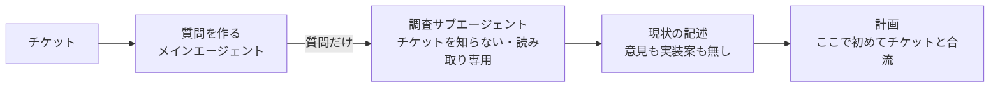

# 調査サブエージェントには何を作るかを渡さず質問だけ渡した方がよさそう

## 課題

変更の計画を立てる前に、コードの現状を調べさせる。ここで調査役にチケット (何を作るか) をそのまま渡すと、調査が目的に引っ張られる。
「こう動いているはず」を確かめに行き、都合のよい箇所だけ読んで、実装案が調査文書に混じる。計画はその文書を根拠にするので、根拠が最初から傾いている。

自分の手でも同じことが起きる。[敵対的レビューを独立コンテキストに切り出す](adversarial-review-in-isolated-subagent.md) で作者の経緯を渡さないのと同じ理由で、調査にも「目的を知らない目」が要る。

## 解決

チケットから質問への変換と、質問への回答を**別のコンテキスト**に分ける (HumanLayer の research-plan-implement。講演では「調査するコンテキストからチケットを隠す。決定的にやる」と言っている)。

1. **質問を作る。** メインエージェントがチケットを読み、「関係する箇所をすべて触らせる質問」を書く。例: 「endpoint はどう定義されているか」「spline に触れる処理の流れを追え」「reticulation を担う worker を全部挙げよ」。何を作るかは書かない
2. **調査する。** Claude Code の Agent ツールで読み取り専用のサブエージェント (組み込みの Explore か、`tools` を Read / Grep / Glob に絞った定義) を起こし、プロンプトには質問と出力形式だけを入れる。「意見と推奨を書くな。今どう動いているかだけを、ファイルと行を添えて書け」を明示する
3. **合流する。** 調査結果を読んだ後で、メインエージェントがチケットと突き合わせて計画を書く。矛盾があれば調査に質問を足して再実行する

サブエージェントは親のコンテキストを継がないので、プロンプトに書かないかぎりチケットは渡らない。渡さないことを「決定的に」保証するのは、この分離の構造そのもの。

## 適用条件

- 効く: 変更が複数モジュールにまたがり、計画が現状の理解に依存するとき。計画の根拠を人がレビューするとき (現状の記述だけなら短時間で検証できる)
- 効かない: 1 ファイルの修正。調査の往復コストが変更そのものより重い
- 効かない: 「どの案がよいか」を調べたいとき。それは計画側の仕事で、目的を知らなければ答えられない
- 質問の質に依存する。関係箇所を取りこぼす質問では、調査も取りこぼす

## トレードオフ

- 得る: 調査文書が事実だけになり、計画の誤りが「調査が足りない」か「計画の推論が誤り」かに切り分けられる。調査文書は目的に依らないので、別のチケットでも再利用できる
- 失う: 質問を作る 1 往復。調査役が「なぜ聞かれているか」を知らないぶん、聞かれていない重要な箇所を自発的に拾わない。取りこぼしは質問を足して埋めるしかない
- 講演では、質問作りは慣れた人が手でやっていた。エージェントに作らせるなら、質問にも実装案が漏れていないかを見る

## 関連

- [敵対的レビューは独立コンテキストの読み取り専用サブエージェントに切り出すべき](adversarial-review-in-isolated-subagent.md)。「経緯を渡さない」の同型
- [文脈を持たない監査サブエージェント](context-free-audit-subagent-on-tool-count.md)。文脈を持たないことを武器にする別の役
- [計画の直後に初期化サブエージェントを走らせる](preflight-subagent-after-plan-before-fanout.md)。調査と計画の後、散らす前に挟む役
- [サブエージェントは既定で background で走る](subagent-runs-in-background-by-default.md)。調査の結果を待って合流する手順に影響する
