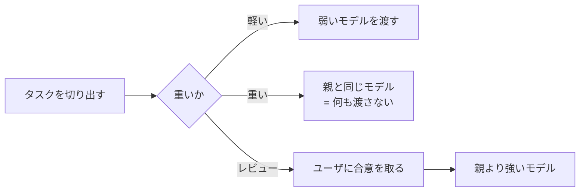

# サブエージェントのモデルは定義で固定せず呼び出し側に決めさせる

## 課題

カスタムサブエージェントの定義に `model: opus` のような固定値を書くと、そのエージェントが呼ばれるたびに
同じモデルが走る。ところが一つのエージェントに来る仕事の重さは一定ではない。同じ調査役でも
「設定ファイルの 1 行を確認する」と「複数モジュールの依存を追って設計の当たりを付ける」が同じ入口から入る。

定義を書く時点では、どちらが来るか分からない。重さを知っているのは、そのタスクを切り出した**呼び出し側**
(オーケストレータ) だけ。判断材料を持たない側に決定を固定させているのが問題の形。

固定した結果は 2 通りとも損をする。強いモデルで固定すれば軽い呼び出しでコストを払い続ける。
弱いモデルで固定すれば重い呼び出しで質が落ち、やり直しでかえって高くつく。

## 解決

**エージェント定義から `model` を落とす。** そうするとモデルは呼び出しごとに決まる。

Claude Code のモデル解決順序 (v2.1 系)。

| 順位 | 決めるもの |
|---|---|
| 1 | 呼び出しごとに渡す `model` パラメータ |
| 2 | 定義の `model` frontmatter (`inherit` は本体会話のモデル) |
| 3 | 環境変数 `CLAUDE_CODE_SUBAGENT_MODEL` |
| 4 | 本体会話のモデル |

定義に何も書かなければ 2 が空になり、オーケストレータが 1 で指定できる。指定しなければ 4 に落ちて
本体会話と同じモデルになる。つまり**既定が「親と同じ」になり、明示したときだけそこからずらせる**。

方針は 2 つ。

1. **重さで選ぶ。** 重いタスクだとオーケストレータが判断したら強いモデル、そうでなければ弱いモデル
2. **原則としてオーケストレータ自身のモデルを越えない。** 上限は自分。越える必要があるなら、それは
   サブエージェントに投げる話ではなく本体のモデルを上げる話

方針 2 は製品側の設計とも一致する。組み込みの Explore は Claude API 上で親のモデルを継承しつつ Opus で
上限を切っており、公式ドキュメントはその理由を「セッションに選んだモデルより高価なモデルで Explore が
走らないようにするため」と書いている。

### 例外: レビューエージェント

レビューだけは親より強いモデルで走らせてよい。オーケストレータが自分で立てた計画と自分で書いた差分を
検証させる役なので、同じ強さだと同じ穴を見落とす。

ただし**越えるときは必ず事前にユーザと合意する**。「このレビューはオーケストレータより強いモデルで起動する」
と計画の段階で伝え、了解を取ってから呼ぶ。コストが上がる方向の判断を、コストを払う側に黙って下さない。

## 適用条件

効く条件。

- 同じサブエージェントに軽重どちらのタスクも来る
- 定義を書く場面と呼ぶ場面が離れている (共有した `.claude/agents/` を複数のリポジトリで使うなど)
- 本体会話のモデルをユーザが `/model` で切り替える。定義に固定値があるとその切り替えが効かない

効かない条件。

- **仕事の重さが常に同じエージェント。** 組み込みの `statusline-setup` (Sonnet 固定)、
  `claude-code-guide` (Haiku 固定) のように、用途が一点に決まっているなら固定でよい
- **`CLAUDE_CODE_SUBAGENT_MODEL_FORCE` を立てた環境。** 呼び出しごとの指定も定義の `model` も無視される。
  組織全体を 1 モデルに寄せる運用とこのパターンは両立しない
- **fork (会話を分岐させるサブエージェント)。** 常に親のモデルで走り、`model` の指定は無視される
- 組織の `availableModels` 許可リストで弾かれる値を渡すと別のモデルに置き換わる。渡した通りに走る保証はない

## トレードオフ

得るもの。

- タスクの重さとモデルが噛み合う。軽い呼び出しのコストが落ちる
- 既定が「親と同じ」なので、指定を忘れても親を越えない。**上振れが事故で起きない**
- 定義が環境から独立する。同じ定義を Opus のセッションでも Haiku のセッションでも使える

失うもの。

- **再現性。** 同じエージェントが呼び出しごとに違うモデルで走る。結果がぶれたとき、原因がプロンプトなのか
  モデルなのか切り分けにくい。評価やベンチマークで比較するなら frontmatter に固定値を書く
- **判断がオーケストレータ任せになる。** 「重い」の見立てが外れれば弱いモデルで重い仕事をさせる。
  この見立ての精度は測っていない

書き方の要点として、定義から `model` を外すだけでは「重さで選べ」は伝わらない。判断規則は呼び出し側
(CLAUDE.md か skill) に書く。エージェントの `description` にも「軽い確認なら弱いモデル、
設計判断を含むなら親と同じ」のような目安を書いておくと、呼ぶ瞬間の材料になる。

## 関連

- [ツール使用回数を閾値にして、文脈を持たない監査サブエージェントを背景で走らせる](context-free-audit-subagent-on-tool-count.md) — 別文脈の点検役を立てる話。その点検役のモデルをどう決めるかがこのパターン
- [タスクの切れ目で /compact と /clear をユーザに依頼させる](../hooks/ask-user-to-reset-context-at-task-boundaries.md) — エージェントが自分で決めずユーザに判断を返す形の別例
