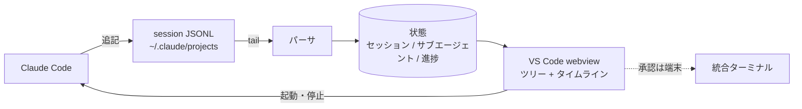

# サブエージェントと全体進捗を VS Code 拡張で可視化しながら実行できるはず (未検証)

## 思いつき

サブエージェントは独立したコンテキストで走るので、親から見えるのは最後に返ってきた要約だけになる。
複数を並列に投げると、今どれが何をしているのか、止まっているのか、全体がどこまで進んだのかが
ターミナルのスクロールバックからは読めない。公式 VS Code 拡張でも同じ声が上がっている
(claude-code/issues/46076 「サブエージェントが何をしているのか、詰まっているのかが見えない」)。

進捗は本来ダッシュボードで見るものなのに、今はログを目で追う作業になっている。
**可視化しながら実行する**を 1 つの拡張にまとめたい。

もう 1 つ、これは技術ではなく採用の話。CLI だけの道具は書いた本人しか使わない。
同じ機能でも、パネルに出て触れる形になった瞬間に使われ始める。UI を後回しにしない。

## 参考にする 2 つ

| | claude-code-park | Claude Code Agent Monitor |
|---|---|---|
| データ源 | `~/.claude/projects/*.jsonl` を追記監視して差分を解析 | settings.json に hook を自動登録し、各イベントをローカルサーバに POST |
| 拾うイベント | ファイルに残るもの全部 | SessionStart / PreToolUse / PostToolUse / Stop / SubagentStop / Notification |
| 保存 | 持たない (ファイルが正) | SQLite (WAL)。JSONL も履歴解析に併用 |
| 見せ方 | 俯瞰オフィス。エージェント = 社員、セッション = 指揮者 | D3 の DAG、ツール遷移の Sankey、協調ネットワーク、Kanban |
| 実装 | Tauri v2 (Rust) + React + Pixi.js | Express + React + WebSocket。VS Code 拡張のサイドバーあり |
| 実行 | しない。読むだけ (セッションをクリックすると元の端末にフォーカスする) | Run ページを持つが TUI と同等ではない |
| 制約 | macOS 専用 | 承認プロンプト・`/login`・キーバインドは CLI のみ |

観測の作り方はこの 2 通りしかない。

## 決めたこと: JSONL tail を採る

hook は**本来のタスク実行のクリティカルパスに乗る**。同期 hook はツール呼び出しをブロックし、
その分だけ実行が遅くなる。しかも遅延はツール 1 回ごとに積み上がるので、ツールを何百回も叩く
長いセッションほど損が大きい。可視化のために本業を遅くするのは順序が逆。

`async: true` を付ければブロックはしないが、それでもツール呼び出しのたびにプロセスが 1 つ起きる。
`async` は `command` type にしか無いので、そのプロセス起動コストは避けられない。

対して JSONL tail は**エージェントの実行に一切触らない**。ファイルを後ろから読むだけなので、
遅くなりようがない。settings.json も書き換えないから、ユーザーの設定と競合しない。
Park が読み取り専用に振り切っているのは、この性質を取ったからだと見ている。

代償は割り切る。

- **遅れる。** 転写ファイルは非同期に書かれるので、UI は常に少し過去を映す。
  ダッシュボードの用途 (今どれが動いているか、詰まっていないか) には十分
- **hook 固有のイベントは見えない。** PreToolUse での拒否、Notification、権限の判定結果は落ちる。
  これらが要ると分かったときに初めて hook を検討する
- **承認 UI は作らない。** 承認をこちらで受けるには結局 hook で待たせることになり、
  [hook はタイムアウトすると素通りする](../hooks/common/hook-timeout-fails-open.md) にぶつかる。
  fail-open するゲートは承認 UI として成立しない。承認はターミナルに残す

## 設計の当て

- 状態は tail した転写だけから組み立てる。書き込みは一切しない
- サブエージェント 1 件を 1 行にし、状態 (待機 / 実行中 / 完了 / 失敗)、経過時間、
  直近のツール呼び出し、消費トークンを出す。全体進捗はその集計にする
- 起動と停止はこの UI から行う。VS Code の統合ターミナルで `claude` を起こせば足りるので、
  ここにも hook は要らない。ここが Park との差になる

## ここが弱い

- **サブエージェントの内部がどこまで転写に出るか未確認。** Park は作業種別に Delegating を
  持っているので何らかの形では出ているはずだが、子側のツール呼び出し 1 件ずつまで追えるかは
  自分で JSONL を読んで確かめる必要がある。ここが取れないと「サブエージェントが詰まっている」を
  検出できず、目的の半分が欠ける。**最初に確認すべきはここ**
- **転写の形式は非公開。** 追記型 JSONL の構造は仕様として公開されていない。
  バージョンが上がると壊れうる。パーサは未知フィールドを黙って捨てる作りにする
- **「実行中」を推測で出すことになる。** 転写に残るのは起きた事実だけなので、
  完了イベントが来ていない = 実行中、と推定する。落ちたセッションが永遠に実行中に見える。
  最終追記からの経過時間で「無反応」を別状態にする必要がある
- **遅れの実測がまだ無い。** どのくらい遅れるかを測っていない。数秒なら問題ないが、
  数十秒だと「詰まっているか」の判断には使えない。1 の段階で測る
- **Windows と Linux。** Park が macOS 専用なのは端末フォーカスに AppleScript を使っているから。
  VS Code 拡張なら OS 依存の端末操作は拡張 API に置き換えられるので、ここは有利なはず
- **公式拡張との二重化。** すでに公式 VS Code 拡張がある。別拡張として並べるのか、
  ターミナルを内側で起こすのか、どちらでも UI の一貫性が崩れる懸念がある
- **見た目に時間を吸われる。** Park の Pixi.js のオフィスは魅力だが、そこは本質ではない。
  最初はツリー + タイムラインだけにする

同じ「転写は遅れる」という制約に、
[ツール使用回数を閾値にした監査サブエージェント](context-free-audit-subagent-on-tool-count.md)
でも当たっている。あちらは遅れが致命的なので hook でカウンタを持つ側に倒したが、
こちらは遅れても構わない用途なので反対側に倒れる。

## 試すなら

1. JSONL を 1 本手で読む。サブエージェントの起動・ツール呼び出し・終了がどう記録されているかを
   確かめ、追記から読めるまでの遅れを測る。ここで欲しい粒度が無ければ設計をやり直す
2. 読むだけの版を作る。tail してサブエージェントの一覧と状態を webview に出す。設定は書き換えない。
   これで「見えるだけで嬉しいか」を判定する
3. 起動と停止を足す。統合ターミナル経由。承認は端末に任せたまま
4. hook は、2 と 3 で足りないと分かった項目が出てから、その項目に限って検討する

## 昇格の目安

これが揃ったら type を `note` から変える (.claude/rules/knowledge-authoring.md「note を昇格させる」)。ファイルは動かさない。

- [ ] type を決めた → 課題と解決の組なので `pattern` になる見込み。
      データ源の 2 択と「観測は本業のクリティカルパスに置かない」だけ切り出すなら `concept`
- [ ] sources に一次情報がある → 両プロジェクトの repo と hooks リファレンスはある
- [ ] applies_to に検証したバージョンがある
- [ ] 実際に試して verified_at を書ける → 上の「試すなら」の 1 と 2 を通す
