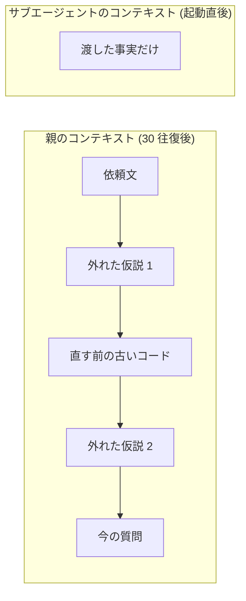

# サブエージェントが効くのは親の節約ではなく新品のコンテキストで考え直せるから

## 要点

サブエージェントの説明はたいてい「メインのコンテキストを節約できる」で終わる。それは結果であって理由ではない。
効くのは、**子が何も知らない状態から始まる**から。親が積み上げた古い誤り・自分で書いた言い訳・「こうしたい」という願望が 1 つも載っていない頭で、同じ問題を見直せる。
節約が目的なら選ぶ理由は無い。子は子でコンテキストを持つので、払うトークンはむしろ増える。

## 仕組み

### そもそもコンテキストとは「毎回渡し直す 1 通の手紙」

エージェントはやりとりを覚えていない。1 往復ごとに、これまでの会話・読んだファイル・コマンドの出力を**全部まとめて 1 通の手紙にして送り直している**
([Messages API はステートレスで会話全文を毎回送り直す](../workflow/messages-api-is-stateless-and-resends-the-whole-conversation.md))。
「コンテキスト」はこの手紙のこと。作業が進むほど手紙は長くなり、途中で捨てたコードも、外れた仮説も、そのまま末尾に足されていく。消す操作は無い。



### 長くなった手紙は読み飛ばされる

長さそのものが質を下げる。Chroma が 18 モデルを測った context rot の調査では、**上限に達していなくても**入力が伸びるほど精度が落ちた。
仕組みは注意の希薄化で、トークンを足すほど既にあるトークンの取り分が減る
([context が伸びるほど指示が効かなくなるのは注意が全トークンに配られるから](../model/attention-dilutes-as-context-grows.md))。
何トークンから落ちるかは諸説あって決まっていない ([閾値は 40% から 400k トークンまで諸説ある](../model/context-quality-drop-thresholds-vary-by-source.md))。

### だが本当の問題は長さではなく中身

長さは目に見えるので語られやすいが、実際に判断を狂わせるのは**何が残っているか**。よくあるのは次の 3 つ。

| 汚れ方 | 何が残るか | 何が起きるか |
|---|---|---|
| 古い事実 | 直す前のファイル内容、消したはずの関数 | 「その関数は無い」と言っても、手紙の中には在る。存在しないコードを前提に直そうとする |
| 自分の理屈 | 「この実装で問題ない」と自分で書いた説明 | 自分の文章を読み返す構図になり、追認する方向へ働く |
| 願望 | チケットの「〜にしたい」という文 | 調査の答えが「現状はこうだった」ではなく「こうなっているはず」に寄る |

30 往復デバッグして直らないとき、「もう一度よく考えて」と頼んでも結果が変わらないのはこれが理由。
考え直す材料が、外れた仮説で汚れた同じ手紙のままだから。

### `/compact` では消えない

`/compact` は会話を要約 1 通と直近数通に組み直す ([compact はモデルへ送る会話を要約に組み直す](../workflow/compact-rebuilds-the-sent-conversation-as-a-summary.md))。
短くはなるが、**「これまでの経緯」として残る**。外れた仮説も「この方針は駄目だった」という形で要約に入り、
誤解を含んだまま凝縮されることもある。長さは治せても、上の 3 つの汚れは治せない。

### サブエージェントは読み手ごと取り替える

`Agent` ツールを呼ぶと、Claude Code は**別のコンテキストを新しく作って**そこで作業させる。
親の会話は 1 行も入らない。入るのは呼び出し時に書いた指示だけ。終わると子のコンテキストは捨てられ、親には最終報告だけが返る。
実装上も別物で、子のやりとりは親とは別ファイル (`subagents/agent-<id>.jsonl`) に記録される
([サブエージェントの transcript は別ファイル](../workflow/subagent-transcript-is-separate-file-with-every-tool-call.md))。

つまりサブエージェントは「手伝ってくれる人」ではなく、**同じ問題を何も知らない人にもう一度見せる仕組み**。
親のコンテキストが汚れないのは、そのついでに手に入るおまけ。

### トークンは減らない

節約という言葉から誤解しやすいが、**支払いは増える**。子は自分のコンテキストを持ち、CLAUDE.md も skill も MCP のツール定義も自分で読み込む。
公式ドキュメントは agent teams が plan mode で標準セッションの約 7 倍のトークンを使うと書いている。
守っているのは親のコンテキストの質であって、コストではない
([Claude Code の機能が分かれているのは context を守るため](../workflow/features-split-to-protect-the-context-window.md))。

### 何を渡し、何を渡さないか

新品のコンテキストは何も知らない。だから必要な事実は明示的に渡す。ただし渡しすぎると親の汚れがそのまま移り、新品にした意味が消える。

| 渡す | 渡さない |
|---|---|
| 症状、再現手順、エラーメッセージの原文 | これまで試した推測とその理由づけ |
| 見るべきファイル・ディレクトリの範囲 | 「たぶんここが原因」という当たり |
| 答えてほしい問い、返す形式 | チケットの「こうしたい」という目的 |
| 守るべき制約 (触ってよい範囲、読み取り専用か) | 親の会話ログそのもの |

「試したこと」を渡すのは、同じ手を繰り返させたくないときだけ。そのときも理由づけは落とし、事実だけ 1 行で書く
([失敗した手はチケットの Do-Not-Repeat 節に残す](../workflow/keep-do-not-repeat-list-outside-context.md))。

### サンプル 1: 詰まったデバッグを渡す

30 往復かけて直らないログイン失敗を、当たりごと渡すか、症状だけ渡すか。

```text
# 悪い渡し方 (親の汚れがそのまま移る)
ログインが失敗する件、session の期限切れ周りが怪しいと思って
src/auth/session.ts を直したけど直らなかった。他に原因を探して。
```

```text
# 良い渡し方 (事実だけ)
症状: ログイン直後の /api/me が 401 を返す。再現は pnpm dev のあと
test@example.com でログイン。ブラウザには "session expired" と出る。
サーバのログは logs/dev.log。
問い: 401 を返している箇所と、その分岐に入る条件を特定して。
原因の推測は要らない。該当ファイルと行、判定に使っている値を挙げて。
制約: 読むだけ。修正はしない。
```

悪い方は「session.ts は違う」という情報を与えているようで、実際には**探索範囲を親と同じ形に縛っている**。
良い方は範囲を切らないので、cookie の SameSite 設定やプロキシのヘッダ落ちのような、親が一度も見ていない側に手が伸びる。

### サンプル 2: 調査は問いだけ渡す

計画を立てる前の現状調査では、目的を渡さないだけで結果が変わる。
チケット文を渡すと「そうなっているはず」と書いてしまうので、**問いの形に直してから渡す**
([調査サブエージェントには何を作るかを渡さず質問だけ渡した方がよさそう](research-subagent-gets-questions-not-the-ticket.md))。

```text
# 親がチケットから作った問い (チケット本文は渡さない)
このリポジトリについて次の 3 点を、コードを読んで事実だけ答えて。
1. リトライはどこで実装されている。回数と待ち時間はどう決まっている
2. リトライ対象になる例外の種類は何か。判定している関数はどれか
3. リトライ回数を設定から変える口は今あるか。無いなら無いと書く
各項目にファイルパスと行番号を添えて。改善案は書かない。
```

### サンプル 3: 定義として置いて繰り返し使う

同じ渡し方を毎回書くのが面倒なら、`.claude/agents/<name>.md` に置く。呼ぶたびに新しいコンテキストで起動するのは同じ。

```markdown
---
name: fact-finder
description: コードの現状を事実として答える。推測・改善案・実装はしない
tools: Read, Grep, Glob
---

渡された問いにだけ答える。答えは「どこに何が書いてあるか」の記述に限る。

- 各項目にファイルパスと行番号を添える
- 分からないものは「分からない」と書く。推測で埋めない
- 改善案・設計案・修正は書かない。求められても書かない
```

`tools` を読み取り専用に絞ると、書き込めない以上「ついでに直しておきました」が起きない。
モデルは定義で固定せず呼び出し側に決めさせる方が扱いやすい
([サブエージェントのモデルは呼び出し側に決めさせた方がよさそう](subagent-model-selection-by-orchestrator.md))。

## 使いどころ

新品のコンテキストが効くのは、**親の文脈が邪魔になっている**ときだけ。次のどれかに当てはまるかで判断する。

- **堂々巡りに入った。** 同じ箇所を何度も直して直らない。親には外れた仮説が積み上がっている
- **客観性が要る。** 自分の書いたコードのレビュー。経緯を知らない読み手に diff だけ見せる
  ([敵対的レビューは独立コンテキストの読み取り専用サブエージェントに切り出すべき](adversarial-review-in-isolated-subagent.md))
- **事実が知りたい。** 「こうなっているはず」が混ざると困る調査
- **大量の出力を読ませたいが結論だけ要る。** 数万行のログやテスト出力を子に読ませ、親は要約だけ受け取る。ここは節約も同時に効く
- **並列に進めたい。** 独立した作業を同時に走らせる。編集が衝突するなら worktree で分ける
  ([並列で走らせるエージェントは git worktree で隔離すべき](parallel-agents-isolated-by-worktree.md))

効かない場面もある。

- **積み重ねそのものが価値なとき。** 設計の議論の続き。親と合意した前提を全部渡し直すことになり、渡した時点で新品ではなくなる
- **前提の説明が本題より長いとき。** 渡すべき事実が多すぎるなら、切り出し方が間違っている。タスクの切り直しを先にする
- **数分で終わる作業。** 起動と報告の往復が本体より重い
- **コストを下げたいとき。** 目的が逆。前述のとおりトークンは増える
- **失敗に気づきたいとき。** サブエージェントは既定で背景で走り、親には最終報告しか返らない。途中の失敗は見えにくい
  ([サブエージェントは既定で background で走る](subagent-runs-in-background-by-default.md))

なお、汚れたコンテキストを捨てる手段はサブエージェントだけではない。作業そのものを引き継ぐなら `/clear` して仕切り直す方が素直で、
サブエージェントは「1 つの問いに答えさせて親は作業を続ける」ときに選ぶ
([タスクの切れ目で /compact と /clear をユーザに依頼させる](../hooks/22-PostToolUse/ask-user-to-reset-context-at-task-boundaries.md))。

## 関連

- [Claude Code の機能が分かれているのは context を守るため](../workflow/features-split-to-protect-the-context-window.md) — サブエージェントを他の手段と並べた全体像
- [context が伸びるほど指示が効かなくなるのは注意が全トークンに配られるから](../model/attention-dilutes-as-context-grows.md) — 長さが効く側の仕組み
- [context が増えると質が落ち始める閾値は 40% から 400k トークンまで諸説ある](../model/context-quality-drop-thresholds-vary-by-source.md)
- [調査サブエージェントには何を作るかを渡さず質問だけ渡した方がよさそう](research-subagent-gets-questions-not-the-ticket.md)
- [敵対的レビューは独立コンテキストの読み取り専用サブエージェントに切り出すべき](adversarial-review-in-isolated-subagent.md)
- [レビュー役は findings に確度を付けて返し閾値は呼び出し側が持つ](reviewer-scores-findings-caller-applies-threshold.md)
- [サブエージェントへの委譲と隔離](../diagrams/subagent-delegation.architecture.html)。委譲・隔離・レビューの門を 1 枚にした archify の構成図 (ブラウザで開く)
