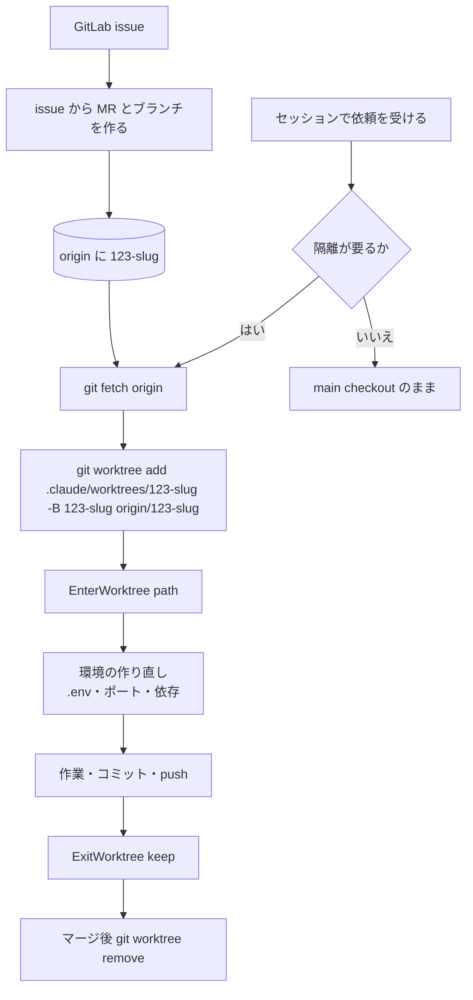

# GitLab のマージリクエストのブランチで worktree に入るには git で自分で追加して EnterWorktree に path を渡すべき

## 前提

- チームの流れが「issue を作る → issue からマージリクエストとブランチを作る → ローカルで checkout して作業」で、
  **作業を始める時点でブランチが既にリモートにある**こと
- Claude Code 2.1 (VS Code 拡張 2.1.261 で確認)。`EnterWorktree` の `path` が「`git worktree list` に載っている既存の worktree」を
  受け付けることはツールの説明にも書かれている
- 手元に main checkout があり、`git fetch` と `git push` が非対話で通る認証 (glab の credential helper など) が入っていること。
  詰まりどころは後述
- 確認に使ったのは docker の GitLab CE 18.5 (自己管理) と glab 1.114。issue からブランチと MR を作るのは
  Web UI の「Create merge request and branch」ではなく `glab mr create --related-issue <iid> --create-source-branch` で代用した

[並列で走らせるエージェントは git worktree で隔離する](parallel-agents-isolated-by-worktree.md) の 2 つの入口 (`EnterWorktree` の `name`、
`claude --worktree <name>`) はどちらもブランチ名を受け取らず、分岐元は `worktree.baseRef` (`fresh` か `head`) で決まる。
新しいブランチを作る前提なので、既にあるブランチに乗る道がそのままでは無い。ブランチの指定を git に任せ、隔離への移動だけ Claude Code にやらせる。

## 手順

1. リモートのブランチ名を確かめる。issue 由来のブランチ名は作り方で変わる (UI は `<iid>-<slug>`、glab は title 由来。
   [glab の --create-source-branch はブランチ名を title から作る](../workflow/glab-create-source-branch-names-branch-from-title.md))

   ```sh
   git fetch origin
   git branch -r
   ```

2. main checkout で、`.claude/worktrees/` の下に既存ブランチを追跡する worktree を作る

   ```sh
   git worktree add .claude/worktrees/123-slug -B 123-slug origin/123-slug
   ```

   `-B` なのでローカルに同名ブランチが無くても作られ、`origin/123-slug` を upstream にする (「set up to track」と出る)。

3. エージェントに `EnterWorktree` を `path: .claude/worktrees/123-slug` で呼ばせる。`.claude/worktrees/` の下なので承認プロンプトは出ず、
   「Entered worktree at ... on branch 123-slug」と返る。以後の Bash の cwd はその worktree、`git branch --show-current` は `123-slug`

4. 中で普通にコミットし `git push` する。upstream が付いているので引数は要らない。push の応答に
   「View merge request for 123-slug」と既存 MR の URL が出て、MR の `sha` と `changes_count` が更新される

5. 抜けるときは `ExitWorktree` を `action: "keep"` で呼ぶ。`"remove"` は
   「This session is not the owner of the worktree ... it either entered a pre-existing worktree via EnterWorktree({path}) ...
   so this tool will not remove it」と拒否される。マージ後に main checkout で自分で消す

   ```sh
   git worktree remove .claude/worktrees/123-slug
   ```



## 確認方法

- `EnterWorktree` の応答に worktree のパスとブランチ名が出る。Bash で `pwd` と `git branch --show-current` を打つと同じ値になる
- push 後に `glab api projects/<id>/merge_requests/<iid>` の `sha` が push したコミットになり、`changes_count` が増える
- `ExitWorktree` の `remove` が上の文言で断られる。`keep` で「Session is now back in <main checkout>」と戻る

## つまずきどころ

- **worktree の中では Bash の git コマンドが単文に制限される。** `pwd; git branch --show-current; git rev-parse ...` のように
  `;` や `&&` で git をつないだ 1 行は「too complex to verify that it stays inside the worktree」と拒否される。
  `glab auth git-credential` のように引数に `git` を含む別コマンドも同じ理由で止まる。1 コマンド 1 行に分ける
  ([worktree に入ったセッションでは複合 git コマンドが拒否された](worktree-session-refuses-compound-git-commands.md))
- **push で GUI の資格情報ダイアログが開いて止まる。** Windows の Git for Windows はシステム設定の `credential.helper=manager` が先に動くので、
  リポジトリ設定に glab の helper を足しただけでは順番が後になる。空の helper を 1 つ挟んで連鎖をリセットしてから glab を足す
  ([エージェントの gh / glab / git 認証は範囲限定トークン 1 本に寄せるべき](../workflow/scoped-token-for-agent-git-cli-auth.md) の「つまずきどころ」)
- **`.worktreeinclude` は効かない。** 処理されるのは Claude Code が自分で作った worktree だけなので、`.env` の持ち込みとポートの差し替えは自分でやる (ドキュメントの記述。今回の検証では `.worktreeinclude` を置いていない)
- **定期 sweep も消さない。** Claude Code のマーカーが無いため、後始末は `git worktree remove` を自分で打つ
- 検証では main checkout をこのリポジトリの中の追跡外ディレクトリに置いた入れ子のリポジトリにした。`ExitWorktree keep` の戻り先は
  セッションを起こしたディレクトリではなく**その入れ子リポジトリのルート**だった。実運用の「現在のリポジトリの worktree」では起きない

## 他の道

### A. 起動時にマージリクエスト番号を渡す (未実施)

```sh
claude --worktree "#123"
```

番号を `#` 付きで渡すか、`https://gitlab.com/group/repo/-/merge_requests/123` の URL を渡す。ドキュメントによると Claude Code が origin から
その変更の head をフェッチし、`.claude/worktrees/pr-123` に worktree を作る。フェッチ経路は origin のホストで決まり、gitlab.com なら
`merge-requests/<番号>/head`、自己管理の GitLab を含むその他のホストでは `pull/<番号>/head` を試してから `merge-requests/<番号>/head` に落ちる。

`.worktreeinclude` が効く。欠点は**起動時に決めなければならない**ことと、VS Code 拡張のチャットパネルからはフラグを渡せないこと。
ターミナルの CLI でしか使えないので、拡張で検証しているこのリポジトリでは実行していない。

### C. worktree で作ってから push 先を合わせる

`EnterWorktree` に普通に新しい worktree を作らせ、コミットしてから `git push origin HEAD:123-slug` で既存の MR のブランチに載せる。
ブランチ名の一致を人が管理することになり、取り違えの余地が残る。

判断を依頼を読んだ後に置ける道は B (上の手順) だけで、VS Code 拡張のパネルからも使える。

## 確かめていないこと

- A がブランチの上に置くのか切り離した状態にするのか、そのまま push して MR が更新されるか
- Web UI の「Create merge request and branch」で作ったブランチ (`<iid>-<slug>` 形式) での同じ手順。glab で作ったブランチでしか通していない
- ブランチ名に `/` が入るとき (`feature/123-slug`) の worktree ディレクトリ名の扱い
- GitLab 側の保護ブランチやブランチ名テンプレートの影響
