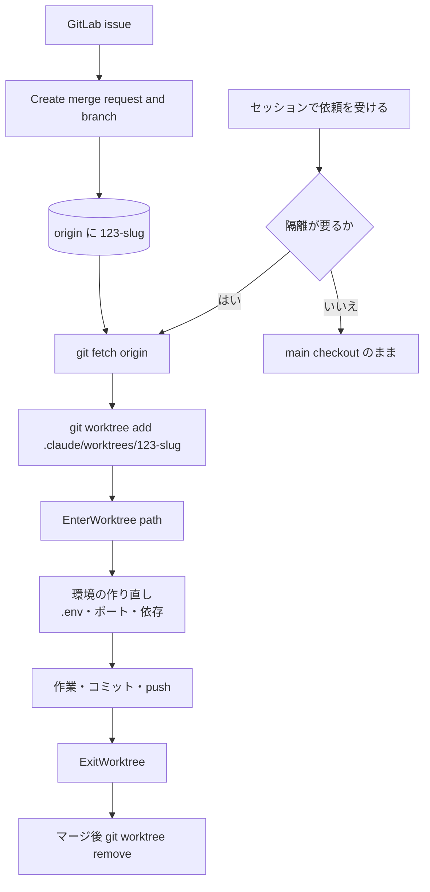

# GitLab のマージリクエストのブランチで worktree に入るなら git で自分で追加してパスで入るのがよいはず (未検証)

## 噛み合わない点

チームの標準的な流れが「issue を作る → Create merge request and branch でリモートにブランチと
マージリクエストを作る → ローカルで checkout して作業」だとすると、**作業を始める時点でブランチは
既にリモートにある**。

ところが [並列で走らせるエージェントは git worktree で隔離する](parallel-agents-isolated-by-worktree.md)
で使う 2 つの入口は、どちらもブランチ名を受け取らない。`EnterWorktree` も `claude --worktree <name>` も
分岐元は `worktree.baseRef` が決め、値は `"fresh"` (リモートのデフォルトブランチ) か `"head"` (手元の HEAD)
の 2 つしかない。新しいブランチを作る前提の設計なので、既にあるブランチに乗る道がそのままでは無い。

## 道は 3 つ

### A. 起動時にマージリクエスト番号を渡す

```sh
claude --worktree "#123"
```

番号を `#` 付きで渡すか、`https://gitlab.com/group/repo/-/merge_requests/123` の URL を渡す。
Claude Code が origin からその変更の head をフェッチし、`.claude/worktrees/pr-123` に worktree を作る。
フェッチ経路は origin のホストで決まり、gitlab.com なら `merge-requests/<番号>/head`、
自己管理の GitLab を含むその他のホストでは `pull/<番号>/head` を試してから `merge-requests/<番号>/head` に落ちる。

`.worktreeinclude` が効くので `.env` のコピーは自動。欠点は**起動時に決めなければならない**ことと、
VS Code 拡張のチャットパネルからはフラグを渡せないこと。

### B. 自分で worktree を足して path で入る

```sh
git fetch origin
git worktree add .claude/worktrees/123-slug -B 123-slug origin/123-slug
```

そのうえで `EnterWorktree` に `path` として `.claude/worktrees/123-slug` を渡す。`.claude/worktrees/` の
下にあるパスなので承認プロンプトは出ない。既存ブランチを名指しできるのは git 側だけなので、
ブランチの指定を git に任せ、隔離への移動だけ Claude Code にやらせる形になる。

欠点が 2 つ。`.worktreeinclude` が処理されるのは Claude Code が git で作った worktree だけなので、
`.env` の持ち込みとポートの差し替えは自分でやる。もう 1 つ、Claude Code が付けるマーカーが無いため
定期 sweep は消さない。後始末は `git worktree remove` を自分で打つ。

### C. worktree で作ってから push 先を合わせる

`EnterWorktree` に普通に新しい worktree を作らせ、コミットしてから `git push origin HEAD:123-slug` で
既存のマージリクエストのブランチに載せる。ブランチ名の一致を人が管理することになり、取り違えの余地が残る。

## 既定にするなら B

判断を依頼を読んだ後に置ける道は B だけで、VS Code 拡張のパネルからも使える。A は速いが起動時の決め打ちで、
[並列で走らせるエージェントは git worktree で隔離する](parallel-agents-isolated-by-worktree.md) の
「重さが分かってから決める」を捨てることになる。



## 確かめていないこと

- **A がブランチの上に置くのか、切り離した状態にするのか。** ドキュメントは「その変更の head コミットを
  フェッチして worktree を作る」としか書いていない。そのまま push してマージリクエストが更新されるかは未確認
- 自己管理の GitLab で `pull/<番号>/head` を先に試す挙動が、失敗を 1 回挟むだけで済むのか
- **B で手作りした worktree に `EnterWorktree` の `path` を渡したときに受理されるか。** 通常の
  `git worktree add` なら git メタデータが main checkout に解決されないので通るはずだが、試していない
- ブランチ名に `/` が入るとき (`feature/123-slug`) の worktree ディレクトリ名の扱い
- 手順全体を実行していない。GitLab 側の設定 (ブランチ名テンプレート、保護ブランチ) の影響も見ていない

## 昇格の目安

- [ ] 粒度が type の定義に収まっている (道を 1 つに絞れば `how-to` になる)
- [ ] sources に一次情報がある
- [ ] 実際に issue からマージまで通して applies_to と verified_at を書ける
