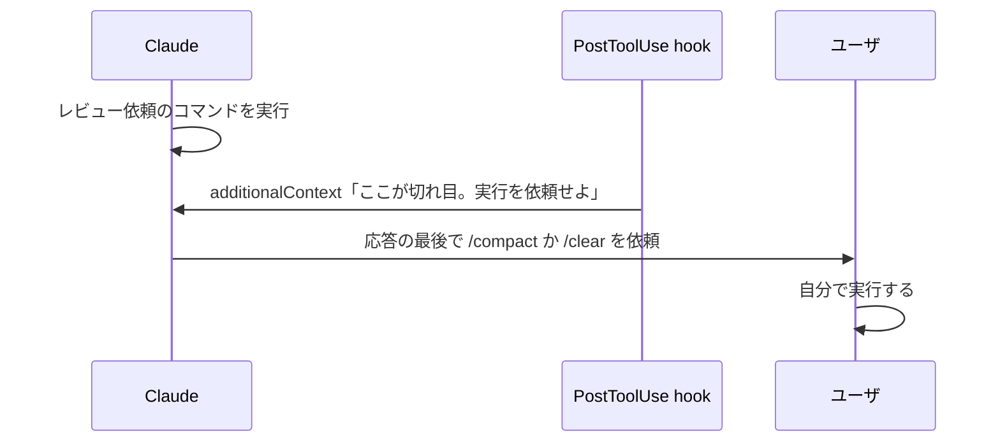

# タスクの切れ目で /compact と /clear をユーザに依頼させる

## 課題

長いセッションでは、レビュー依頼を出した直後のような自然な区切りを過ぎても、会話がそのまま次の作業へ流れる。
区切りで文脈を捨てないまま進むと、自動圧縮が「閾値に達した時点」で走る。その時点はたいてい次のタスクの最中で、要約は自動パスが重要と推測したものだけを残すので、進行中の作業の細部が薄まる。

エージェント側でこれを直せない。`/compact` と `/clear` は built-in command で、固定のロジックを直接実行する。
Claude が呼べるのは `Skill` ツールだけで、これは skill を実行するものであり built-in command は打てない。つまり文脈を切る操作は必ず人の手を経る。

## 解決

区切りを hook で検出し、`additionalContext` で「ユーザに実行を依頼せよ」という指示を注入する。Claude は依頼文を応答に含め、ユーザが自分で打つ。



区切りがコマンドで判定できるなら `PostToolUse` が一番素直で、ターンも増えない。

```json
{ "hooks": { "PostToolUse": [
  { "matcher": "Bash", "hooks": [{ "type": "command", "command": ".claude/hooks/suggest-context-reset.sh" }] }
] } }
```

```sh
#!/bin/sh
# レビュー依頼のコマンドを見たら、タスクの切れ目として Claude に伝える
node -e '
let s = ""; process.stdin.on("data", d => s += d).on("end", () => {
  const cmd = (JSON.parse(s).tool_input || {}).command || "";
  if (!/(gh pr create|glab mr create)/.test(cmd)) { process.stdout.write("{}"); return; }
  process.stdout.write(JSON.stringify({ hookSpecificOutput: {
    hookEventName: "PostToolUse",
    additionalContext: "レビュー依頼を出した。ここがタスクの切れ目。応答の最後に 1 行で、"
      + "同じ主題を続けるなら /compact を、別のタスクに移るなら /clear を実行するようユーザに頼むこと。"
      + "これらは built-in command なので自分では実行できない。"
  } }));
});'
```

注入先は目的で選ぶ。

| やりたいこと | イベント | 返す値 |
|---|---|---|
| コマンドで区切りを判定し、Claude に依頼させる | `PostToolUse` | `additionalContext` |
| 応答が終わってから依頼させる | `Stop` | `additionalContext` (会話が続くのでターンが 1 回増える) |
| モデルを介さずユーザに直接見せる | `Stop` | `systemMessage` |

`Stop` の `additionalContext` は transcript に `Stop hook feedback` として出て、会話が継続する。ループ保護は `stop_hook_active` と 8 連続継続の上限。
トークンを一切使わずに知らせたいだけなら `systemMessage` にする。ただしこちらは Claude が読まないので、応答本文には現れない。

依頼文では `/compact` と `/clear` を必ず書き分ける。同じ主題を続けるなら `/compact` (焦点を渡せる: `/compact focus on the auth bug fix`)、別の仕事に移るなら `/clear`。

## 適用条件

効く条件。

- 区切りが機械的に判定できる (レビュー依頼、デプロイ、テストが green になった時点)
- 1 セッションを長く使い、区切りをまたいで別のタスクに移る運用
- 対話セッションであること

効かない条件。

- 非対話 (`-p`) 実行。依頼を受け取る人がいない
- 区切りが曖昧で、判定が当たったり外れたりする場合。頻繁に出す依頼は無視される
- 単に自動圧縮を早めたいだけの場合。それは `/autocompact 500k` のように閾値を直接動かすほうが確実

## トレードオフ

- 得るもの: 圧縮の位置を人が選べる。焦点を指定した `/compact` や、完全に捨てる `/clear` を、作業が途切れている時点で打てる
- 失うもの: 注入文のトークンが区切りごとに乗る。強制力は無く、Claude が依頼を書き落とすことがある
- コマンド判定を生の `tool_input.command` に正規表現でかけているので、引用符やコメントに誤爆する。厳密にやるなら字句解析してから判定する
- hook がタイムアウトすると出力は破棄され、依頼はそのまま消える。壊れても実害が無い用途なのでこれは許容できる

## 関連

- [生の文字列でコマンドを判定すると引用符とコメントに誤爆する](regex-command-match-misfires.md)
- [タイムアウトした hook はガードにならず素通りする](hook-timeout-fails-open.md)
- [Gemini CLI には圧縮後に発火する hook が無い](gemini-cli-no-post-compress-hook.md)
