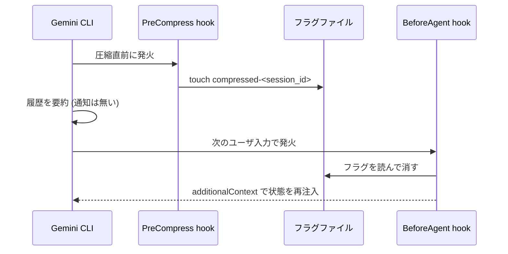

# Gemini CLI には圧縮後に発火する hook が無い

## 症状

Claude Code で「圧縮されたら状態を入れ直す」構成を組み、同じものを Gemini CLI に移すと動かない。
`/compress` を打っても自動圧縮が走っても、圧縮後に実行したい処理が一度も呼ばれない。エラーも警告も出ない。

Claude Code 側の元の構成は次のもの。`SessionStart` の matcher に `compact` があり、圧縮直後の再開を捕まえて stdout をコンテキストに注入できる。

```json
{ "hooks": { "SessionStart": [
  { "matcher": "compact", "hooks": [{ "type": "command", "command": ".claude/hooks/reseed.sh" }] }
] } }
```

これをそのまま `.gemini/settings.json` に写しても、`matcher` が効かないだけでなく、圧縮では `SessionStart` 自体が発火しない。

## 原因

Gemini CLI の hook イベントは圧縮の**前**しか持たない。

| | 圧縮前 | 圧縮後 |
|---|---|---|
| Claude Code | `PreCompact` (matcher `manual` / `auto`) | `PostCompact`、および `SessionStart` の source `compact` |
| Gemini CLI | `PreCompress` (input の `trigger` が `manual` / `auto`) | **無し** |

- Gemini CLI の `SessionStart` の source は `startup` / `resume` / `clear` の 3 つだけ。圧縮は含まれない
- `PostCompress` に相当するイベントが存在しない
- `PreCompress` は advisory で、返せるのは `systemMessage` だけ。圧縮を止めることも、要約を差し替えることも、コンテキストを注入することもできない。matcher も取らない

つまり「圧縮が起きたこと」を知れるのは圧縮**直前**の 1 回きりで、その時点ではまだ何も注入できない。

## 回避策

`PreCompress` でフラグファイルを落とし、次に発火する hook でフラグを見て処理し、消す。



拾う側は目的で選ぶ。

- **コンテキストを入れ直したい** → `BeforeAgent`。ユーザ入力後・計画前に発火し、`hookSpecificOutput.additionalContext` がそのターンのプロンプトに追記される。Claude Code の `SessionStart` 注入に一番近い
- **副作用を走らせたいだけ** (索引の再生成、ログ、外部への通知) → `BeforeTool` でもよい。ただしツールを一度も呼ばないターンでは発火しない

hook スクリプトの骨子。stdin に JSON、stdout も JSON 1 個だけ。デバッグ出力を stdout に混ぜると parse が壊れるので stderr に出す。

```sh
# PreCompress: フラグを置くだけ
flag_dir="${TMPDIR:-/tmp}/gemini-flags"; mkdir -p "$flag_dir"
sid=$(node -e 'let s="";process.stdin.on("data",d=>s+=d)
  .on("end",()=>process.stdout.write(JSON.parse(s).session_id))')
: > "$flag_dir/compressed-$sid"
echo '{"systemMessage":"圧縮した。次のターンで状態を入れ直す"}'
```

```sh
# BeforeAgent: フラグがあれば注入して消す
flag_dir="${TMPDIR:-/tmp}/gemini-flags"
sid=$(node -e 'let s="";process.stdin.on("data",d=>s+=d)
  .on("end",()=>process.stdout.write(JSON.parse(s).session_id))')
flag="$flag_dir/compressed-$sid"
[ -f "$flag" ] || { echo '{}'; exit 0; }
rm -f "$flag"
node -e 'const c=require("fs").readFileSync("AGENTS.md","utf8");
  process.stdout.write(JSON.stringify({hookSpecificOutput:
    {hookEventName:"BeforeAgent",additionalContext:c}}))'
```

注意点。

- フラグ名に `session_id` を入れる。並行セッションで取り違える。共通入力フィールドは `session_id` / `transcript_path` / `cwd` / `hook_event_name` / `timestamp`
- 読んだら必ず消す。消し忘れると毎ターン注入し続けてトークンを食う
- 自動圧縮は連続で起きうる。フラグは有無だけの真偽値として扱い、回数を数えない
- `BeforeAgent` が失敗するとフラグごと注入が落ちる。注入に失敗したら消さない順序にするか、失敗を stderr に残す

## 移植時の名前の対応

hook 名が Claude Code と違うので、設定を写すときは機械的に置換できない。

| Claude Code | Gemini CLI |
|---|---|
| `PreToolUse` | `BeforeTool` |
| `PostToolUse` | `AfterTool` |
| `UserPromptSubmit` | `BeforeAgent` |
| `Stop` | `AfterAgent` |
| `PreCompact` | `PreCompress` (matcher 無し、`trigger` で判別) |
| `SessionStart` (`compact`) | 対応無し |

設定ファイルも `.claude/settings.json` ではなく `.gemini/settings.json`。

## 再現条件

gemini-cli 0.58.0 の hooks リファレンスと claude-code 2.1 の hooks ドキュメントで、イベント一覧と `SessionStart` の source 値を突き合わせて確認した。

## 関連

- [タイムアウトした hook はガードにならず素通りする](hook-timeout-fails-open.md)
- [権限は permissions.deny ではなく PreToolUse hook で止める](deny-by-hook-not-permissions.md)
