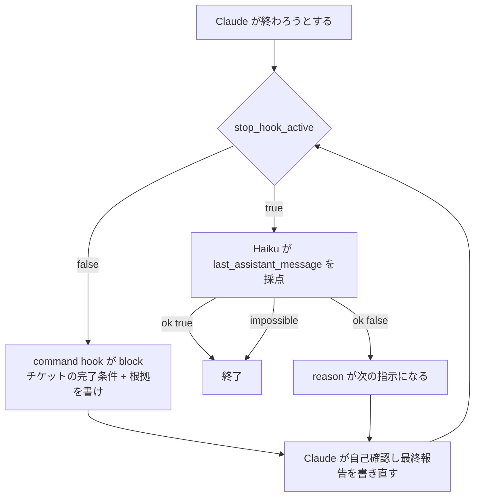

# Stop の 2 回目は prompt 型 hook で Haiku に最終報告をレビューさせた方がよさそう

## 課題

[完了時にやらせたい作業はチケットに置き Stop hook で 1 回だけ機械的に差し戻すべき](return-once-with-the-ticket-checklist.md) は、
1 回目の Stop でチェックリストを貼って自己確認させる。判定を持たないので誤 block は無いが、
作業した本人が採点するので「全部やった」と書けば通る。凡庸でも自信を持って褒める側の目しか無い
([完了条件は達成型・収束型・判定型に分けて達成型だけを Stop hook に置いた方がよさそう](../../workflow/three-types-of-completion-conditions.md) の判定型)。

このリポジトリの hook 知見は LLM を呼ぶ hook を勧めていない。`type: "prompt"` はタイムアウトで素通りするのでガードにならず
([タイムアウトした hook はガードにならず素通りする](../common/hook-timeout-fails-open.md))、判定がプロンプトへ漏れ出す。
ただし Stop の 2 回目だけは事情が違う。守るのは動作ではなく報告の質で、素通りしても「レビュー無しで終わる」以上の被害が無い。
ここだけは prompt 型を例外として使う。

## 解決

Stop に hook を 2 本置き、`stop_hook_active` で役割を分ける。1 回目は機械的な差し戻し、2 回目は別のモデルによるレビュー。

| 回 | `stop_hook_active` | command hook (1 段目) | prompt hook (2 段目、Haiku) |
|---|---|---|---|
| 1 回目 | false | block。reason にチケットの完了条件と「項目ごとに根拠を最終報告に書け」 | 何も見ずに `ok: true` |
| 2 回目 | true | approve | `last_assistant_message` を読み、根拠の無い項目・TODO・矛盾があれば `ok: false` + reason |
| 3 回目以降 | true | approve | 同上。直せないと報告していれば `impossible: true` で終わらせる |

```json
{
  "hooks": {
    "Stop": [
      {
        "hooks": [
          { "type": "command", "command": "sh .claude/hooks/stop-checklist.sh", "timeout": 10 },
          {
            "type": "prompt",
            "timeout": 60,
            "prompt": "You review the final report of a coding agent. Input: $ARGUMENTS\nRules:\n- If stop_hook_active is false, or background_tasks is non-empty, respond {\"ok\": true} without reviewing.\n- Otherwise read last_assistant_message and check: (1) every completion condition it lists has evidence (a command and its result, a path, a commit); (2) no TODO, placeholder, or 'later' item remains; (3) no claim contradicts its own evidence.\n- Respond {\"ok\": true} when all pass. Otherwise {\"ok\": false, \"reason\": \"<the missing items, one line each>\"}.\n- If the report says a remaining item needs the user's decision or cannot be done in this session, respond {\"ok\": false, \"reason\": \"...\", \"impossible\": true}."
          }
        ]
      }
    ]
  }
}
```

1 段目の command hook は既存 pattern のものをそのまま使う。reason の末尾に「最終報告では完了条件を 1 項目ずつ根拠付きで列挙する」と
足しておくと、2 段目が読む材料が `last_assistant_message` に揃う。Haiku はチケットを読めないので、これが無いと採点する対象が無い。

`model` は書かなくてよい。公式文書は「Haiku by default」と言い切っている。固定したいなら `claude-haiku-4-5-20251001` のようなモデル ID を書く。



## 適用条件

公式 hooks リファレンス (2026-09 時点) で確かめた前提は次の 4 つ。実際に 2 本を登録して走らせてはいない。

- prompt hook に渡るのは **hook 入力の JSON だけ**。`$ARGUMENTS` の位置に埋まり、無ければ末尾に足される。会話も transcript も見えない。
  公式の例文は「Analyze the conversation」と書いているが、モデルが読めるのは Stop の入力にある `last_assistant_message` までなので、
  レビューの対象は最終報告の文面に限る。だから 1 段目で報告の形を整えさせる
- `ok: false` の `reason` は Stop では「Claude の次の指示」として戻り、ターンが続く。`impossible: true` を付けると reason を戻さずに終わらせる。
  8 回連続の継続で Claude Code 側が打ち切るので、Haiku が厳しすぎても止まらなくなることは無い
- `if` は tool イベントでしか評価されず、Stop に付けると **その hook は一度も走らない**。2 回目だけに絞る条件は prompt の中に書くしかなく、
  1 回目にも Haiku の呼び出しが 1 回起きる。決定的に絞りたいなら command hook から `claude -p --model haiku` を呼ぶ形に変える
- 同じイベントの hook は並列に走る ([同じイベントの hook は並列に走り settings.json の配列順は実行順ではない](../common/hooks-run-in-parallel-not-in-array-order.md))。
  1 回目に両方が block したときの合成は公式文書に無いので、prompt 側を `stop_hook_active` で黙らせて同時 block を作らない

効かないのは、完了条件がチケットに無い作業と、報告に書けない根拠 (画面の見た目、外部システムの状態) が完了条件の中心にある作業。
ファイルや diff を見ないと判定できないなら `type: "agent"` (experimental、既定 timeout 60 秒) が Read / Grep で確かめられるが、
公式が production では command hook を勧めているので、まず報告の形を整える側で解決する。

`/goal` は公式文書が「session-scoped な prompt 型 Stop hook のショートカット」と説明している。条件を対話で 1 回だけ決めるなら
`/goal`、リポジトリの全セッションに掛けるなら settings.json の 2 段目、と使い分ける。

## トレードオフ

- 得る: 作業者以外の目が入る。人がレビューする前に「根拠の無い完了宣言」と「TODO を残した完了宣言」が落ちる
- 失う: Stop ごとに Haiku の呼び出しが 1 回、差し戻しが起きればさらに 1 往復。短い質問応答が続くセッションでは邪魔なので、
  1 段目と同じくチケットがあるときだけ動かす条件を prompt に書く (`cwd` にチケットがあるかは Haiku に分からないので、
  1 段目の reason に「チケット ID」を含めさせ、報告にそれが無ければ `ok: true` で通す、が現実的)
- タイムアウトは fail-open。Haiku が 60 秒で返さなければレビュー無しで終わる。ここを fail-closed にしようとしない。
  この pattern は screening であってガードではなく、人のレビューが後ろに残っている前提で成り立つ
- Haiku は報告しか読めないので、報告が上手ければ通る。嘘の根拠 (実行していないコマンドの結果) は見抜けない。
  客観的に見える項目 (未コミットの変更、lint の error) は 1 段目の command hook が事実として並べる方が強い
- `type: "prompt"` を使う例外はここだけに留める。PreToolUse や PostToolUse の判定に広げると、素通りが「許可」に化ける元の問題に戻る

## 関連

- [完了時にやらせたい作業はチケットに置き Stop hook で 1 回だけ機械的に差し戻すべき](return-once-with-the-ticket-checklist.md)。1 段目
- [完了条件は達成型・収束型・判定型に分けて達成型だけを Stop hook に置いた方がよさそう](../../workflow/three-types-of-completion-conditions.md)。この pattern が受け持つのは判定型の十分条件
- [タイムアウトした hook はガードにならず素通りする](../common/hook-timeout-fails-open.md)。prompt 型を避ける本則。ここはその例外
- [敵対的レビューは独立コンテキストの読み取り専用サブエージェントに切り出すべき](../../agents/adversarial-review-in-isolated-subagent.md)。diff まで読ませたいときはこちら
- [サブエージェントとメインエージェントの完了条件は共有状態に触るかで分けるべき](../13-SubagentStop/split-completion-checks-between-parent-and-subagent.md)。SubagentStop にも同じ形で置ける
