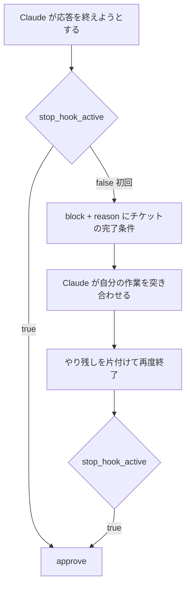

# 完了時にやらせたい作業はチケットに置き Stop hook で 1 回だけ機械的に差し戻す

## 課題

Claude Code は作業を書き終えると「完了しました」で応答を終える。だが終わっていないことが多い。
テストを流していない、`pnpm check` を通していない、コミットしていない、worktree を残している、チケットの TODO を消していない。
note の記事はこの症状を「コードを書いた直後に完了宣言し、staged のまま放置された worktree が残る」と書いている。

CLAUDE.md や skill に「終わる前にコミットすること」と書いても効きは確率的で、長いセッションほど落ちる。
かといって settings.json 側に完了条件を書き込むと、条件がタスクごとに違うので破綻する。
「index を再生成してからコミット」はこのリポジトリの話、「マイグレーションを流す」は別リポジトリの話で、hook は両方を知らない。

Stop hook で止める発想は記事に既にある。ただし Qiita は `type: "prompt"` の hook に判定用 LLM を呼ばせ、
note は shell で git の状態を出してから LLM に approve / block を決めさせている。どちらも**判定を hook 側に持たせている**ので、
タスク固有の完了条件が hook のプロンプトへ漏れ出し、レイテンシとトークンと誤 block が付いてくる。

## 解決

判定を hook から外す。hook は「1 回だけ止めてチケットを読ませる」ことだけをする。

1. 完了条件はチケット (このリポジトリなら `wip/tickets/<id>.md`) に、タスクを始めるときに書く
2. Stop hook は入力の `stop_hook_active` を見る。`false` なら `decision: "block"` を返し、`reason` にチケットの完了条件をそのまま載せる
3. `true` なら何も見ずに `decision: "approve"`。つまり差し戻しは 1 セッション 1 回だけ
4. 差し戻された Claude は、reason に入ったチェック項目と自分の作業を突き合わせ、残っていれば片付けてから終わる

hook 本体はチケットを読んで貼るだけなので、判定ロジックを持たない。完了条件が変わってもチケットだけ書き換えればよい。

## 適用条件

`stop_hook_active` が「hook が止めた結果いま継続している」を表すので、これを見れば追加の状態ファイルなしに 1 回だけの差し戻しが書ける。
Claude Code 2.1.260 (VS Code 拡張に同梱の実体) の実装を読むと、Stop と SubagentStop の入力に次が入っている。

| フィールド | 中身 |
|---|---|
| `stop_hook_active` | hook による差し戻し中かどうか |
| `last_assistant_message` | 直前の応答本文。transcript を読まずに完了宣言の文面を見られる |
| `background_tasks` | 実行中の background 作業。「終わった」と「待っている」を区別できる |
| `session_crons` | このセッションを後で起こす予約 |

出力は `{"decision":"block","reason":"..."}` か exit 2 で、`reason` が Claude に渡る。
連続 block には上限があり、既定は 8 回。超えると Claude Code が警告を出してターンを強制終了し、
「`stop_hook_active` を見て true の間は成功を返せ」という趣旨の文言を出す。上限は `CLAUDE_CODE_STOP_HOOK_BLOCK_CAP` で変えられる。
つまり `stop_hook_active` を無視した無条件 block でもセッションは死なないが、8 往復ぶんのトークンを捨てることになる。

このフィールドは 2026-09-05 時点の公式 hooks ドキュメントには載っていない。上の表は同梱実体を読んだ結果で、実際に hook を登録して走らせたわけではない。

`Stop` と `SubagentStop` は settings.json の別のキーで、片方に登録してももう片方では発火しない。
実体側も、終わろうとしているのがサブエージェントなら `hook_event_name` を `SubagentStop` にして分岐している。
サブエージェントにも自己確認をさせたいなら両方に登録する。`stop_hook_active` はどちらにも入るので同じスクリプトを使い回せる。
`SubagentStop` 側には `agent_id` `agent_type` `agent_transcript_path` が足されるので、エージェントの種類ごとにチケットを出し分けるならこれで分岐する。
ただし差し戻しの `reason` が届くのはサブエージェント本人で、親は最終報告しか見ない。親に効かせたい確認は親の `Stop` 側に置く。

効かないのは、完了条件を事前に言葉にできないタスク。何をもって終わりかが作業しながら決まるなら、貼る中身が無い。

## トレードオフ

- 毎ターン 1 往復増える。差し戻しは応答の終わりごとに起きるので、短い質問応答が続くセッションでは邪魔になる。チケットが存在するときだけ block する条件を付けて絞る
- 判定をエージェントに預けるので、エージェントが「全部やった」と嘘をつけば通る。hook は読ませたことしか保証しない。客観的に見える項目 (未コミットの変更、worktree の残り) は note の記事のように shell 側で事実として並べて `reason` に混ぜると強くなる。判定させるのではなく事実を渡すのがこの pattern の線
- LLM に判定させる版 (Qiita、note) に比べて誤 block は無い代わりに、見逃しも止められない。確実に止めたい 1 項目があるなら、それだけを決定的な条件として hook に持たせる
- ガード系ではなく注入系の hook なので、落ちたら差し戻しが黙って消える。チケットが読めなかったときは reason にその旨を書いて block する側に倒す

## 関連

- [hook は注入系とガード系に分かれ失敗時の既定は逆であるべき](../common/injecting-vs-guarding-hooks.md) — この差し戻しをどちらの型として書くか
- [意味理解を要する判定はエージェントのもので、スクリプトには決定的な判定だけがあるべき](../../skills/scripts/delegate-meaning-to-agent-keep-scripts-decidable.md) — 判定を hook から外す根拠
- [タスクの切れ目で /compact と /clear をユーザに依頼させた方がよさそう](../22-PostToolUse/ask-user-to-reset-context-at-task-boundaries.md) — 同じく応答の切れ目に介入する話
- [サブエージェントとメインエージェントの完了条件は共有状態に触るかで分けるべき](../13-SubagentStop/split-completion-checks-between-parent-and-subagent.md) — 同じ差し戻しをサブエージェントへ広げるときの分け方
- [Agent ツール周りの hook 入出力はイベントごとにフィールドの有無と命名が異なる](../../agents/agent-tool-hook-fields-reference.md) — SubagentStop 側の入力
