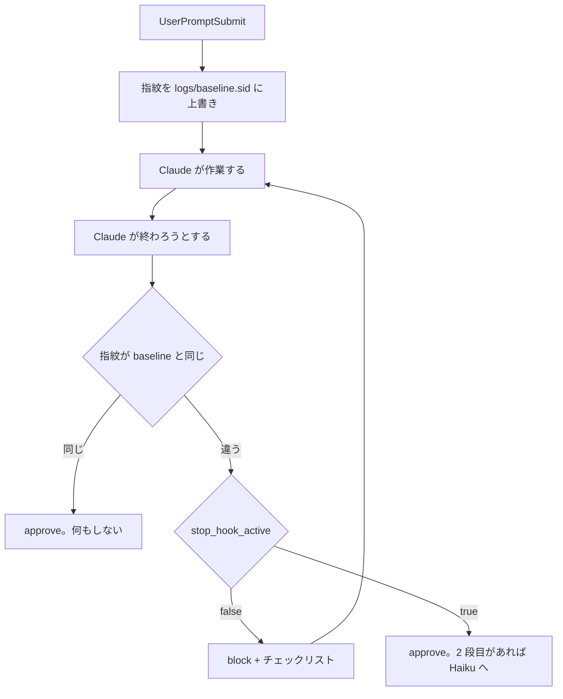

# Stop hook の自己チェックとエージェントチェックはターン開始時からの差分があるときだけ走らせた方がよさそう

## 課題

Stop hook で自己チェック ([完了時にやらせたい作業はチケットに置き Stop hook で 1 回だけ機械的に差し戻すべき](return-once-with-the-ticket-checklist.md)) や
エージェントチェック ([Stop の 2 回目は prompt 型 hook で Haiku に最終報告をレビューさせた方がよさそう](haiku-prompt-hook-reviews-final-report-on-second-stop.md)) を
settings.json に置くと、応答が終わるたびに走る。Stop には matcher も `if` も無いので、登録した hook はすべての Stop で必ず発火する
(公式 hooks リファレンス 2026-09 時点)。

困るのは何も変えていないターン。「この関数は何をしている?」に答えただけで、チェックリストが貼られて 1 往復増え、Haiku の呼び出しが 1 回起きる。
どちらの pattern も「チケットがあるときだけ」で絞ることを勧めているが、チケットがあるセッションの中でも質問応答のターンは多い。
チケットの有無はセッションの性質で、そのターンで何かしたかは別の軸で見る必要がある。

## 解決

「ターンの始まりから作業ツリーが変わったか」を機械的に見て、変わっていなければ Stop hook は何もせず approve する。

イベントの対で考える。SessionStart と対になるのは SessionEnd で、Stop (ターンの終わり) と対になるのは UserPromptSubmit (ターンの始まり)。
だから baseline はセッション開始ではなく、プロンプトが送られるたびに取り直す。

1. UserPromptSubmit hook が作業ツリーの指紋 (HEAD、`git status --porcelain`、`git diff HEAD` を連結してハッシュ) を `logs/baseline.<session_id>` に上書きする
2. Stop hook は同じ指紋を計算し、baseline と同じなら exit 0 で終わる。違うときだけ既存の差し戻し (1 回目 block、2 回目 approve) に進む
3. Haiku の 2 段目はファイルを読めないので、1 段目が block しなかった (= 報告に完了条件の列挙が無い) ことを手掛かりに `ok: true` で通す

```sh
# .claude/hooks/turn-baseline.sh (UserPromptSubmit)
input=$(cat)
sid=$(printf '%s' "$input" | jq -r '.session_id')
cd "$(printf '%s' "$input" | jq -r '.cwd')" || exit 0
mkdir -p logs
{ git rev-parse HEAD; git status --porcelain -uall; git diff HEAD; } 2>/dev/null \
  | git hash-object --stdin > "logs/baseline.$sid"
```

```sh
# .claude/hooks/stop-checklist.sh の冒頭に足す
input=$(cat)
sid=$(printf '%s' "$input" | jq -r '.session_id')
cd "$(printf '%s' "$input" | jq -r '.cwd')" || exit 0
base="logs/baseline.$sid"
if [ -f "$base" ]; then
  now=$({ git rev-parse HEAD; git status --porcelain -uall; git diff HEAD; } 2>/dev/null | git hash-object --stdin)
  [ "$now" = "$(cat "$base")" ] && exit 0   # このターンで何も変わっていない。チェックを走らせない
fi
# 以降は既存の差し戻し (stop_hook_active を見て 1 回だけ block)
```

ハッシュに `git hash-object --stdin` を使うのは、`sha1sum` と `shasum` のどちらがあるかが Git Bash、WSL、web で揃わないため。git があれば必ずある。
`cd` 先を hook 入力の `cwd` にしているのは、worktree で走らせたとき親リポジトリではなく worktree の指紋を取るため
([worktree に入ったらガード hook の前提が変わった](../common/hook-guards-under-worktree-isolation.md))。



## 適用条件

- 差し戻し中 (`stop_hook_active` が true の継続) は UserPromptSubmit が挟まらないので baseline は動かない。1 回目の block で片付けた変更も 2 回目の Stop で「差分あり」に見え、2 段目のレビューに進む
- 指紋に HEAD を含めるので、ターンの中で全部コミットして `git status` が空に戻っても「差分あり」になる。コミットで終わるターンにもチェックが掛かる
- ターン開始時点で未コミットの変更が残っていても、それは baseline に含まれるので、触らない限り「差分なし」。前のターンや前のセッションの残骸で毎回止まることは無い
- baseline が無い (UserPromptSubmit hook が落ちた、`logs/` が消された) ときは**チェックを走らせる側**に倒す。
  gate はコストを削るための物で、gate が壊れたときに差し戻しまで消えるのは損の方が大きい
- 追跡外ファイルは `git status -uall` で名前しか見ていない。ターン開始時から存在する追跡外ファイルの中身だけを書き換えた場合は「差分なし」に見える。
  `wip/local/` や `logs/` の下だけを触るターンではチェックが走らないが、それらはコミット対象でないので実害は小さい
- 効かないのは、成果物が変更ではなく回答のタスク (調査、設計の相談)。作業ツリーが変わらないので gate が閉じたまま終わる。
  そういうタスクでもレビューが欲しいなら、チケットの調査ログを書かせる (それで差分が出る) か、このタスクだけ `/goal` で条件を掛ける

公式 hooks リファレンス (2026-09 時点) で確かめたのは、全イベントの入力に `session_id` と `cwd` があること、UserPromptSubmit と Stop に matcher と `if` が効かず毎回発火すること。
上の 2 本を登録して走らせて確かめたわけではない。

## トレードオフ

- 得る: 質問応答のターンで 1 往復と Haiku 1 回が消える。チケット有無の gate と重ねると、「作業セッションの、何かを変えたターン」だけに絞れる
- 失う: プロンプトごとに git を 3 回叩く。大きいリポジトリでは `git diff HEAD` の出力が MB 単位になり、UserPromptSubmit の体感遅延になる。
  そのときは `git diff HEAD --stat` に落とす (内容の差は見えなくなるが、変更ファイルの一覧と行数で十分なことが多い)
- セッション開始時に 1 回だけ取る案と比べると、baseline を書く回数は増えるが、「一度でも変えたあとの質問応答ターンに毎回チェックが掛かる」問題が無い。
  Stop の対は UserPromptSubmit なので、ターン単位で見る方が自然
- 状態ファイルが 1 つ増える。`logs/` はセッションをまたいで残るので、UserPromptSubmit で 7 日より古い `logs/baseline.*` を消す掃除を同じスクリプトに入れる (ローテーションは書き手の責任)

## 関連

- [完了時にやらせたい作業はチケットに置き Stop hook で 1 回だけ機械的に差し戻すべき](return-once-with-the-ticket-checklist.md)。gate の先にある 1 段目
- [Stop の 2 回目は prompt 型 hook で Haiku に最終報告をレビューさせた方がよさそう](haiku-prompt-hook-reviews-final-report-on-second-stop.md)。2 段目。prompt 型はファイルを見られないので 1 段目の結果に連動させる
- [状態を持たない LLM への環境情報は変わる頻度で hook イベントを分けて注入した方がよさそう](../common/split-state-injection-by-staleness.md)。ターンごとの事実を UserPromptSubmit で取る考え方が同じ
- [hook の判定材料はリモートに問い合わせず全実行環境で読めるものだけであるべき](../common/hooks-read-local-state-only.md)。指紋はローカル git と hook 入力だけで作る
- [完了条件は達成型・収束型・判定型に分けて達成型だけを Stop hook に置いた方がよさそう](../../workflow/three-types-of-completion-conditions.md)
