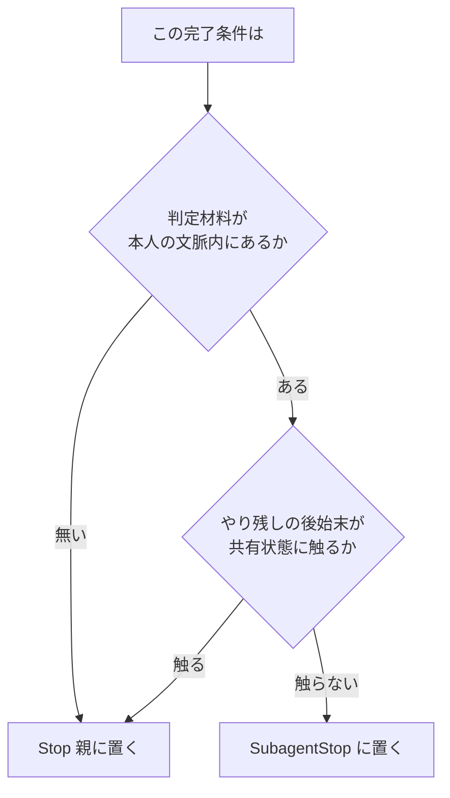

# サブエージェントとメインエージェントの完了条件は共有状態に触るかで分ける

## 課題

Stop hook で完了条件を差し戻す設計をサブエージェントにも広げたくなる。だが同じチェックリストを `SubagentStop` にもそのまま登録すると壊れる。

- サブエージェントは既定で background で並列に走る。「コミットしてから終われ」を各自にやらせると、同じ作業ツリーで index を取り合う
- サブエージェントは自分の文脈の外を知らない。他のサブエージェントが何を触ったかも、チケット全体で何が残っているかも見えないので、「全部終わったか」を判定する材料が無い

逆向きの取りこぼしもある。サブエージェント固有の手抜き、たとえば根拠を示さない報告や、依頼された問いの一部にしか答えない報告は、
親の `Stop` では捕まえられない。親が見るのはサブエージェントの最終報告だけで、その時点で本人は既に終わっている。
差し戻せる相手がいない。

## 解決

完了条件を 1 枚のチェックリストとして持たず、**判定材料と影響範囲がサブエージェント 1 体の文脈に収まるか**で 2 つに割る。

| 完了条件 | 置き先 | 理由 |
|---|---|---|
| 報告に根拠が付いているか (ファイルパスと行、コマンドの出力) | SubagentStop | 判定材料が本人の文脈で閉じる。`last_assistant_message` に報告本文が来る |
| 依頼された問いに全部答えたか | SubagentStop | 同上。答えていなければ本人がその場で調べ直せる |
| 「調べた」「確認した」で中身が無い断定になっていないか | SubagentStop | 差し戻しの `reason` が本人に届き、本人の文脈にまだ材料が残っている |
| 自分専用の作業領域に散らかした一時ファイル | SubagentStop | 他のサブエージェントと領域が分かれているときだけ |
| コミット・push | Stop | 共有状態。並列サブエージェントが同時にやると競合する |
| リポジトリ全体の検査 (`pnpm check`、テスト) | Stop | 他のサブエージェントの差分も混ざる。1 体では合否を判定できない |
| worktree の片付け | Stop | 作ったのは親 |
| チケットの締め、ユーザへの最終報告 | Stop | 全体を知っているのは親だけ |

サブエージェント側は「自分の成果物が report として成立しているか」だけを見る。副作用の後始末は一切持たせない。
親側は「セッション全体としてやり残しが無いか」だけを見る。個々の報告の質は見ない。役割が重ならないので、
どちらの差し戻しも 1 回で終わる。

チケットにもこの 2 つを別の節として書く。1 つの節を両方に貼ると、サブエージェントが親向けの項目を読んでコミットを試みる。

## 適用条件

この分け方が要るのは、サブエージェントに作業をさせている場合。読むだけの調査に使っているなら親の `Stop` だけでよい。

Claude Code 側の制約が 4 つある。前の 3 つは分離を強制する側、最後の 1 つは穴になる側。

- `SubagentStop` の出力は親に届かない。親にやらせたいことをここに書いても伝わらないので、そもそも置けない
- サブエージェントは既定で background なので、親側の `PostToolUse` `Agent` は起動直後に発火する。ここも「作業後の検査」には使えない
- 連続 block の上限 8 回は `Stop` と共通の経路で、サブエージェント側にも効く。並列 10 体なら差し戻しのトークンも 10 体ぶん増える
- 組み込みの `web-fetch` サブエージェントだけは、停止時に managed hook のみへ絞られる。自前の `SubagentStop` hook は走らない (2.1.260 の実体を読んだ結果、走らせて確かめてはいない)。
  自前の種類だけを対象にしたいなら、どのみち `agent_type` で分岐することになる

## トレードオフ

- 完了条件が 2 か所に散る。チケットの節を分けて 1 ファイルに保ち、hook 側はどちらの節を貼るかだけを持つ
- サブエージェント側の条件を厳しくしても報告が遅くなるだけで、質が上がるとは限らない。「共有状態を触らせない」は hook で差し戻すより、
  サブエージェントに渡すツールを絞る方が確実に効く。`SubagentStop` は最後の網であって一次の防御ではない
- 分離を徹底すると、サブエージェントが自分で直せる小さな不備 (書きかけのファイル) まで親に上がってくる。親の差し戻しが増えるなら、
  影響範囲がサブエージェント専用の領域に収まるものだけを個別に戻す

## 関連

- [完了時にやらせたい作業はチケットに置き Stop hook で 1 回だけ機械的に差し戻すべき](../11-Stop/return-once-with-the-ticket-checklist.md) — 親側の本体。差し戻しを 1 回に留める仕組み
- [Agent ツール周りの hook 入出力はイベントごとにフィールドの有無と命名が異なる](../../agents/agent-tool-hook-fields-reference.md) — SubagentStop の出力が親に届かないこと、親へ返す経路
- [サブエージェントは既定で background で走り PostToolUse Agent は起動直後に発火する](../../agents/subagent-runs-in-background-by-default.md) — 親側で作業後の検査ができない理由
- [並列で走らせるエージェントは git worktree で隔離すべき](../../agents/parallel-agents-isolated-by-worktree.md) — 共有状態そのものを分けて競合を消す方向
- [hook は注入系とガード系に分かれ失敗時の既定は逆であるべき](../common/injecting-vs-guarding-hooks.md) — どちらの差し戻しも注入系として書く
