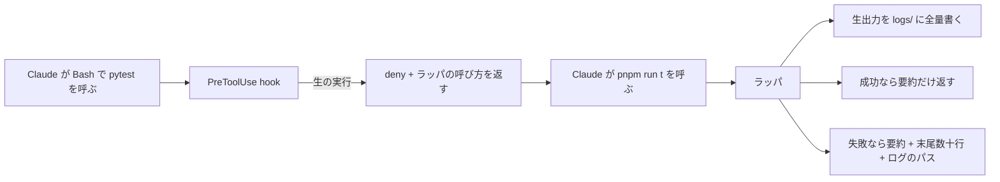

# 生のコマンド実行を deny してラッパスクリプトへ誘導する

## 課題

テスト、ビルド、コンテナ操作、デプロイのようなコマンドを Claude に直接叩かせると、2 つの問題が同時に起きる。

- **出力がそのままコンテキストに載る**。失敗した 1 件を知りたいだけなのに、成功した数百件のログと進捗表示まで丸ごと入る。1 回の実行で数千行になることがあり、残りの作業に使える長さが削られる
- **オプションの制御ができない**。`permissions.allow` に `Bash(pnpm test:*)` と書いても、`:*` は前方一致でしかない。後ろに何を足されても通る。`--force`、`-r`、`--no-verify` のような一語で結果が変わる引数を、許可ルールの粒度では止められない

同じコマンドを人が手で叩くときは、長い出力を目で飛ばし読みし、危ない引数は指が止まる。エージェントにはどちらも無い。

## 解決

そのコマンドの入口をリポジトリ側のラッパスクリプト 1 本に固定し、生の呼び出しは PreToolUse hook で deny する。deny の理由文に代わりの呼び方を書いて、そこへ誘導する。



### 1. hook で止めて案内する

`permissionDecisionReason` は deny のときだけ Claude に届く。ここに「なぜ止めたか」ではなく「代わりに何を叩くか」を書くのが要点で、これが無いと Claude は言い換えて再試行する。

```sh
#!/bin/sh
# 生のテスト実行を止めてラッパへ誘導する。settings.json の matcher は "Bash"。
cmd=$(jq -r '.tool_input.command // ""')
case "$cmd" in
  *pytest*|*vitest*|*"docker compose"*) ;;
  *) exit 0 ;;
esac
cat <<JSON
{"hookSpecificOutput":{"hookEventName":"PreToolUse","permissionDecision":"deny",
"permissionDecisionReason":"このコマンドは直接実行しない。代わりに pnpm run t -- <suite> を使う。要約が返り、生出力は logs/ に全量残るので失敗時はそれを読む"}}
JSON
```

### 2. ラッパは成功時に要約、失敗時に手がかりを返す

```ts
const log = `logs/${name}-${new Date().toISOString().replace(/[:.]/g, '-')}.log`
mkdirSync('logs', { recursive: true })
const r = spawnSync(bin, args, { encoding: 'utf8' })
const raw = `$ ${bin} ${args.join(' ')}\n${r.stdout}${r.stderr}`
writeFileSync(log, raw)

if (r.status === 0) {
  console.log(`ok  ${summarize(r.stdout)}  log=${log}`)   // 例: ok  142 passed / 0 failed  log=logs/...
  process.exit(0)
}
console.log(`fail exit=${r.status}  log=${log}\n${tailLines(raw, 30)}`)
process.exit(1)
```

引数はラッパ側で allowlist する。`--force` のような語は受け取らず、エラーにする。hook で全パターンを正規表現に書くより、入口が 1 本なら判定も 1 箇所で済む。

### 3. ログは常に全量、置き場は logs/ で git 管理外

成功でも失敗でも書く。成功時に捨てると、後から「あのとき何秒かかったか」を確かめられない。`.gitignore` に `logs/` を足し、コミット対象にしない。ログには環境変数やパスが混ざるので、リポジトリに残さないこと自体が目的でもある。

要約に何を出すかはコマンドごとに決める。件数、所要時間、変更されたファイル数のような、次の判断に効く数値だけにする。

## 適用条件

効くのは次のとき。

- 出力が長い、または長さが入力次第で読めないコマンド。テスト、ビルド、コンテナのログ、マイグレーション、デプロイ
- 使ってよい引数が有限で、列挙できる
- 失敗時の生出力が後から必要になる。ログのパスを返せば、Claude は必要なときだけ `sed -n` で該当部分を読める

効かないのは次のとき。

- `ls`、`grep`、`cat` のような探索用のコマンド。ラップすると往復が増えるだけで、出力も短い
- **迂回できる**。`sh -c`、`node -e`、`python -c` の中に埋めれば hook の文字列一致は外れる。ここまで塞ぐなら `permissions.deny` か sandbox にする。この hook は事故と浪費を減らすためのもので、敵対的な回避への防御ではない
- 何でもラップすると、Claude が回り道を探して素の shell に逃げる。対象は出力が長いものと危険なものに絞る

## トレードオフ

- **得る**: 1 回の実行で消費するコンテキストがコマンドの規模によらずほぼ一定になる。危ない引数が入口で落ちる。生出力は失われず、必要なときだけ読める
- **失う**: ラッパの保守。コマンドが増えるたびに入口を足す必要がある。要約を削りすぎると、Claude が結局ログを読みに行って往復が 1 回増える
- hook は毎回のツール呼び出しで走る。`pnpm exec` や `uv run` を挟まず、`sh` か node を直接呼ぶ ([scripting.md](../../../.claude/rules/scripting.md))
- logs/ は放っておくと増え続ける。世代数か日数で切る処理をラッパに入れる

## 関連

- [権限は permissions.deny ではなく PreToolUse hook で止める](deny-by-hook-not-permissions.md)。このパターンの一般形。deny の理由文に代替を書いて誘導する考え方はそちらにまとめてある
- [タイムアウトした hook はガードにならず素通りする](../common/hook-timeout-fails-open.md)。この hook も timeout すると素通りするので、判定は `jq` の文字列一致だけに留め、`timeout` を短く明示する
