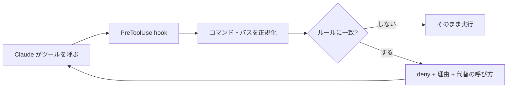

# 権限は permissions.deny ではなく PreToolUse hook で止めるべき

## 課題

settings.json の `permissions.deny` に禁止コマンドを並べるのは、書くのが速く、効きも確実に見える。
それでも運用に入れると 3 つの形で破れる。

- **迂回される**。deny の判定は文字列の一致でしかない。タスクを達成しようとするエージェントは、同じ結果になる別の書き方を探す。
  kawarimidoll の記事が挙げているのは `git push` を禁じたら `/usr/bin/git push` と絶対パスで叩き、`rm` を禁じたら `git rm` に持ち替え、
  両方を禁じたら `mv {file} /tmp/` で消したのと同じ状態にした、という 3 段の回避。ルールを 1 行足すたびに次の抜け道が見つかる
- **理由が届かない**。deny で止めたとき Claude が受け取るのは `Permission to use Bash has been denied.` のような一文だけ。
  なぜ止まったのか、代わりに何を叩けばよいのかが無いので、言い換えて再試行する。上の迂回はこの情報不足の帰結でもある
- **静的で、タスクごとの範囲を書けない**。「今回触ってよいのは scripts/ だけ」のような範囲はタスクごとに変わる。settings.json の固定ルールでは表せない

## 解決

判定をスクリプトに寄せる。`matcher` は広く取り、**どのツールに効かせるかもスクリプト側で決める**。
そのうえで deny の理由文に「なぜ止めたか」と「代わりに何を叩くか」の両方を書いて返す。



### 1. 入口を 1 本にする

```json
{ "hooks": { "PreToolUse": [
  { "matcher": "", "hooks": [{ "type": "command", "command": "node --import tsx \"${CLAUDE_PROJECT_DIR}/scripts/guard.ts\"", "timeout": 10 }] } ] } }
```

`matcher` を空にすると全ツールに走る。ツールの振り分けを hook 側に持つと、ルールが 1 箇所に集まり、
新しい禁止事項を settings.json ではなくルールのデータに足せる。記事の guard-and-guide (Rust 製の CLI) はこの形で、
禁止事項を `rules.toml` に外出ししている。

```toml
# rules.toml のルール 1 件 (実際は配列テーブルで並べる)
matcher = "Bash"                                 # Bash / File (Read|Write|Edit) / Write|Edit
regex = '\bgit\s+add\s+(-A|--all|\.($|[ ;|&]))'
message = "全ファイルを git add しない。追加するファイルを個別に指定する"
```

### 2. 判定の前に正規化する

文字列一致のままスクリプトに移しても迂回耐性は上がらない。[shlex でトークン化](regex-command-match-misfires.md)してから、次を潰す。

- 絶対パス・相対パスを剥がしてコマンド名にする (`/usr/bin/git` → `git`)
- `;` `&&` `|` で分割し、節ごとに判定する。1 節目が無害でも 2 節目で消される
- 同じ結果になる書き方を同じルールに寄せる (`rm` と `git rm`、`mv` の一時ディレクトリ行き)

### 3. 理由と追加コンテキストを分けて返す

```json
{ "hookSpecificOutput": {
  "hookEventName": "PreToolUse",
  "permissionDecision": "deny",
  "permissionDecisionReason": "git push は禁止。push が要るならユーザーに依頼する",
  "additionalContext": "作業前に読み直す: .claude/rules/scripting.md" } }
```

`permissionDecisionReason` は拒否理由として Claude に返り、`additionalContext` は system reminder の平文として渡る。
理由が Claude に届くのは `deny` のときだけで、`allow` と `ask` では人に表示されるだけなのに注意する。
どちらも `hookSpecificOutput` の下に置くこと。トップレベルに書くと黙って無視される。

**message には禁止だけでなく代替を書く**。「使うな」で終えると別の道を探すが、「代わりにこう叩く」があれば素直にそちらへ行く。
拒否のたびに理由がコンテキストへ戻るので、長いセッションで冒頭の指示が薄まっても、手を動かす瞬間に必要な分だけ再注入される。

### 4. 範囲がタスクごとに変わるなら、判定の根拠を外に置く

固定の禁止事項ではなく「今回触ってよい場所」を縛るなら、作業指示 (チケット) 1 ファイルの frontmatter を唯一の権限ソースにし、
hook がそれと突き合わせる。範囲を広げたければチケットを先に直す、という順序が強制できる。

```yaml
---
id: T-123
allow_edit: [scripts/**, package.json]
read_first: [.claude/rules/scripting.md]
---
```

## 適用条件

### 優先順位

hook を足しても、明示的 ask と暗示的 ask の強さが逆な点は変わらない。ここを混ぜると設計を誤る。

| 強さ | 判定 | 性質 |
|---|---|---|
| 1 | `permissions.deny` の一致 | 誰も覆せない。hook が `allow` を返しても評価される |
| 1 | hook の `deny` | 全 permission mode で効く。mode 変更では迂回できない |
| 2 | **明示的 ask** (`permissions.ask` の一致) | どのモードでも自動承認されない。hook の `allow` でも飛ばせない |
| 3 | allow (`permissions.allow` または hook の `allow`) | 飛ばせるのは暗示的 ask だけ |
| 4 | **暗示的 ask** (どのルールにも一致しない) | 一番弱い。allow で消え、モードによっては最初から prompt が出ない |

暗示的 ask は「ルールが無いのでモードの既定に落ちた」状態でしかない。auto mode では classifier が人の代わりに判断し、
`bypassPermissions` では素通りする。守らせたいものを暗示的 ask に任せない。

hook の `deny` は `EndConversation` 以外の全ツール、全 permission mode で走るので、`--dangerously-skip-permissions` でも効く。
複数の hook が答えたときは最も厳しいものが勝ち、`additionalContext` は全 hook 分が連結して渡る。
合成順に出てくる `defer` は拒否ではなく保留で、`claude -p` の非対話実行でしか効かず、理由も追加コンテキストも捨てられる。ガードには使わない。

効かないのは次のとき。**permissions.deny を捨てるという話ではない。**

- **敵対的な回避には勝てない**。`sh -c`、`node -e`、`python -c` の中に埋められれば正規化しても外れる。秘密の隔離のような絶対に破られてはいけない線は `permissions.deny` と sandbox で引く
- **間接的なファイルアクセスは見えない**。Read / Edit の deny は Claude のファイルツールと `cat` `sed` には効くが、スクリプトが内部で開くファイルには効かない
- **read は強制できない**。hook はツール呼び出しを起こせない。`additionalContext` は指示を積むだけで、実際に読むかは Claude 次第
- 判断が要る範囲 (「この変更は設計を壊すか」) は正規表現で書けない。prompt-based hook や agent-based hook にする

## トレードオフ

- **得る**: 拒否が説明付きになり、言い換えの再試行と回り道が減る。ルールがデータになるので、禁止事項の追加が settings.json の編集より軽い
- **失う**: 正規化と判定の保守。deny の 1 行に比べれば確実にコードが増える。広く書きすぎると正当な作業まで止まる
- hook はツール呼び出しのたびに走る。`pnpm exec` や `uv run` を挟むと 1 回で 3 秒級になるので、`sh` か node を直接呼ぶ ([scripting.md](../../../.claude/rules/scripting.md))
- deny の理由は毎回コンテキストに入る。「代わりにこう叩く」が伝わる最小限に留める

## 関連

- [ガード hook の 1 回の判定](../../diagrams/guard-hook-evaluation.lifecycle.html)。入力の正規化から deny / 通す / 素通りまでの状態遷移を描いた archify の図 (ブラウザで開く)
- [タイムアウトした hook はガードにならず素通りする](../common/hook-timeout-fails-open.md)。hook をガードにする以上は必ず併読する。判定はローカルの文字列一致とファイル読みに留め、外部通信や LLM 呼び出しを混ぜない
- [ガードの設定と hook スクリプト自身をエージェントから守る](protect-guard-config-from-the-agent.md)。この settings.json と hook スクリプト自体を Claude が書き換えられる。設定は live reload されるので、外した瞬間から効かなくなる
- [生のコマンド実行を deny してラッパスクリプトへ誘導する](command-wrappers-instead-of-raw-bash.md)。この考え方の具体例。deny の理由文でラッパへ誘導する
- [Edit/Write を deny してもスクリプト経由でファイルは書き換わる](protected-file-rewritten-via-subprocess.md)。上の「間接的なファイルアクセスは見えない」を掘ったもの。止める層だけでは足りず、検知して戻す層が要る
- このリポジトリの [protect-generated.sh](../../../.claude/hooks/protect-generated.sh) は最小版。生成物の編集を exit 2 と stderr で止め、再生成コマンドを理由として返す。exit 2 + stderr でも止まるが、理由と追加コンテキストを分けて渡せるのは JSON 出力だけ
