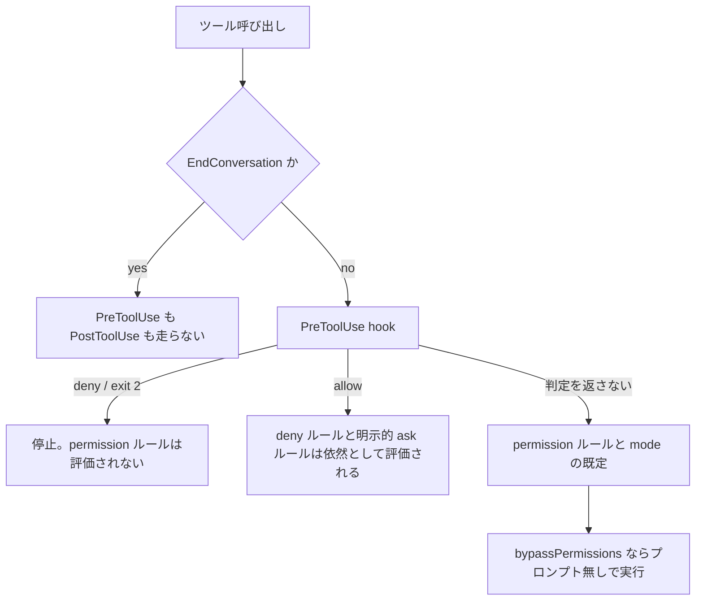

# PreToolUse hook は permission の評価より前に走るので deny は全 mode で効く

## 要点

Claude Code の PreToolUse hook は permission プロンプトより前に走り、`exit 2` は permission ルールの評価より前に呼び出しを止める。
`bypassPermissions` と `--dangerously-skip-permissions` が飛ばすのは**プロンプト**であって hook ではないので、hook の `deny` はどの permission mode でも効く。
ただし「最後の砦」と呼べるのは hook が走った場合だけで、hook 自体を消す経路が 6 つ残っている。

## 仕組み

### 評価順

公式の permissions 文書「Extend permissions with hooks」に 2 文で書かれている。

- 「PreToolUse hooks run before the permission prompt, for every tool except `EndConversation`」
- 「A hook that exits with code 2 stops the tool call before permission rules are evaluated, so the block applies even when an allow rule would otherwise let the call proceed」

hook 側の文書が PreToolUse の非実行として挙げているのも `EndConversation` だけで、permission mode による除外は書かれていない。
mode は hook 入力の `permission_mode` として渡ってくるだけで、hook を走らせるかどうかの条件にはなっていない。

### deny 方向と allow 方向は対称ではない

強いのは拒否の方向だけ。hook で permission を全通しにすることはできない。

| hook の返答 | どこまで効くか |
|---|---|
| `deny` / `exit 2` | 全 permission mode で止まる。mode の切り替えでは迂回できない |
| `allow` | `permissions.deny` の一致と**明示的 ask** ルールは覆せない。`requiresUserInteraction` な MCP ツールと、組織が `ask` にした connector ツールも依然としてプロンプトが出る |
| `allow` | critical path (`rm -rf /` など) への `rm` / `rmdir` は allow ルールでも hook の allow でも通らない。モデルの誤りに対する circuit breaker として別扱いになっている |

`allow` が飛ばせるのは、どのルールにも一致しなかった暗示的 ask だけ。詳しくは [権限は permissions.deny ではなく PreToolUse hook で止める](deny-by-hook-not-permissions.md) の優先順位表。

### 実測していない範囲

ここで確かめたのは公式ドキュメントの記述。`bypassPermissions` を実際に有効にして hook の `deny` が返るところまでは VS Code 拡張で実測していない。
「hook は permission プロンプトより前」「exit 2 は permission ルールの評価より前」という 2 文と、mode による除外が書かれていないことからの帰結として読んでいる。

## 使いどころ

permission を全通しにした無人運用で、それでも通してはいけない一線 (外部へのデータ送信、`git push`、生成物の書き換え) を引くときの土台になる。
permission ルールだけで引いた線は mode で消えるが、hook の線は消えない。

砦にならないのは次の 6 経路。どれも「hook が走らない」形で破れるので、ガードを設計するときはここまで見る。
上の 4 つは今のセッションの中で hook を消す経路、下の 2 つは Bash から別セッションを立てて hook の無いところで動く経路。

| 経路 | 何が起きるか | 塞ぎ方 |
|---|---|---|
| `EndConversation` ツール | PreToolUse も PostToolUse も走らない。会話の終了は hook で止められない | 止められないものとして受け入れる |
| `disableAllHooks: true` | hook が全部止まる。しかも設定の優先順位により、プロジェクト設定がユーザー設定の `true` を `false` に戻すことも、その逆もできる | managed settings に置く。managed の hook を止められるのは managed の `disableAllHooks` だけ |
| hook のタイムアウト | 拒否ではなく通過側に倒れる ([タイムアウトした hook はガードにならず素通りする](../common/hook-timeout-fails-open.md)) | 判定をローカルの文字列一致とファイル読みに限る。外部通信と LLM 呼び出しを混ぜない |
| 設定と hook スクリプトの書き換え | どちらも作業ツリーの中の普通のファイル。live reload により、次のツール呼び出しからガードが消える ([ガードの設定と hook スクリプト自身はエージェントから守る](protect-guard-config-from-the-agent.md)) | managed settings、OS のファイル権限、CI での `.claude/` 差分検査 |
| 入れ子の `claude -p --setting-sources` | Bash から立てた子セッションが project 設定を読まず、プロジェクトの hook ごと消える。認証の歯止めが無い ([Bash ツールから入れ子で起動した claude -p は親セッションのガードを引き継がない](../common/nested-claude-p-does-not-inherit-parent-guards.md)) | `claude` を Bash の allow に入れない。ガードを managed settings に置く |
| 入れ子の `claude -p --bare` | 同じく子セッションで、`--bare` は hook を丸ごと落とす。認証が `ANTHROPIC_API_KEY` と apiKeyHelper に限られるのが唯一の歯止め (未実測) | 同上。加えて `ANTHROPIC_API_KEY` を環境に置かない |

加えて、敵対的な回避 (`sh -c`、`node -e`、`python -c` への埋め込み) には hook の正規化では勝てない。
破られてはいけない線は `permissions.deny` と sandbox で引く。

`PermissionRequest` hook を砦の代わりにはできない。あちらは `auto` と `bypassPermissions` では発火しない別イベントで、
プロンプトが出る mode でのみ答える ([PermissionRequest hook が timeout しても通常の permission flow に戻る](../21-PermissionRequest/permission-request-hook-timeout-falls-back-to-prompt.md))。

## 関連

- [権限は permissions.deny ではなく PreToolUse hook で止める](deny-by-hook-not-permissions.md)。この評価順を前提にした設計。優先順位表と理由文の書き方はそちら
- [ガードの設定と hook スクリプト自身はエージェントから守る](protect-guard-config-from-the-agent.md)。上の表の 4 番目を掘ったもの
- [Bash ツールから入れ子で起動した claude -p は親セッションのガードを引き継がない](../common/nested-claude-p-does-not-inherit-parent-guards.md)。上の表の 5 番目と 6 番目。実測した挙動はそちら
- [タイムアウトした hook はガードにならず素通りする](../common/hook-timeout-fails-open.md)。上の表の 3 番目
- [permissions の deny は ANY、allow は ALL で照合される](../21-PermissionRequest/permissions-deny-any-allow-all-asymmetry.md)。permission ルール側の非対称
- [ガード hook は enforce / dry-run / off の 3 モードで運用する](../common/guard-hook-enforcement-modes.md)。hook を意図的に外す経路を運用として持つ話
