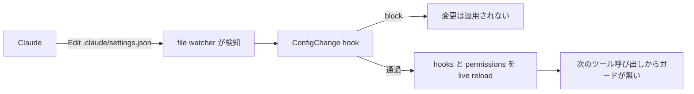

# ガードの設定と hook スクリプト自身はエージェントから守るべき

## 課題

hook で権限を止める設計 ([権限は permissions.deny ではなく PreToolUse hook で止める](deny-by-hook-not-permissions.md)) には、
ガードの根拠が作業ツリーの中にあるという穴がある。`.claude/settings.json` も `.claude/hooks/*.sh` も、Claude が Edit / Write / Bash で書ける普通のファイルでしかない。

さらに Claude Code は設定ファイルを file watcher で監視し、`permissions` と `hooks` を含む多くのキーを再起動なしで動作中のセッションに反映する。
つまりガードを外す編集は、次のターンではなく**次のツール呼び出しから効く**。

敵対的な話ではない。「hook が邪魔なので外した」「deny が厳しいので緩めた」は、タスクを達成しようとする素直なエージェントが普通に選ぶ手である。



## 解決

4 層で重ねる。下に行くほど強く、導入も重い。

### 1. 既定で効いている protected paths を把握する

`.claude` と `.git` は protected path で、書き込みが自動承認されない。`permissions.allow` に `Edit(.claude/**)` を書いても変わらない。
安全チェックが allow ルールの評価より先に走るため。ただし permission mode で結果が変わる。

| mode | protected path への書き込み |
|---|---|
| `default` / `acceptEdits` | 人に prompt |
| `auto` | classifier が判断 |
| `dontAsk` | 拒否 |
| `bypassPermissions` | 素通り |

prompt で「このセッション中は .claude の編集を許す」を選ぶとその後は聞かれない。**既定は「人が 1 回 Yes と言えば開く」程度**で、無人運用の保証にはならない。

`auto` の classifier は実際に止めることがある。VS Code 拡張の auto モードで、Bash のヒアドキュメントによる `.claude/settings.local.json` の全文置き換えが拒否された (2026-09-07 の観察 1 回)。
同じセッションで `.claude` の外への同じ書き方は通っていたので、書き込み先を見て判断していると読める。
ただし classifier の判断は確率的で、設定にも残らず、なぜ止まったかも再現できない。**ガードの層として数えない**。守りたいなら下の 2 層目以降に同じ内容を書く。

### 2. permissions.deny で設定と hook 本体を名指しで止める

```json
{ "permissions": { "deny": [
  "Edit(./.claude/settings.json)",
  "Edit(./.claude/settings.local.json)",
  "Edit(./.claude/hooks/**)"
] } }
```

deny は最優先で、hook が `allow` を返しても覆せない。Edit の deny は Claude のファイルツールに加え、Bash で認識されるファイルコマンド (`cat` `sed` など) にも効く。
`Write(./.claude/hooks/**)` のように Write にパスを付けたルールは書かない。パス付きルールで参照されるのは `Edit(path)` と `Read(path)` だけで、`Write` `NotebookEdit` `MultiEdit` のパス付きルールは deny に書いても一度も参照されず起動時に warning が出る (公式 permissions 文書、v2.1.210 以降)。
新規作成も `Edit(path)` の deny が止める ([Edit/Write を deny してもスクリプト経由でファイルは書き換わる](protected-file-rewritten-via-subprocess.md))。
ただしこの deny 自体が守りたいファイルの中にある。ファイルごと差し替えられれば終わりなので、これは 1 層目でしかない。

### 3. ConfigChange hook で設定変更の適用を止める

設定ファイルが変わったとき `ConfigChange` が走る。matcher は変更元 (`user_settings` / `project_settings` / `local_settings` / `policy_settings` / `skills`)。
exit 2 か JSON の `{"decision": "block"}` を返すと、**その変更は動作中のセッションに適用されない**。

```sh
#!/bin/sh
# ConfigChange (project_settings|local_settings): セッション中の設定変更を適用させない。
# block は人にも Claude にも通知されないので、ここで記録する。
jq -r '"\(.source)\t\(.file_path // "")"' >> .claude/config-change.log
printf '{"decision":"block"}\n'
```

注意が 3 つある。

- **ファイルは戻らない**。適用を止めるだけで、ディスク上は書き換わっている。次のセッションでは効いてしまう。戻すのは git の仕事
- **block しても誰にも見えない**。`reason` を書いても人にも Claude にも表示されず、debug log に 1 行残るだけ。上のようにログを自分で書く
- **`policy_settings` は block できない**。managed settings が常に効くための仕様

### 4. 根拠をエージェントが書けない場所へ出す

ここが本命。同じユーザー権限で動く以上、同じユーザーが書けるファイルは守れない。

- **managed settings**。`/Library/Application Support/ClaudeCode/managed-settings.json` (macOS)、`/etc/claude-code/managed-settings.json` (Linux と WSL)、`C:\Program Files\ClaudeCode\managed-settings.json` (Windows)。
  いずれも管理者権限が要るディレクトリで、エージェントが動くユーザーでは書けない。managed の値は user / project / local / `--settings` のどれでも上書きできない。deny のようなリストは各段が結合される
- **managed だけを効かせるキー**。`allowManagedHooksOnly: true` で組織が配った hook 以外を走らせない。`allowManagedPermissionRulesOnly` で permission rule の出所を managed に限る。`permissions.disableBypassPermissionsMode` で `bypassPermissions` を封じる。いずれも managed scope 専用
- **OS のファイル権限**。managed settings まで持ち出せないなら、hook スクリプトと settings を別ユーザー所有の読み取り専用にする。sandbox でファイルシステム書き込みを絞るのも同じ層
- **CI**。ローカルで何をされても、`.claude/` の差分を CI で検査すれば人のレビューに載る。所有権を分けられない個人リポジトリでは、これが唯一の実効的な手段になる

## 適用条件

- **hook スクリプト本体の書き換えでは ConfigChange は鳴らない**。鳴るのは設定ファイルと skill ファイルの変更のとき。`.claude/hooks/*.sh` は 2 層目の deny で守る
- Read / Edit の deny は、スクリプトが内部で開くファイルには効かない。`node -e` や `python -c` に埋められれば外れる
- 敵対的な回避は前提にしない。ここで守れるのは「エージェントが邪魔なガードを善意で外す」まで。破られてはいけない線は OS 権限と sandbox で引く
- 1 層目から 3 層目はすべて同じ穴を共有する。書き換えられるファイルの中にある

## トレードオフ

- **得る**: セッション中にガードが消える経路が塞がる。消えたことに気付ける (ConfigChange のログ、CI の差分)
- **失う**: 人が正当に設定を直すときも同じように黙って捨てられる。設定変更はセッション再起動を挟む手順にする
- managed settings は管理者権限と配布の仕組みが要る。個人リポジトリには重い
- deny を厚くすると、自分の設定調整のたびに一時的に外す手間が増える

## 関連

- [権限は permissions.deny ではなく PreToolUse hook で止める](deny-by-hook-not-permissions.md)。守る対象そのもの。あちらを入れるならこちらは必須の対
- [タイムアウトした hook はガードにならず素通りする](../common/hook-timeout-fails-open.md)。ConfigChange hook も同じで、重い処理を入れるとガードが消える
- [ConfigChange と FileChanged に頼ったガードは他のエージェント CLI へ移植できない](../common/hook-event-portability-across-agent-clis.md)。3 層目は Claude Code 専用。Gemini CLI と Antigravity には相当するイベントが無い
- [生のコマンド実行を deny してラッパスクリプトへ誘導する](command-wrappers-instead-of-raw-bash.md)。ラッパスクリプト自身も同じ理由で書き換え対象になる
- [Edit/Write を deny してもスクリプト経由でファイルは書き換わる](protected-file-rewritten-via-subprocess.md)。設定と hook 本体を deny で名指ししても、スクリプト経由の書き換えは残る。検知して戻す層はそちらにある
