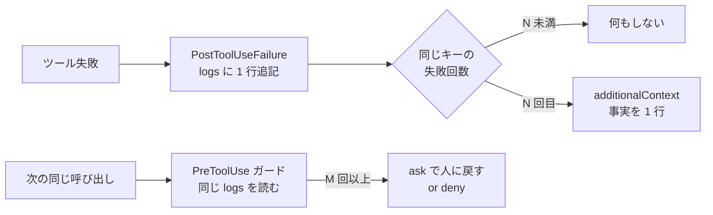

# 同じコマンドの失敗は PostToolUseFailure で数えて段階的に介入した方がよさそう

## 課題

auto モードで放置した Claude Code が一番トークンを溶かすのは、同じコマンドを言い換えながら失敗し続ける堂々巡り。
`pnpm test` が落ちる、依存を入れ直す、また落ちる、フラグを変える、また落ちる。1 回 1 回は無害なので auto モードの分類器は止めず、
モデル自身は「前も同じ失敗をした」ことを数えていない。CLAUDE.md に「3 回失敗したら手を止めろ」と書いても効きは確率的で、失敗の
出力で context が埋まるほど効かなくなる。

`PostToolUseFailure` は、ツールが実行を始めてから失敗したときに発火する (公式 hooks 文書)。入力に `tool_name`、`tool_input`、`error`、
`is_interrupt`、`duration_ms` が来て、`additionalContext` を返せる。permission で拒否された呼び出しやスキーマ検証で弾かれた呼び出しには発火しない。

## 解決

hook は数えるだけにして、判断はしない。回数で 2 段に分け、上の段はガードに渡す。



### 1. 記録の単位を決める

`logs/tool-failures.jsonl` に 1 行 1 件で追記する。キーは `session_id` + `tool_name` + 正規化したコマンド。
正規化は Bash なら `command` の先頭 2 語 (`pnpm test`、`git push`)、Write / Edit なら `file_path`。引数まで含めると言い換えで別キーになり、数えられない。

`error` の書式はツールごとに違い、安定していない。公式が「`tool_name`、`is_interrupt`、先頭行の `Exit code N` で分岐し、残りは表示用として扱え」と
書いている通りにする。`is_interrupt` が true の回はユーザの中断なので数えない。`Command timed out after ...` の行が入る回はタイムアウトで、
これは数える (放置中のタイムアウト連発は堂々巡りの一種)。

### 2. N 回目に事実だけ注入する

```sh
# PostToolUseFailure。数えて閾値なら 1 行返す。注入系なので常に exit 0
n=$(count_same_key "$key")   # logs を grep -c する程度
[ "$n" -ge 3 ] && printf '{"hookSpecificOutput":{"hookEventName":"PostToolUseFailure","additionalContext":"The command `%s` has failed %s times in this session, each with the same first error line."}}\n' "$cmd" "$n"
exit 0
```

命令文 (「別の手を試せ」) ではなく平叙文で書く。公式が、system 命令の体裁は prompt injection 防御に引っかかってユーザに突き返される、と注意している。
「何回目か」と「エラーの先頭行が同じか」が事実で、そこから手を変えるのはモデルの仕事。

### 3. M 回目は PreToolUse が止める

同じ logs を PreToolUse の Bash ガードが読み、同じキーが M 回以上失敗していたら `permissionDecision` を `ask` で返す。
hook の `ask` は auto モードでも必ずプロンプトを出す (公式、2.1.211 以降) ので、放置中の堂々巡りは「止まって人を待つ」で終わる。
人が居ない前提で完全自動にしたいなら `deny` にし、`permissionDecisionReason` に「このコマンドは M 回失敗している。原因をチケットに書いて別の手を取る」と代替を書く
([deny の理由文には縮退と本当の拒否を区別できる情報を入れる](../20-PreToolUse/deny-reason-distinguishes-degraded-from-real-denial.md))。

閾値は N=3、M=6 から始める。3 回は「同じ手を 2 回試し直した」で、まだ正当な調査の範囲。6 回は明らかに回っている。

## 適用条件

- 効く: auto モードでの放置、テストやビルドを何度も回す作業、依存解決が絡む環境構築
- ホットパスではない (失敗時だけ発火する) ので fork 予算は緩くてよい。ただし PreToolUse 側は毎回走るので、logs の読みは 1 回に収める
  ([ホットパスの hook は秒数ではなく fork の回数で予算を決めた方がよさそう](../scripts/count-forks-not-seconds-for-hot-path-hooks.md))
- 並列ツール呼び出しで同時に発火するので、追記は tmpfile + mkdir ロックで行う
  ([並行する hook の書き込みは tmpfile 追記と mkdir ロックで守る](../scripts/concurrent-hook-writes-append-tmpfile-mkdir-lock.md))
- サブエージェントの失敗も同じ hook に来る (`agent_id` が付く)。親と別に数えるか、合算するかを先に決める。合算だと並列 3 本で閾値に早く達する
- 設計は公式文書の入出力に基づく。閾値の妥当性と、注入でモデルが手を変える割合は運用して測っていない

## トレードオフ

- 得る: 放置中の堂々巡りが有限で終わる。失敗の履歴が logs に残り、翌朝「何を何回試したか」が読める
- 失う: 正当な再試行 (flaky なテスト、ネットワーク待ち) も数える。閾値を低くしすぎると `ask` で止まって放置にならない
- 正規化を粗くしすぎると `git push` と `git push origin feature` が同じキーになり、別ブランチへの正当な push まで数える。粗さは repo ごとに調整する

## 関連

- [hook は注入系とガード系に分かれ失敗時の既定は逆であるべき](../common/injecting-vs-guarding-hooks.md)。PostToolUseFailure 側は注入系、PreToolUse 側はガード系
- [hook の判定材料はリモートに問い合わせず全実行環境で読めるものだけであるべき](../common/hooks-read-local-state-only.md)。数える材料は logs だけ
- [状態を持たない LLM への環境情報は変わる頻度で hook イベントを分けて注入した方がよさそう](../common/split-state-injection-by-staleness.md)。additionalContext が届く先
- [完了時にやらせたい作業はチケットに置き Stop hook で 1 回だけ機械的に差し戻すべき](../11-Stop/return-once-with-the-ticket-checklist.md)。同じ「hook は判断せず 1 回だけ介入する」型
