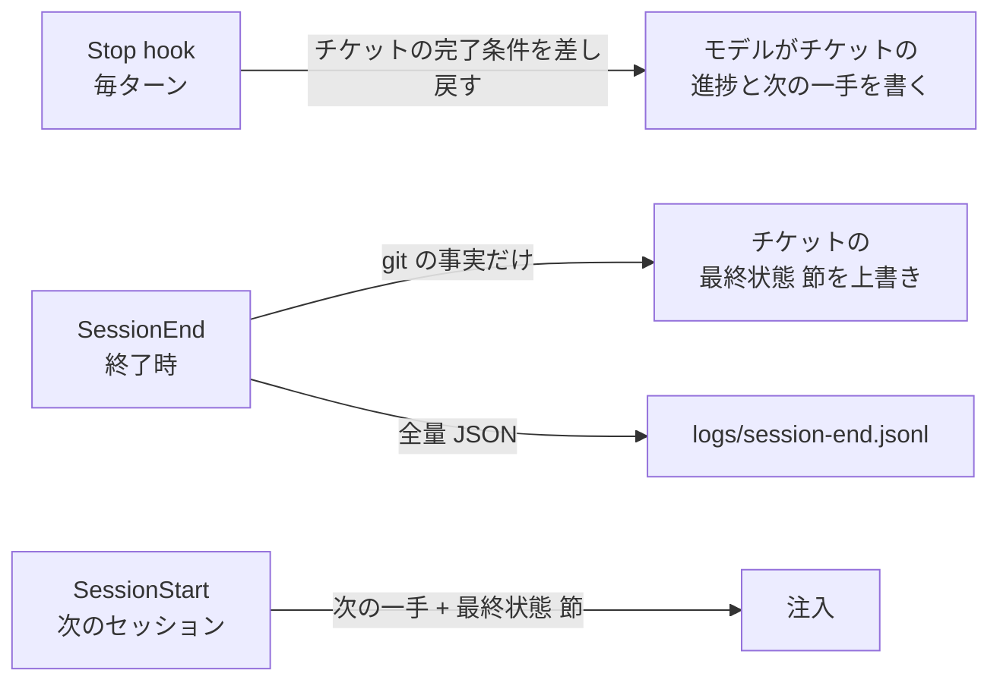

# SessionEnd の機械的な最終状態はチケットの固定節へ上書きし全量は logs に残した方がよさそう

## 課題

放置したセッションが終わった後、次のセッション (か翌朝の人) が知りたいのは「どこで終わったか」。
これを SessionEnd hook で HANDOFF.md に書けばよさそうに見えるが、SessionEnd には制約が 4 つある (公式 hooks 文書)。

| 制約 | 帰結 |
|---|---|
| 入力は共通フィールドと `reason` (`clear` `resume` `logout` `prompt_input_exit` `other`) だけ | モデルの最後の発話も、やったことの要約も来ない |
| 既定のタイムアウトが 1.5 秒 (per-hook の `timeout` で最大 60 秒まで引き上がる) | git を 2〜3 回呼ぶのが精一杯。transcript の解析は入らない |
| JSON 出力は捨てられ、block できない | 副作用しか起こせない |
| 走る条件は上の reason に限られ、プロセスが落ちたときに走る保証は文書に無い | ここにしか書いていない情報は、落ちたら無い |

つまり SessionEnd に書けるのは**機械が git から取れる事実**だけで、「何をして何が残っているか」はここでは作れない。
一方で、その事実を `logs/` にだけ落とすと、logs は git 管理外で次のセッションに自動で読まれず、絶対パスも混ざるので他所へ写せない。

## 解決

「モデルが書く引き継ぎ」と「機械が書く最終状態」を分け、置き場所も分ける。



### 1. モデルが書く分は Stop hook に任せる

やったこと、迷った点、次にやること、はモデルにしか書けない。Stop hook でチケットの完了条件を 1 回差し戻し、その中に「チケットの進捗と次の一手を更新した」を入れておく
([完了時にやらせたい作業はチケットに置き Stop hook で 1 回だけ機械的に差し戻すべき](../11-Stop/return-once-with-the-ticket-checklist.md))。
Stop は毎ターン確実に走るので、セッションがどこで切れても直前のターンまでの引き継ぎは残る。

### 2. SessionEnd はチケットの固定節を上書きする

対象のチケットは `wip/tickets/` で最終更新が最も新しい 1 件 (または `logs/current-ticket` に書いてあるパス)。その中の
`<!-- final-state:begin -->` と `<!-- final-state:end -->` の間を丸ごと置き換える。追記ではなく上書きなので、何度終わっても 1 節のまま。

```markdown
## 最終状態 (自動)
<!-- final-state:begin -->
- 2026-09-05T18:02+09:00 reason=other session=abc123
- main@3fc61d9 upstream +51/-0 staged=0 modified=1 untracked=3 in-progress=none
- dirty: INDEX.md, knowledge/hooks/14-StopFailure/, knowledge/hooks/23-PostToolUseFailure/
<!-- final-state:end -->
```

- パスは**リポジトリ相対だけ**。`cwd` と `transcript_path` は絶対パスなので logs 側に置く (規約: 絶対パスは `logs/` 以外に書かない)
- マーカーの中はモデルが編集しない、とチケットの雛形に 1 行書く。同じファイルに機械と人が書くときの取り決めはこれだけ
- `timeout` は明示する。Windows の Git Bash では git 1 回が 100〜300ms なので、既定の 1.5 秒は git 3 回でぎりぎり。10 秒にしておく
- 書き込みは tmpfile + rename。途中で切られてもチケットが壊れない

### 3. 全量は logs に落とす

同じ hook が入力 JSON に timestamp と git の行を足して `logs/session-end.jsonl` に追記する。transcript_path が残るので、
何をしていたかは後から末尾を読める。ここは規約通り追跡しない。

### 4. 次のセッションは節ごと注入する

SessionStart の注入 hook がチケットの「次にやること」節と「最終状態 (自動)」節を読む。前者はモデルが書いた意図、後者は機械が書いた事実で、
両方揃って「どこまでやって、今どうなっているか」になる。timestamp が古ければ「前回は綺麗に終わっていない (SessionEnd が走らなかった)」と読める。

## 適用条件

- 効く: チケット (wip/tickets/) を運用していて、SessionStart で再注入する構成が既にあるリポジトリ
- HANDOFF.md を 1 枚で運用しているなら、その中に同じ固定節を置けばよい。要点はファイル名ではなく「機械の節と人の節を分け、機械の節は上書き」
- 設計は公式文書の SessionEnd の仕様と、このリポジトリの wip/ と logs/ の規約から導いたもの。hook を置いて何セッションか回した実績は無い

## トレードオフ

- 得る: 次のセッションが「どこで終わったか」を commit 済みの情報から得られる。logs には全量が残る
- 失う: チケットに機械が触る。マーカーの取り決めを破ると節が二重になる。SessionEnd が走らない終わり方 (クラッシュ) では節が古いまま残るので、timestamp を読む習慣が要る
- SessionEnd に git を呼ぶ分だけ終了が遅くなる。`/clear` や `/resume` のたびに走ることも織り込む

## 関連

- [compact 後は SessionStart hook で作業コンテキストを再注入すべき](../00-SessionStart/reinject-work-context-after-compact.md)。注入側
- [完了時にやらせたい作業はチケットに置き Stop hook で 1 回だけ機械的に差し戻すべき](../11-Stop/return-once-with-the-ticket-checklist.md)。モデルが書く側
- [API エラーで止まった回は Stop hook が走らないので StopFailure で記録した方がよさそう](../14-StopFailure/log-api-errors-where-stop-hook-does-not-run.md)。Stop が走らない終わり方の記録
- [hook は注入系とガード系に分かれ失敗時の既定は逆であるべき](../common/injecting-vs-guarding-hooks.md)。この hook は注入系
