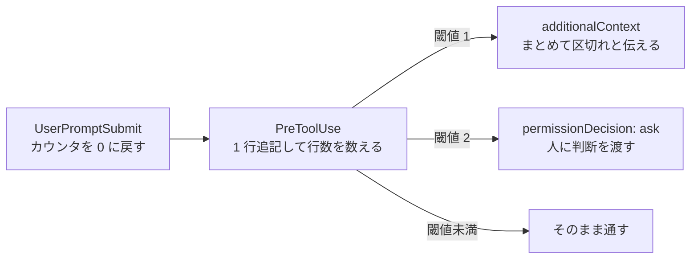

# 1 ターンのツール実行回数を数えて機械的に止めるとよいはず (未検証)

## 観測

Claude Code 2.1 (VS Code 拡張) で、1 回のユーザ入力に対するツール実行が積み上がったターンほど、
終盤で危ない手を打ちやすい。観測した挙動は次のようなもの。

- 序盤に読んだ制約や、ユーザが最初に出した条件を落とす
- 確認せずに上書き・削除・`git` の破壊的操作へ進む
- 元の依頼から外れた範囲まで手を広げる

原因はツール結果がターン内に積み上がることだと思っている。ツール結果は 1 件ずつは小さくても、
数十件溜まれば最初の指示や規約より新しく、量も多い。指示が相対的に薄まる。
これは自動圧縮が走る前から起きる。閾値に達していなくても、比率としては薄まっているため。
context が増えると質が落ち始める点については
[context が増えると質が落ち始める閾値は 40% から 400k トークンまで諸説ある](../../model/context-quality-drop-thresholds-vary-by-source.md) を参照。

自分で気付いて止まることは期待できない。薄まった側が「薄まった」と判断する立場にあるので、
判断そのものが同じ劣化を受ける。プロンプトや rules で「長くなったら止まれ」と書いても効きが確率的になるのはこのため。

## 案

判断をモデルに任せず、hook で回数を数えて機械的に切る。



境界は「ユーザ入力から次のユーザ入力まで」に取る。`UserPromptSubmit` でカウンタを捨て、`PreToolUse` で数える。
2 つのイベントにまたがるので状態はファイルに置く (`logs/tool-call-count/<session_id>`)。

数え方は read-modify-write ではなく **1 行追記して行数を数える**。
同じイベントの hook と並列のツール呼び出しは同時に走るので
([同じイベントの hook は並列に走り settings.json の配列順は実行順ではない](hooks-run-in-parallel-not-in-array-order.md))、
読んで足して書き戻すと数え落とす。追記なら落ちない。

```sh
#!/bin/sh
# PreToolUse: このターンのツール実行回数を数え、閾値を超えたら人に渡す
node -e '
let s = ""; process.stdin.on("data", d => s += d).on("end", () => {
  const fs = require("fs"), path = require("path");
  const inp = JSON.parse(s);
  const dir = path.join(process.env.CLAUDE_PROJECT_DIR, "logs", "tool-call-count");
  fs.mkdirSync(dir, { recursive: true });
  const f = path.join(dir, inp.session_id);
  fs.appendFileSync(f, "x\n");
  const n = fs.readFileSync(f, "utf8").split("\n").length - 1;
  const soft = 30, hard = 50;
  if (n === soft) {
    process.stdout.write(JSON.stringify({ hookSpecificOutput: {
      hookEventName: "PreToolUse",
      additionalContext: `このターンでツールを ${n} 回呼んでいる。ここで一度手を止め、`
        + "分かったことと残りをユーザに返して指示を仰ぐこと。"
    } }));
  } else if (n >= hard) {
    process.stdout.write(JSON.stringify({ hookSpecificOutput: {
      hookEventName: "PreToolUse",
      permissionDecision: "ask",
      permissionDecisionReason: `このターンで ${n} 回目のツール呼び出し。続けるかを確認する`
    } }));
  } else { process.stdout.write("{}"); }
});'
```

`UserPromptSubmit` 側は同じファイルを消すだけでよい。

止め方は `deny` にしない。正当に長い作業 (大きなリファクタ、広い調査) は普通にあるので、
硬く落とすと使えなくなる。`ask` にして人に渡すか、`additionalContext` で区切りを促すのが妥当だと思う。
段階を分けて入れる話は [ガード hook は enforce / dry-run / off の 3 モードで運用すべき](guard-hook-enforcement-modes.md) と同じで、
まず dry-run で「実際に何回で止まるのか」を記録してから閾値を決めた方がよい。

## 確かめていないこと

- **閾値の妥当な値。** 30 / 50 は根拠のない仮置き。実際の分布をログに取ってから決める必要がある
- **回数が本当に効く指標かどうか。** ツール結果の**トークン量**の方が近いかもしれない。`Read` 1 回と `Bash` 1 回では嵩が桁で違う。
  ただし量は hook 入力から直接は取れず、statusLine 経由になる ([context 使用率は hook 入力に無いので statusLine から状態ファイル経由で hook に渡した方がよさそう](statusline-as-context-usage-sensor-for-hooks.md))
- **サブエージェントの扱い。** サブエージェントのツール呼び出しで `PreToolUse` が発火したとき、`session_id` が親と同じかどうかを確かめていない。
  同じなら親のカウンタが汚れる
- **ターン境界の取り方。** ユーザがターンの途中で送るメッセージ (実行中の割り込み) でも `UserPromptSubmit` が発火するなら、そこでカウンタが戻ってしまう。未確認
- **自動圧縮との関係。** ターンの途中で圧縮が走ってもカウンタは戻らない。戻すべきかどうか決めていない
- **hook 自体のコスト。** ツール呼び出しのたびにプロセスが 1 つ増える。回数が多いターンほど効いてくる
- **観測の裏付け。** 「回数が多いと危ない手を打つ」は手元の印象で、対照を取った計測ではない

## 昇格の目安

- [ ] 粒度が type の定義に収まっている (pattern。課題と解決が 1 つずつ)
- [ ] sources に一次情報がある
- [ ] 実際に試して applies_to と verified_at を書ける — dry-run で回数の分布を取り、閾値を実測で決める

## 関連

- [タスクの切れ目で /compact と /clear をユーザに依頼させた方がよさそう](../22-PostToolUse/ask-user-to-reset-context-at-task-boundaries.md) — セッション全体の圧縮の話。こちらは 1 ターン内の話で、対象が違う
- [同じイベントの hook は並列に走り settings.json の配列順は実行順ではない](hooks-run-in-parallel-not-in-array-order.md)
- [タイムアウトした hook はガードにならず素通りする](hook-timeout-fails-open.md)
- [ガード hook は enforce / dry-run / off の 3 モードで運用すべき](guard-hook-enforcement-modes.md)
