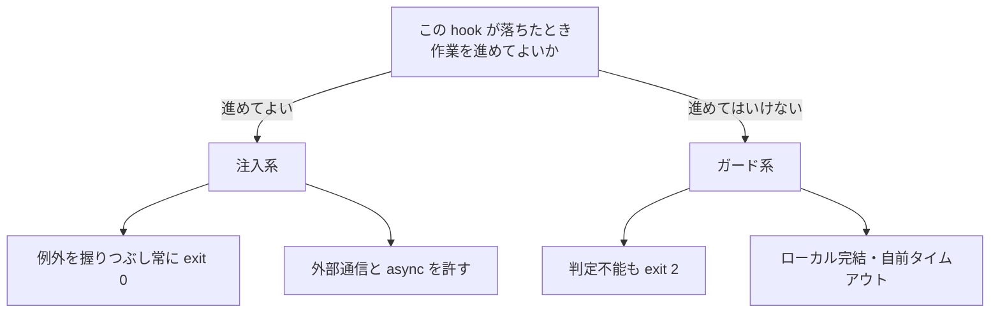

# hook を注入系とガード系に分け、失敗時の既定を逆にする

## 課題

hook スクリプトの作法として「全体を try/except で包み、例外を握りつぶして常に exit 0 で終える」という原則が広まっている。
zaico の記事はこれを全 hook の統一原則として採っていて、個別 hook の不具合がセッション全体に波及しない、という理屈は正しい。

問題は、この原則を settings.json に並ぶ hook 全部へ一律に当てるところにある。hook には役割の違う 2 種類が混ざっている。

- 状態やコンテキストを**足す** hook。落ちても足りないだけで、作業は進めてよい
- 動作を**止める** hook。落ちたということは判定が出ていないので、進めてはいけない

後者に「常に exit 0」を当てると、ガードが黙って無効になる。落ちたことは stderr のログに残るだけで、transcript には目立って出ない。
逆に前者を厳格にすると、ログの書き込み失敗や通知の失敗でセッションが止まる。作法が 1 つしかないのが原因で、どちらに寄せても片方が壊れる。

## 解決

hook を書く前に「この hook が落ちたとき、作業を進めてよいか」を決め、答えで 2 種類に分ける。分類ごとに失敗時の既定を逆にする。

|  | 注入系 | ガード系 |
|---|---|---|
| 目的 | コンテキストや外部状態を足す | 動作を止める、差し戻す |
| 例 | SessionStart のミッション読み込み、UserPromptSubmit の状態再注入、通知、ログ、index 再生成 | 生成物の手編集を止める、危険な引数を弾く、lint の error を突き返す |
| 落ちたときの意味 | 足りない | 判定できていない |
| 終了コードの既定 | 常に 0 | 判定不能も 2 |
| 例外の扱い | 握りつぶして stderr に出す | 握りつぶさない |
| 外部通信 | 入れてよい | 入れない |
| `async: true` | 使ってよい | 使えない (判定が戻らない) |
| 末尾の `\|\| true` | 付けてよい | 付けない |

ガード系で exit 2 にするのは「違反を見つけたとき」だけではない。**判定に必要なものが揃わなかったときも exit 2 にする。**
jq が見つからない、stdin の JSON が壊れている、対象ファイルが読めない、自前タイムアウトに達した、はどれも「安全だと確認できていない」であって「安全」ではない。

このリポジトリの 2 本がそれぞれの型になっている。`protect-generated.sh` はパスが生成物に一致したら `exit 2` で PreToolUse を止めるだけのガード系で、
外部通信も `|| true` も無い。`lint-on-edit.sh` は PostToolUse だが、lint が error を返したときも lint 自体が異常終了したときも `exit 2` に落ちる書き方で、ガード系に寄せてある。

## 適用条件

効くのは、1 つの settings.json に両方の種類が並んでいるときと、hook の本数が増えて作法を揃えたくなったとき。hook が 1 本しか無いなら分類の意味は無い。

ガード系を置けるイベントは限られる。exit 2 が block になるのは PreToolUse、UserPromptSubmit、Stop、SubagentStop、ConfigChange などで、
SessionStart と PostToolUse では block にならない。PostToolUse はツールが既に走った後なので止められないが、stderr が Claude に渡るので差し戻しには使える。
逆に stdout がそのままコンテキストに入るのは UserPromptSubmit、UserPromptExpansion、SessionStart、PostModelSwitch の 4 イベントだけで、注入系をそれ以外に置いても内容は Claude に届かない。

1 本の hook が両方の役目を持ったら分割する。SessionStart で index を再生成しつつ違反履歴を注入する、のような書き方は、片方の失敗でもう片方が道連れになる。

## トレードオフ

- ガード系を fail-closed にすると、hook 自身のバグがセッションの停止に直結する。代償として、ガード系はローカル完結・短時間・依存最小に保つ制約がかかる
- 注入系を fail-open にすると、注入が黙って欠ける回が出る。欠けたことに気づく必要があるなら、注入した内容そのものに件数や日付を混ぜて、Claude 側から欠落が見えるようにする
- 分類は hook を書く人が毎回決める必要がある。settings.json のコメントか hook スクリプトの冒頭コメントに、どちらの型かを 1 行書いておく

## 関連

- [タイムアウトした hook はガードにならず素通りする](hook-timeout-fails-open.md) — ガード系を fail-closed に保つための具体策
- [権限は permissions.deny ではなく PreToolUse hook で止める](../20-PreToolUse/deny-by-hook-not-permissions.md) — ガード系の中身の設計
- [ガードの設定と hook スクリプト自身をエージェントから守る](../20-PreToolUse/protect-guard-config-from-the-agent.md) — ガード系が無効化されない前提を作る
- [ガード hook は enforce / dry-run / off の 3 モードで運用する](guard-hook-enforcement-modes.md) — ガード系側の運用。判定を止めずに記録だけする段を挟む
- [Gemini CLI には圧縮後に発火する hook が無い](../01-PreCompact/gemini-cli-no-post-compress-hook.md) — 注入系を毎ターン打ち直す動機
