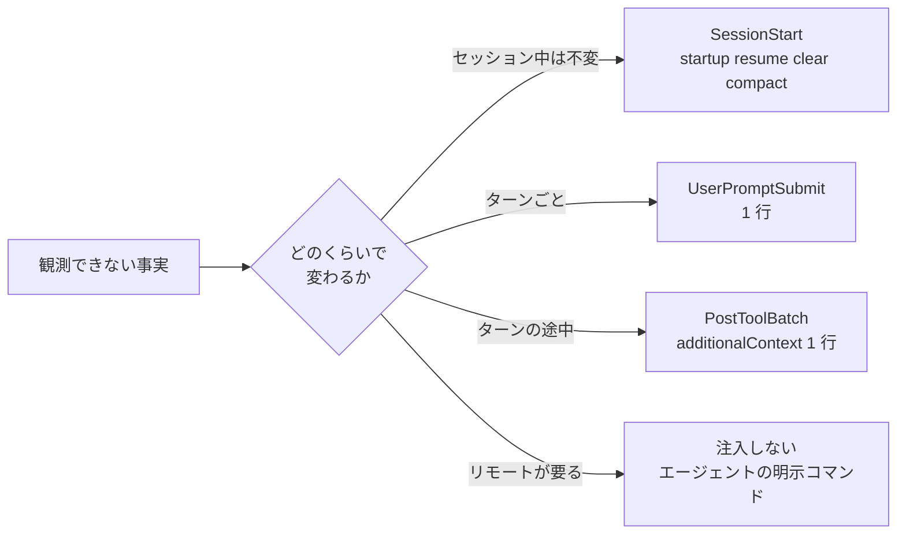

# 状態を持たない LLM への環境情報は変わる頻度で hook イベントを分けて注入した方がよさそう

## 課題

LLM は自分の置かれた状況を観測できない。日付は学習データに引きずられ、ブランチや未コミットの有無は直前にツールで見た値を
セッションの終わりまで信じ、Windows の Git Bash と WSL と Claude Code on the web のどれで動いているかは区別がつかない。
自分が何分処理しているか、このターンで何回ツールを呼んだかも分からない。

Claude Code (VS Code 拡張、2.1 で確認) は起動時に system prompt へいくつか入れてくれるが、それで足りない。

| Claude Code が起動時に入れるもの | 足りないところ |
|---|---|
| `currentDate` (日付のみ) | 時刻とタイムゾーンが無い。logs の timestamp や「6 か月後」の計算に効く |
| `gitStatus` (branch、status、直近 commit) | 「起動時のスナップショットで更新されない」と明記されている。checkout や commit の後は古い |
| platform (`win32` / `linux`) | Git Bash か WSL かは分からない。`win32` でも hook は sh で動く |
| cwd | worktree が複数あるとき、隣で何が動いているかは分からない |

これを CLAUDE.md に「作業前に git status を見ること」と書いても効きは確率的で、長いセッションほど落ちる。
毎回機械的に足す方が確実だが、全部を 1 つの hook に寄せると、変わらないものを毎回払うか、変わるものが古いまま残るかのどちらかになる。

## 解決

「どのくらいの頻度で変わるか」で 3 つのイベントに分ける。注入の経路は 2 つある。plain な stdout がそのまま入るのは
`SessionStart` `UserPromptSubmit` `UserPromptExpansion` `PostModelSwitch` だけだが、JSON の `hookSpecificOutput.additionalContext` は
`PreToolUse` `PostToolUse` `PostToolUseFailure` `PostToolBatch` `Stop` `SubagentStop` `SubagentStart` からも届く (公式 hooks 文書「Add context for Claude」)。
ツール結果の隣に置かれるので、ターンの途中でも注入できる。



どれも注入系なので常に exit 0 で終え、失敗は握りつぶす ([hook は注入系とガード系に分かれ失敗時の既定は逆であるべき](injecting-vs-guarding-hooks.md))。

### SessionStart に置くもの (1 セッション 1 回、数行)

| 事実 | 取り方 (git と POSIX sh だけ) | なぜ要るか |
|---|---|---|
| 時刻とタイムゾーン | `date -u +%FT%TZ` と `date +%z` | verified_at や logs の timestamp。UTC と JST の取り違え防止 |
| 実行環境 | `uname -s` が `MINGW64_NT-*` なら Git Bash、`Linux` で `/proc/version` に microsoft があれば WSL、それ以外は web | パス区切り、シンボリックリンク、`.venv/Scripts` か `.venv/bin` かが変わる |
| 入口 | 環境変数 `CLAUDE_CODE_ENTRYPOINT` (VS Code 拡張では `claude-vscode`) | 拡張と CLI で違う挙動を本文に書き分けるため |
| 道具の版 | `node -v` `pnpm -v` `jq --version` `gh --version` `glab --version`。無いものは「無い」と出す | CLAUDE.md の固定値と実測がずれたら気づける。web には gh も glab も無い |
| worktree の一覧 | `git worktree list` | 並列作業の前提。自分がどれで、隣が何のブランチかを知る |
| ホスティング | `git remote get-url origin` の host | gh と glab のどちらを使うか |
| チケットの次の一手 | `wip/tickets/` の「次にやること」節 | [compact 後は SessionStart hook で作業コンテキストを再注入すべき](../00-SessionStart/reinject-work-context-after-compact.md) と同じ |

matcher は `startup|resume|clear|compact`。`fork` は親のコンテキストを引き継ぐので要らない。

### UserPromptSubmit に置くもの (毎ターン、1 行)

```
[state 2026-09-05T16:38+09:00] main@3fc61d9 upstream +51/-0 staged=0 modified=1 untracked=2 in-progress=none
```

材料は `git status --porcelain=v2 --branch` の 1 回で揃う。先頭の `# branch.oid` `# branch.head` `# branch.upstream` `# branch.ab +N -M` が
HEAD・ブランチ・upstream・ahead/behind で、続く行の先頭 1 文字 (`1` `2` が追跡ファイルの変更、`?` が未追跡) を数えれば dirty の内訳になる。
rebase / merge の途中かは `$(git rev-parse --git-dir)` 直下の `MERGE_HEAD` `REBASE_HEAD` `CHERRY_PICK_HEAD` `rebase-merge` `rebase-apply` の有無で分かる。
これはモデルが最も見落として壊す状態なので、`none` でも毎回出す。

### PostToolBatch に置くもの (モデル呼び出しごと、1 行)

`PostToolBatch` は並列ツール呼び出しの束が全部終わった後、次のモデル呼び出しの前に 1 回だけ発火する (matcher 無し)。
`PostToolUse` はツールごとに (並列なら同時に) 発火するので、「このターンの状態」を 1 行にまとめる場所は PostToolBatch の方。

```
[turn 2026-09-05T16:41+09:00] elapsed=3m12s tool-calls=14 main@a1b2c3d staged=0 modified=3
```

- 経過時間は hook が測る。UserPromptSubmit でターン開始時刻を `logs/` に書き、PostToolBatch がそれと今の差を出す
- ツール呼び出し数は入力の `tool_calls` の要素数を `logs/` に足し込む
- git の行は UserPromptSubmit と同じ材料。ターン内で commit や checkout をした直後に効く

ただし、経過時間と回数を**見せるだけでモデルが止まる保証はない**。「延々やり直している」を止めたいなら、同じカウンタを PreToolUse のガードが読んで
閾値で 1 回止める側に置く。ここに出すのは「事実として知っていてほしい」分だけ。

### 書き方の共通則 (公式文書の指針)

- 事実の平叙文で書く (`The current branch is main`)。命令文や system 命令の体裁は prompt injection 防御に引っかかり、モデルがユーザに突き返す
- 1 値 10,000 字が上限。超えるとファイルに落とされて preview とパスだけ届く。1 行を守っていれば無縁
- `--resume` / `--continue` では、ターン途中の注入 (UserPromptSubmit、PostToolBatch など) は hook を再実行せず保存済みの文字列を再生する。
  timestamp や SHA は古いまま戻るので、毎行に timestamp を入れて「いつの値か」を自明にしておく。SessionStart は `resume` で走り直すので、ここで取り直す
- UserPromptSubmit がタイムアウトすると additionalContext ごと捨てられ、プロンプトだけ届く。1 行注入を数百 ms に収める理由がここにもある

### 注入しないもの

- PR の open/closed、未解決レビュー、CI の結果。リモートが要るものは hook から取らない
  ([hook の判定材料はリモートに問い合わせず全実行環境で読めるものだけであるべき](hooks-read-local-state-only.md))
- ファイルの中身。チケットの「次にやること」節以外は名前だけ
- `claude --version`。実測 0.85 秒で、hook から provider CLI を呼ばない規約とも衝突する
  ([hook から呼ぶスクリプトは gh / glab に依存させず git だけで完結させるべき](../scripts/keep-provider-cli-out-of-hook-scripts.md))。要るなら SessionStart で 1 回だけ、失敗しても黙る

## 適用条件

- 効く: セッションが長く checkout や commit を挟む作業、worktree を並べる作業、3 つの実行環境を行き来するリポジトリ
- UserPromptSubmit と PostToolBatch はホットパス。Windows の Git Bash では `git status --porcelain=v2 --branch` が 1 回 117〜334ms、`date` ですら 92ms (fork のコスト) だった。
  秒数ではなく fork の回数で予算を切る ([ホットパスの hook は秒数ではなく fork の回数で予算を決めた方がよさそう](../scripts/count-forks-not-seconds-for-hot-path-hooks.md))
- 既に SessionStart で index 再生成などの副作用を走らせているなら、注入とは別の hook エントリにする。片方の失敗でもう片方が道連れになる
- Gemini CLI には compact 後に発火する hook が無いので、SessionStart 側の分は成り立たない ([Gemini CLI には圧縮後に発火する hook が無い](../01-PreCompact/gemini-cli-no-post-compress-hook.md))

## トレードオフ

- 得る: git の現在地と時刻がモデル呼び出しごとに正しい。環境の判別を本文の書き分けに使える。compact 後も同じ前提で再開できる
- 失う: 呼び出しごとに 1 行 (約 100 バイト) と git 1 回分の時間。PostToolBatch まで入れると、ツールを多用するターンでは行数がターン内で積もる
- 注入は「事実を置く」だけで、モデルがそれを使う保証は無い。行動を変えたい場面はガード系の PreToolUse で止める側に持っていく
- イベントの選択と additionalContext が届く先は公式文書で確認し、各コマンドの出力と所要時間は Git Bash で確かめた。
  3 本の hook を運用して注入量や効き方を測ってはいない

## 関連

- [compact 後は SessionStart hook で作業コンテキストを再注入すべき](../00-SessionStart/reinject-work-context-after-compact.md)。SessionStart 側の先行パターン。こちらは何をどのイベントに置くかの振り分け
- [1 ターンの hook イベントと 3 機構](../../diagrams/hook-events-per-turn.sequence.html)。stdout と additionalContext が届く位置を 1 ターンの時系列で描いた archify の図
- [compact 後は「読んだ」認識を信用せず手順書の読み直しを指示で注入した方がよさそう](../00-SessionStart/reread-instruction-not-content-after-compact.md)
- [hook は注入系とガード系に分かれ失敗時の既定は逆であるべき](injecting-vs-guarding-hooks.md)。注入系の作法
- [hook の判定材料はリモートに問い合わせず全実行環境で読めるものだけであるべき](hooks-read-local-state-only.md)。注入しないものの境界
- [Windows では hook の "bash" が WSL のスタブに解決されて無言で動かない](bash-hook-resolves-to-wsl-stub-on-windows.md)。登録時の落とし穴
