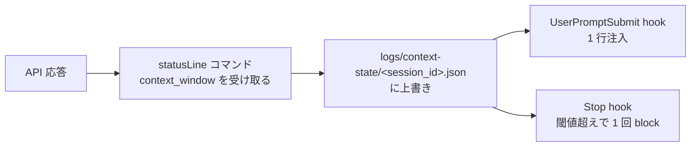

# context 使用率は hook 入力に無いので statusLine から状態ファイル経由で hook に渡す

## 課題

「context が 7 割を超えたら引き継ぎを書かせてから続けさせたい」という hook を作ろうとすると、材料が無い。
hook の共通入力は `session_id`、`transcript_path`、`cwd`、`hook_event_name`、`permission_mode` で、トークン数も使用率も来ない (公式 hooks 文書)。
transcript の `message.usage` を足す手は、値が途中で書かれて更新されないことがあり桁で過小になる
([transcript の usage トークンが過小に記録されていた](../../workflow/transcript-usage-tokens-undercount.md))。

一方、statusLine のコマンドは同じセッションの JSON を stdin で受け取り、その中に `context_window` がある (公式 statusline 文書)。

| フィールド | 中身 |
|---|---|
| `context_window.used_percentage` / `remaining_percentage` | 使用率。セッション初期は `null` になりうる |
| `context_window.total_input_tokens` | 直近の API 応答での入力側合計 (input + cache creation + cache read) |
| `context_window.context_window_size` | 200000、拡張 context のモデルでは 1000000 |
| `context_window.current_usage` | 内訳。初回 API 呼び出し前と `/compact` 直後は `null` |

statusLine はセッション開始時と resume 時、**assistant メッセージが届くたび**、`/compact` 完了時、permission mode 変更時に走る (300ms でデバウンス、実行中に次が来たら中断)。
つまり「最後の API 応答の時点の context の大きさ」を、hook より先に知っている。

## 解決

statusLine を**センサー**にして、hook は状態ファイルを読むだけにする。



### 1. statusLine が書く

```sh
#!/bin/sh
# statusLine。表示と同時に hook 用の状態を残す。失敗しても表示は出す
input=$(cat)
sid=$(printf '%s' "$input" | jq -r '.session_id // empty')
mkdir -p logs/context-state 2>/dev/null
[ -n "$sid" ] && printf '%s' "$input" | jq -c '{ts: (now|todate), pct: .context_window.used_percentage, tokens: .context_window.total_input_tokens, size: .context_window.context_window_size}' > "logs/context-state/$sid.json.tmp" 2>/dev/null && mv -f "logs/context-state/$sid.json.tmp" "logs/context-state/$sid.json"
printf '%s' "$input" | jq -r '"[\(.model.display_name)] \(.context_window.used_percentage // 0)%"'
```

キーは `session_id`。公式が「`$$` や pid は呼び出しごとに変わるので session_id を使え」と書いている通りで、並列セッションが互いの値を読まない。
置き場は `logs/` (追跡しない、絶対パスや session_id を含む記録の置き場)。

### 2. hook が読む

- **UserPromptSubmit**: `pct` を 1 行の事実として注入する (`Context window usage is 62% as of the last response.`)。判断は入れない
- **Stop**: `pct` が閾値を超えていて `stop_hook_active` が false なら `decision: "block"` で 1 回だけ差し戻し、reason に「チケットの次にやることと Do-Not-Repeat を更新してから終える」を載せる
  ([完了時にやらせたい作業はチケットに置き Stop hook で 1 回だけ機械的に差し戻すべき](../11-Stop/return-once-with-the-ticket-checklist.md) と同じ形)。2 回目は通す

Stop の時点で読む値は、そのターンの最後の API 応答で statusLine が書いたものなので鮮度は十分。UserPromptSubmit で読む値は前のターンの末尾のもので、これも用途には足りる。
`pct` が `null` (セッション初期、compact 直後) なら注入も block もしない。

### 3. 閾値と注入量

tomada の実装は 20% で「大きな調査を始めない」、25% で「完了か引き継ぎかを選べ」を注入し、3 回発火して 2 回引き継ぎを選んだ。
sora_biz は statusLine ではなく transcript の最後の `compact_boundary` 以降のバイト数 (800KB ≒ 8 割) を Stop hook で測り、6 か月で 36 回の自動 compact を観測している。
どちらも記事の数値で、この repo では測っていない。

注入自体が context を食う。tomada は 1 回 9〜28 行を入れていて、それ自体が矛盾だと書いている。1 行に絞る。

## 適用条件

- 効く: 放置運用で自動 compact の前に引き継ぎを書かせたいとき。長いセッションで「今どれくらいか」をモデルに知らせたいとき
- **VS Code 拡張で statusLine のコマンドが走るかは確かめていない。** statusLine は端末 UI の機能として書かれていて、このリポジトリの検証環境 (拡張) では未検証。拡張で走らないなら、代替は sora_biz 方式 (transcript の compact_boundary 以降のバイト数) になる
- statusLine の値は「直近の API 応答」で、累計ではない。請求の見積もりには使わない
- statusLine スクリプトは頻繁に走る。`git status` のような重い処理を足すなら session_id をキーに数秒キャッシュする (公式の推奨)
- 設計は公式文書のフィールド定義と 2 本の記事に基づく。この repo で statusLine を置いて hook から読む所までは試していない

## トレードオフ

- 得る: hook が context の大きさを知れる唯一の経路。追加の API 呼び出しも transcript 解析も要らない
- 失う: statusLine を占有する (表示は自分で作る)。状態ファイルが 1 つ増え、statusLine が走らない環境では hook が黙って何もしない。黙るのは注入系の既定なので、`pct` が無いときに「不明」と 1 行出して欠落を見えるようにする

## 関連

- [transcript の usage トークンが過小に記録されていた](../../workflow/transcript-usage-tokens-undercount.md)。transcript から測れない理由
- [完了時にやらせたい作業はチケットに置き Stop hook で 1 回だけ機械的に差し戻すべき](../11-Stop/return-once-with-the-ticket-checklist.md)。閾値超えで差し戻す側の形
- [compact 後は SessionStart hook で作業コンテキストを再注入すべき](../00-SessionStart/reinject-work-context-after-compact.md)。compact されてしまった後の回復側
- [状態を持たない LLM への環境情報は変わる頻度で hook イベントを分けて注入した方がよさそう](split-state-injection-by-staleness.md)。使用率を注入する場所の選び方
- [hook は注入系とガード系に分かれ失敗時の既定は逆であるべき](injecting-vs-guarding-hooks.md)
