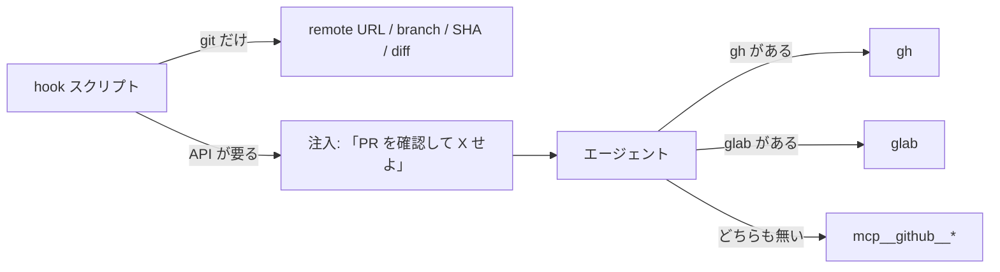

# hook から呼ぶスクリプトは gh / glab に依存させず git だけで完結させる

## 課題

GitHub と GitLab の両方で使うワークフローは、リモートへの経路が 3 つある。

| 経路 | 使える場所 | 呼べる主体 |
|---|---|---|
| `gh` CLI | GitHub、CLI が入った環境 | スクリプトもエージェントも |
| `glab` CLI | GitLab、CLI が入った環境 | スクリプトもエージェントも |
| GitHub MCP (`mcp__github__*`) | Claude Code on the web など CLI が無い環境 | **エージェントのツール呼び出しだけ** |

MCP ツールはエージェントのツール呼び出しとしてのみ発火し、bash や Node のプロセスからは呼べない。
bash から透過的に呼ぶには MCP サーバーへ HTTP / JSON-RPC で直接つなぐ独自クライアントと認証の取り回しが要り、
避けたかった「独自の生 API 呼び出し」に戻ってしまう。

つまり hook から起動されるスクリプトが `gh` / `glab` を呼んだ時点で、MCP しか無い環境ではその hook は動かない。
しかも hook は失敗を握りつぶす書き方 (`( main ) || true`) が多く、CLI 不在で `gh pr view` が失敗すると
「PR: なし」のような**誤った情報をコンテキストへ注入**する。動かないより悪い。

## 解決

1. **hook のスクリプトは git だけで完結させる。** hook が本当に要るのは「今どこにいるか」であり、
   それは git がローカルに持っている。リポジトリの Web URL は `git remote get-url origin` の値を
   `.git` 除去と scp 形式から https への変換で正規化すれば作れる。`gh repo view --json url` と
   実機で比べて `.git` の有無しか違わなかった。ブランチ、SHA、差分、前回 push 時点との比較も git で足りる
2. **プロバイダ判定も remote のホスト部で行う。** `github.com` なら GitHub、それ以外は GitLab とみなす。
   設定ファイルに `provider` を持たせると fork や移設のたびに二重管理になる
3. **プロバイダ API が要る処理はエージェントへ持ち上げる。** PR / MR の存在、レビュースレッド、issue 本文は
   git のデータモデルに無く API 必須。これは hook の中でやらず、hook は `additionalContext` や stdout で
   「ブランチ X の PR を確認して Y をせよ」と**指示だけ注入**し、エージェントがその環境で使える経路
   (`gh` / `glab` / MCP) で実行する。判断は [意味理解を要する判定はエージェントへ委ねる](../../skills/scripts/delegate-meaning-to-agent-keep-scripts-decidable.md)
   と同じ向き
4. **それでもスクリプトが CLI を呼ぶなら、不在時は名指しで委ねる。** `command -v gh` / `command -v glab` で
   経路を判定し、CLI が無ければ「gh / glab が使えないので、`mcp__github__<tool>` で owner/repo を指定して X をしてほしい」を
   stderr と注入文の両方に出して非 0 で終える。空を返して成功しない。書き方は
   [失敗メッセージに代替手段を名指しで埋め込む](../../mcp/name-the-alternative-in-failure-message.md)

## 適用条件

- 効く: 同じ hook を GitHub / GitLab / Claude Code on the web で共有したいとき。hook が push や
  SessionStart のたびに走り、CLI のプロセス起動と API 往復を毎回払いたくないときも同じ設計が効く
- 効かない: skill の手順としてエージェントが対話的に実行する処理。そこでは経路判定の結果で CLI と MCP を
  読み替えればよく、hook の制約は無い
- 未確認: GitLab 向けの MCP サーバー。`glab` 不在の GitLab 環境で何へ委ねるかはツール名を検証できておらず、
  「代替無し、スキップしてよい」と返すに留めている

## トレードオフ

- 得る: hook がプロバイダにも CLI の有無にも依存しない。3 経路のうちどれで動いているかを hook が知る必要がなくなる
- 失う: hook 単体で完結していた処理 (PR リンク付きのレビュー依頼文など) が「リンクは git 由来、PR 番号はエージェント任せ」に分かれる。
  remote URL からの導出は `insteadOf` の短縮エイリアスや SSH と Web UI でポートが違う自己管理構成では 1 本ずれるが、
  フローは止まらないので検知する hook は置かない

## 関連

- [失敗メッセージに代替手段を名指しで埋め込む](../../mcp/name-the-alternative-in-failure-message.md)。手順 4 の具体的な書き方
- [エージェントが呼ぶスクリプトは無言で成功してはならない](../../skills/scripts/agent-scripts-must-not-succeed-silently.md)。「PR: なし」の誤注入はこれの実例
- [意味理解を要する判定はエージェントへ委ねスクリプトには決定的な判定だけを置く](../../skills/scripts/delegate-meaning-to-agent-keep-scripts-decidable.md)
- [worktree に入るとガード hook の前提が変わる](../common/hook-guards-under-worktree-isolation.md)。hook の前提が環境で変わる別の例
