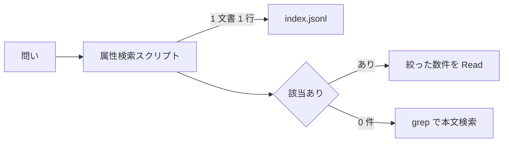

# ドキュメント探索は全文 grep ではなく frontmatter インデックスの属性検索から始めるべき

## 課題

「この機能の設計書はどれか」「コンフリクトについての決定記録はどれか」をエージェントに探させると、既定では `grep` や `find` の全文探索になる。これが 2 つの意味で高い。

**返る量が多い。** ヒット行はファイルの断片でしかないので、結局ファイルを開いて種別と主題を判断することになる。開いた分がそのままコンテキストに残る。

**返る中身が問いに答えていない。** 全文探索は主題としての言及と、他ファイルからの参照リンクや変更履歴の中の言及を同じ重みで返す。「コンフリクト」を含む文書が主題として扱っているのか、一度触れているだけなのかを区別できない。

決定記録 78 件を対象に「コンフリクトについての文書はどれか」を測った (2026-09-09、Git Bash)。

| 手段 | 返る量 | 何が分かるか |
|---|---|---|
| 該当ファイルを全部読む | 178 KB | すべて分かるが、大半は捨てる |
| `grep -rn` (ヒット行) | 56 行 17 KB | 行の断片。主題か言及かは分からない |
| `grep -rl` (ファイル名) | 13 件 1.6 KB | 名前だけ。何の文書かは開かないと分からない |
| インデックスの属性検索 (detail) | 3 件 2.6 KB | 種別・要約・タグ・キーワード |
| インデックスの属性検索 (table) | 3 件 0.8 KB | 種別・パス・タイトル |

grep が返した 13 件のうち、主題としてコンフリクトを扱っていたのは 3 件だった。差の 10 件は文中の言及で、開いて捨てる分がそのままコンテキストの目減りになる。

## 解決

frontmatter を機械可読な 1 レコードとして扱い、探索を 4 層で組む。



**1. 文書側に属性を持たせる。** 各 markdown の frontmatter に種別・タイトル・要約・タグ・キーワードを書く。要約は「この文書を今読むべきか」を本文を開かずに判断するための文にする。ここが薄いと以降の層が全部効かない。

**2. インデックスを生成物にする。** 1 文書 1 行の JSON (`index.jsonl`) をディレクトリごとに生成する。**本文は入れない。** 入れるとインデックスがリポジトリの複製に近い大きさになり、差分スキップも成り立たなくなる。役割を「文書単位の属性検索」に限定し、本文検索は grep に委ねる。

**3. 検索の入口をスクリプト 1 本にする。** インデックスの最新化・結合・絞り込み・並び替え・整形を 1 コマンドで完結させる。エージェントに `jq` のフィルタを毎回書かせると、大文字小文字を無視するか、タグは完全一致か部分一致かといった判断が呼び出しごとに変わり、結果が再現しない。

- **オプションの結合規則は 1 文で説明できる形にする。** 「同じオプションの繰り返しは OR、異なるオプション同士は AND」。オプションごとに規則が変わると覚えられない
- **出力形式で流入量を選べるようにする。** パスだけ、1 行表、要約つき、件数だけ。上の測定で 0.8 KB と 2.6 KB を分けているのがこれ
- **0 件でも終了コードは 0 にする。** 「該当なし」は失敗ではない。非ゼロにすると呼び出し側がエラー処理に落ちる

**4. 呼ばせる動機づけを別に置く。** スクリプトを用意しただけでは第一手段にならない。共通ルール (CLAUDE.md や rules) に「探索はまずインデックス、外れたら grep」の 1 行を置き、判断基準を skill の description に書いてスキル選択の対象に載せる。オプションで表現しない領域 (タグの AND、集計、規約違反の洗い出し) は skill 側に `jq` レシピとして残す。

インデックスは Git 管理から外し、SessionStart hook で再生成する。管理下に置くと生成物の近接行が並行ブランチで競合し、再生成の流し忘れで「インデックスだけを直すコミット」が増える。詳しくは [生成物を Git 管理下に置くかは人間が直接読むかで決めた方がよさそう](../workflow/committed-vs-ignored-generated-files.md)。

### 実物の形

**設計書の frontmatter (層 1)。** 検索の当たり外れは `description` と `tags` / `keywords` でほぼ決まる。

```yaml
---
type: spec
title: セッション再開時のコンテキスト再注入
description: >-
  Defines what the SessionStart hook injects when a session is resumed or restarted after
  compaction, and which sources it reads. Use when changing the injected payload or debugging a
  resume that starts with no context. Not for the hook registration format in settings.json.
tags: [hook, session, context]
keywords: [SessionStart, 再注入, compact, additionalContext, 再開]
status: stable
---
```

**生成される `index.jsonl` の 1 行 (層 2)。** 本文は入らず、パスと frontmatter と mtime だけを持つ。実物は 1 文書 1 行で、ここでは折り返して示す。

```json
{"concept_id":"docs/spec/session-context-injection","directory":"docs/spec",
 "frontmatter":{"type":"spec","title":"セッション再開時のコンテキスト再注入",
   "description":"Defines what the SessionStart hook injects when a session is resumed ...",
   "tags":["hook","session","context"],"keywords":["SessionStart","再注入","compact"]},
 "mtime":"2026-09-09T02:14:31.108Z"}
```

`concept_id` はリポジトリルートからの相対パスで、そのまま Read に渡せる ID にしておく。`mtime` があると更新順の並べ替えと、生成側の差分スキップに使える。

**エージェントが打つ検索 (層 3)。** 同じオプションの繰り返しは OR、異なるオプション同士は AND。

```console
$ search --type spec --tag hook --format table
spec  docs/spec/session-context-injection  セッション再開時のコンテキスト再注入
matched=1 total=214

$ search --type spec --type ddr --text 再注入 --format path
docs/spec/session-context-injection
docs/ddr/i0057-01-compact後もSessionStart-hookで作業コンテキストを再注入する
```

ここまでで 1 KB 未満。当たった 1〜2 件だけを Read し、0 件なら `grep` に落ちる。件数だけ見たいときは `--format count`、要約まで欲しいときは `--format detail` にする。

**オプションで表現しない絞り込みは `jq` に回す (層 4 の skill に置くレシピ)。** タグの AND はこちら。

```bash
cat docs/**/index.jsonl \
  | jq -r 'select((.frontmatter.tags // []) | (index("hook") and index("session"))) | .concept_id'
```

## 適用条件

- 効く: markdown の文書が数百件あり、種別 (仕様・決定記録・計画) が分かれているリポジトリ。エージェントが毎セッション「どれを読むか」から始める運用
- 効く: 文書が主題ごとに分かれていて、frontmatter の要約が書かれている場合
- 効かない: 文書が数十件以下。ファイル名の一覧で足りる
- 効かない: 「この関数を呼んでいる箇所」のような本文の語を探す問い。これは grep の仕事で、インデックスは答えを持たない
- 効かない: frontmatter が形だけで要約が空、あるいはタグの語彙が統制されていない場合。属性検索は frontmatter の質をそのまま増幅する

## トレードオフ

- 得る: 探索 1 回あたりの流入が桁で減る。主題としての言及と、ついでの言及を分離できる
- 失う: frontmatter を書く手間と、語彙を統制する運用が要る。書かれていない文書はインデックスに載っても検索で当たらない
- 外した場合は grep に落ちるだけなので、失敗が安い。逆順 (常に grep) は当たった場合でも読むべきファイルを絞れない
- インデックスが陳腐化すると、実在しない文書を指す。生成のたびに一時ファイル + rename で原子的に差し替え、走査の中断で壊れないようにする

## 関連

- [gitignore 対象のインデックスを fs 走査で集めると無視ディレクトリの残置インデックスまで検索に入る](scripts/index-enumeration-picks-up-ignored-clones.md)。この仕組みを実装したときに踏む落とし穴
- [生成物を Git 管理下に置くかは人間が直接読むかで決めた方がよさそう](../workflow/committed-vs-ignored-generated-files.md)
- [Grep ツールは .gitignore に載ったファイルを検索しない](../workflow/grep-tool-skips-gitignored-files.md)。インデックスを管理外にすると全文探索からも消える
- [skill の description は 1,536 字で切られ一覧が予算を超えると使っていない skill は名前だけになる](skill-description-cut-by-listing-budget.md)。層 4 の skill が呼ばれなくなる条件
- [skill を足すコストは既存の skill が払うので総数を絞るべき](adding-a-skill-is-paid-by-the-other-skills.md)
