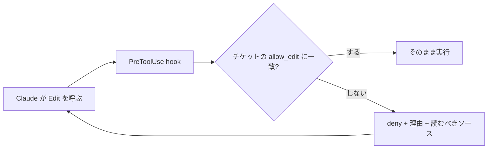

# チケットの frontmatter を根拠に範囲外の操作を deny する

## 課題

長いセッションほど、守らせたい指示が守られなくなる。原因は 3 つある。

- **希薄化**: CLAUDE.md や rules はセッション冒頭に一度入るだけで、会話が伸びるほど直近のやりとりに埋もれる
- **理由が残らない**: `permissions.deny` はツール呼び出しを止められるが、理由を添えられない。Claude が受け取るのは `Permission to use Bash has been denied.` のような一文だけで、なぜ止まったのか、代わりに何を読むべきかが分からない。結果、同じ操作を言い換えて再試行する
- **範囲が固定できない**: 「今のタスクで触ってよい場所」はタスクごとに変わる。settings.json の静的な deny ルールでは表せない

## 解決

作業指示 (チケット) を 1 ファイルにし、その frontmatter に**機械可読な作業範囲**を書く。これを唯一の権限ソースにして、PreToolUse hook が突き合わせる。



拒否のたびに、範囲と参照先がコンテキストへ戻る。冒頭の指示が薄まっても、実際に手を動かす瞬間に必要な分だけ再注入される。

### チケット

```yaml
---
id: T-123
title: index 生成を速くする
allow_edit:
  - scripts/**
  - package.json
read_first:
  - .claude/rules/scripting.md
---
```

### hook

判定は glob と YAML が要るので POSIX sh には収まらない。TypeScript で書き、`pnpm exec` を挟まず node を直接呼ぶ。

```ts
const input = JSON.parse(readFileSync(0, 'utf8'))
const file = String(input.tool_input?.file_path ?? '').replace(/\\/g, '/')
const ticket = process.env.CLAUDE_TICKET
if (!file || !ticket) process.exit(0)

const fm = parse(readFileSync(ticket, 'utf8').split(/^---$/m)[1] ?? '') ?? {}
const allow: string[] = fm.allow_edit ?? []
const rel = file.replace(process.cwd().replace(/\\/g, '/') + '/', '')
if (allow.length === 0 || allow.some((g) => toRe(g).test(rel))) process.exit(0)

process.stdout.write(JSON.stringify({
  hookSpecificOutput: {
    hookEventName: 'PreToolUse',
    permissionDecision: 'deny',
    permissionDecisionReason: `チケット ${fm.id} の範囲外: ${rel}。編集してよいのは ${allow.join(', ')}。範囲を広げるならチケットを先に更新する`,
    additionalContext: `作業前に読み直す: ${(fm.read_first ?? []).join(', ')}`,
  },
}))
```

`permissionDecisionReason` は拒否の理由として Claude に返り、`additionalContext` は system reminder の平文として渡る。理由が Claude に届くのは `deny` のときだけで、`allow` と `ask` では人に表示されるだけなのに注意する。前者に「なぜ止めたか」、後者に「何を読み直すか」を分けて入れる。どちらも `hookSpecificOutput` の下に置くこと。トップレベルに書くと黙って無視される。

settings.json 側は `matcher` で対象ツールを絞る。

```json
{ "matcher": "Write|Edit",
  "hooks": [{ "type": "command", "command": "node --import tsx scripts/scope-guard.ts", "timeout": 10 }] }
```

## 適用条件

効くのは次の条件を満たすとき。

- 範囲がパスの glob やコマンド名で機械的に判定できる。判断が要るなら prompt-based hook や agent-based hook にする
- PreToolUse は `EndConversation` 以外の全ツールで、全 permission mode で走る。`bypassPermissions` や `--dangerously-skip-permissions` でも deny は効くので、mode 変更で迂回されない
- 複数の hook が答えたときは最も厳しいものが勝ち、`additionalContext` は全 hook 分が連結して渡る

### 優先順位

明示的な ask と暗示的な ask は強さが逆になる。ここを混ぜると設計を誤る。

| 強さ | 判定 | 性質 |
|---|---|---|
| 1 | `permissions.deny` の一致 | 誰も覆せない。hook が `allow` を返しても評価される |
| 1 | hook の `deny` | 全 permission mode で効く。mode 変更では迂回できない |
| 2 | **明示的 ask** (`permissions.ask` の一致) | どのモードでも自動承認されない。hook の `allow` でも飛ばせない |
| 3 | allow (`permissions.allow` または hook の `allow`) | 飛ばせるのは暗示的 ask だけ |
| 4 | **暗示的 ask** (どのルールにも一致しない) | 一番弱い。allow で消え、モードによっては最初から prompt が出ない |

暗示的 ask は「ルールが無いのでモードの既定に落ちた」状態でしかない。Manual mode ならファイル編集・シェル実行・ネットワークは人に聞くが、auto mode では classifier が人の代わりに判断し、`bypassPermissions` では素通りする。守らせたいものを暗示的 ask に任せない。止めたいなら deny、必ず人に聞かせたいなら明示的 ask を書く。

### defer は使わない

hook の合成順に出てくる `defer` はこの序列とは別物で、拒否ではなく**保留**。`claude -p` の非対話実行でだけ有効で、ツール呼び出しを transcript に残したままプロセスを `stop_reason: "tool_deferred"` で終える。Agent SDK のアプリが自前の UI で承認を集め、resume して続きを走らせるための値。

ガードには使わない。理由は 3 つある。

- **対話セッションでは効かない。** 警告を出して無視されるので、同じ hook が実行環境によって止めたり止めなかったりする
- **理由が消える。** `defer` では `permissionDecisionReason` も `additionalContext` も `updatedInput` も捨てられる。「拒否と一緒に理由を注入する」というこのパターンの狙いと正面から矛盾する
- **条件が読めない。** 1 ターンに複数のツール呼び出しがあると無視される。Claude が何本まとめて呼ぶかは制御できない

止めたいなら `deny`、必ず人に聞かせたいなら明示的 ask を使う。`defer` は「呼び出し元アプリに承認 UI を作る」ときだけの値で、権限設計の道具ではない。

効かないのは次のとき。

- **read は強制できない**。hook はツール呼び出しを起こせない。`additionalContext` は指示文を積むだけで、実際に読むかは Claude 次第
- Read / Edit の deny は Claude のファイルツールと `cat` `sed` などには効くが、Python や Node のスクリプトが間接的に開くファイルには効かない。OS レベルで止めるなら sandbox
- 普遍的な禁止 (`.env` を読ませない等) は `permissions.deny` の方が確実。hook の allow / ask は deny ルールを覆せない

補完として、`SessionStart` の `compact` matcher で圧縮後にチケットを再注入すると、コンテキスト圧縮をまたいでも範囲が残る。

## トレードオフ

- **得る**: 拒否が説明付きになり、再試行の空回りが減る。範囲はコンテキスト長に依存せず、チケットを直さない限り広がらない
- **失う**: チケットの frontmatter を最新に保つ手間。範囲を狭く書きすぎると正当な作業まで止まり、Claude が回り道する
- hook はツール呼び出しのたびに走る。`pnpm exec` や `uv run` を挟むと 1 回で 3 秒級になるので、node を直接呼ぶ ([scripting.md](../.claude/rules/scripting.md))
- deny の理由は毎回コンテキストに入る。「範囲を広げないと通らない」と分かる最小限に留める

## 関連

- [タイムアウトした hook はガードにならず素通りする](hook-timeout-fails-open.md)。このパターンは hook をガードとして使うので必ず併読する。判定はローカルのファイル読みと glob だけに留め、外部通信や LLM 呼び出しを混ぜない
- このリポジトリの [protect-generated.sh](../.claude/hooks/protect-generated.sh) は同じ発想の最小版。生成物の編集を exit 2 と stderr で止め、再生成コマンドを理由として返す
- exit 2 + stderr でも PreToolUse は止まるが、理由と追加コンテキストを分けて渡せるのは JSON 出力だけ
