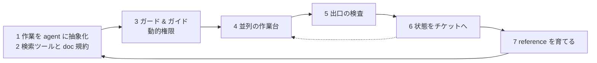

# エージェントに用意する環境は、与える・縛る・走らせる・検査する・引き継ぐ・育てるの一周として組むべき

## 要点

エージェントに任せるために整えるものは、思いついた順の個別対策ではなく 7 つの枠組みに落ちる。
7 つは独立した施策ではなく、与える → 縛る → 走らせる → 検査する → 引き継ぐ → 育てる、で一周するループになっていて、
最後の「育てる」の出力が最初の「与える」の入力に戻る。どれか 1 つを欠くとそこで輪が切れて残りが効かなくなり、
逆に一周が閉じていれば、以後に利用者が育てるのは rules と reference と hook の設定の 3 つだけになる。

## 仕組み

### 土台となる前提

7 つが必要になる理由は 3 つの前提から出ている。枠組みを説明するときは、ここを先に置かないと全部が過剰投資に見える。

- [エージェントの使い方は 1 回で正解が出る前提ではなく、必ず外す前提で組むべき](one-shot-correctness-is-the-wrong-premise.md) — 外れることを前提にすると、必要なのは指示の作り込みではなく、外れを検知して戻す経路になる
- [サブエージェントが効くのは親の節約ではなく新品のコンテキストで考え直せるから](../agents/subagent-value-is-a-fresh-context.md) — 汚れたコンテキストは足し算では直らない
- [context が伸びるほど指示が効かなくなるのは注意が全トークンに配られるから](../model/attention-dilutes-as-context-grows.md) — 渡す量を絞ることが、指示を強めるより効く

### 7 つの枠組み

**1. 作業を agent に抽象化する。**
CLAUDE.md と SKILL.md を好きに作らせない。抽象化した作業を agent として定義し、そのときの指令に必要なプロセスは reference から検索して使わせる。
乱雑な作成はコンテキスト汚染を招き、意図しない挙動に繋がる。
[skill を足すコストは既存の skill が払う](../skills/adding-a-skill-is-paid-by-the-other-skills.md)ので総数は絞り、
[他の skill からしか呼ばれない手順は skill にせず references のファイルに置く](../skills/caller-only-procedures-belong-in-skill-references.md)。

**2. 検索用ツールとドキュメント規約を作る。**
1 の reference 側の裏づけ。属性で引ける索引と、それに沿った書式・チェック手順を用意し、
[全文 grep ではなく frontmatter インデックスの属性検索から始める](../skills/frontmatter-index-search-before-grep.md)。
探索時のコンテキスト汚染を避けるのが目的で、[skill が増えたときも一覧の切り詰めではなく検索ツールに寄せる](../skills/skill-search-tool-instead-of-listing-truncation.md)。
書式は[要件書の 5 節](write-requirements-in-five-sections.md)や[決定記録の 5 節](decision-record-fixed-five-sections.md)のように固定する。
人間には維持が重いが、抽出と更新はエージェントが得意な作業なので回る。

**3. hook をガード & ガイドにする。**
Claude Code 公式でできるより細かい制御を、簡単に設定できる形にする。
[介入はガード・誘導・自動化の 3 機構で切り](../hooks/common/guard-steer-automate-mechanisms.md)、
[権限は permissions.deny ではなく PreToolUse hook で止める](../hooks/20-PreToolUse/deny-by-hook-not-permissions.md)。
計画時にチケットで権限を決め、それをもとに動かす (動的権限設定)。ただし
[エージェントが書く宣言で権限を広げられないようにする](../hooks/20-PreToolUse/agent-written-declarations-cannot-widen-permissions.md)。
細かくした分だけ壊れるので、[enable / dry-run / disable の 3 モードで運用し](../hooks/common/guard-hook-enforcement-modes.md)、
[設定が壊れても復旧経路を残す](../hooks/common/keep-recovery-path-when-guard-config-breaks.md)。

**4. 並列の作業台を用意する。**
1 で定義した agent を複数走らせるための前提。
[並列で走らせるエージェントは git worktree で隔離し](../agents/parallel-agents-isolated-by-worktree.md)、
[依存ディレクトリは symlink で共有する](../agents/share-dependency-dirs-across-worktrees-by-symlink.md)。
並行して初めて壊れるもの ([連番 ID の衝突](sequential-ids-collide-across-branches.md)、
[ベースブランチとの衝突検知](detect-conflicts-with-merge-tree.md)) は、走らせる前に潰しておく。

**5. 出口の検査を機械で持つ。**
3 が入口の制御なのに対し、これは出力側。
[本当に守らせたい内容は指示側の誘導と出力側の検査を対で置く](pair-steering-with-output-check.md)。
[完了条件を達成型・収束型・判定型に分け](three-types-of-completion-conditions.md)、機械が判定できる達成型だけを Stop hook に載せる。
[抜けはルールの文言強化ではなく記録とゲートで塞ぎ](../rules/close-gaps-with-mechanism-not-wording.md)、
判定の要るものは[独立コンテキストの読み取り専用サブエージェント](../agents/adversarial-review-in-isolated-subagent.md)に出して、
[確度と重大度つきの findings を返させ、閾値は呼び出し側が持つ](../agents/reviewer-scores-findings-caller-applies-threshold.md)。

**6. 状態をチケットに外出しして context をまたがせる。**
3 の「チケットに権限を書く」を一般化すると、チケットがセッションをまたぐ状態の置き場になる。
[やらせたい残作業はチケットに置いて Stop hook で 1 回だけ差し戻し](../hooks/11-Stop/return-once-with-the-ticket-checklist.md)、
[踏んだ失敗は Do-Not-Repeat 節に残し](keep-do-not-repeat-list-outside-context.md)、
[最終状態はチケットの固定節へ上書きする](../hooks/30-SessionEnd/write-final-state-into-ticket-section.md)。
compact でコンテキストは必ず失われるので、[SessionStart hook で作業コンテキストを再注入する](../hooks/00-SessionStart/reinject-work-context-after-compact.md)。

**7. reference を育てるフィードバックループを組む。**
5 で検査に引っかかったものと 6 に溜まった失敗が、そのまま入力になる。作業中に見つけた失敗と指摘を自動でドキュメントとして育て、
人間が教師として指摘を入れることで、強化学習的に正解しやすい側へ寄っていく。
[Ralph loop の反復が良い結果に近づくのは、失敗を捨てて成果だけを外に残しているから](ralph-loop-converges-by-ratcheting-progress.md)で、
ここで残す先が 2 の reference になる。[CLAUDE.md はモデルが外したときだけ足す](../rules/claude-md-starts-minimal-and-grows-only-on-misses.md)のも同じ形。

### ループが閉じること

7 の出力が 2 の索引に戻り、次の周では 1 の agent がそれを検索して使う。ここが繋がっていないと、
知見は溜まるが使われないドキュメントになり、エージェントの挙動は周回しても改善しない。
6 から 4 へ戻る破線は、context を捨てて同じ作業台で再開する経路で、周回のたびにコンテキストを新品にするために要る。

### 利用者が育てるのは 3 つになる

一周が閉じた後に触り続ける面は、context に載る経路が 2 種類しかないことから決まる。
常時載るもの (CLAUDE.md、paths を書かない rules、skill とサブエージェントの description 一覧、ツール定義) は、
触るかどうかに関わらず、存在するだけで毎リクエストのコストになる。
契機で載るもの (paths 付き rules、skill の本体、サブエージェントの本体、reference、hook の出力) は呼ばれたときだけ入る。
育ててよいのは後者だけで、この線引きがそのまま担当の線引きになる。

| 面 | 触る人 | 仕組み上の理由 |
|---|---|---|
| reference | 利用者 (と 7 のループ) | 呼ばれたときだけ載るので、増やしても常時のコストが増えない |
| rules | 利用者 (hook と対で) | paths 付きのみ。paths なしのものはreferenceに記載する。また、rulesも長くなりすぎないように詳細はreferenceに分離する |
| hook のポリシー | 利用者 (rules と対で) | settings.json は context に載らない。止めて導く手段なので rules と対になる |

## 使いどころ

- 何から作るかを決めるときの地図として使う。上から順に作るのではなく、輪が切れている場所を先に埋める
- 個別のプロンプト改善が効かない理由を説明するときに使う。文言の問題ではなく、5 か 7 が無いので外れが戻ってこないだけのことが多い
- 単発の小さな作業しかしないなら過剰。一周させる価値が出るのは、同じ種類の作業を繰り返し、失敗が再発するとき

## 関連

- [エージェントの使い方は 1 回で正解が出る前提ではなく、必ず外す前提で組むべき](one-shot-correctness-is-the-wrong-premise.md)
- [本当に守らせたい内容は指示側の誘導と出力側の検査を対で置かないといけない](pair-steering-with-output-check.md)
- [エージェントへの介入はガード・誘導・自動化の 3 機構で切るべき](../hooks/common/guard-steer-automate-mechanisms.md)
- [Claude Code の機能が分かれているのは context を守るため](features-split-to-protect-the-context-window.md)
