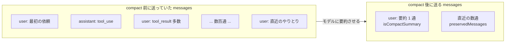

# Claude Code の compact はモデルへ送る会話を要約 1 通と直近数通に組み直す

## 要点

`/compact` と自動圧縮は、サーバに履歴を預ける機能ではない。Claude Code がモデルに会話の要約を書かせ、
次から送る `messages` 配列を**要約 1 通と、直近の数通だけ**に置き換えている。
消えるのは送る側だけで、ディスク上の transcript には 2 行足されるだけで何も消えない。

## 仕組み

### 送る会話がどう変わるか



要約は普通の `user` メッセージとして会話の先頭に置かれ、本文は
`This session is being continued from a previous conversation that ran out of context.` で始まる。
それ以前のメッセージは送られなくなり、その分が `cumulativeDroppedTokens` に積まれていく。

### リクエストの中身がどう変わるか

同じセッションの `POST /v1/messages` のリクエストが、圧縮の前後でこう入れ替わる。
リクエストの本体そのものは外から観測できないので、これは transcript に残る行から組み立てた再現である。

**compact 前**。

```json
{
  "model": "claude-opus-5",
  "max_tokens": 16000,
  "system": "(Claude Code のシステムプロンプト + CLAUDE.md + rules)",
  "tools": [ "Read", "Edit", "Bash", "..." ],
  "messages": [
    { "role": "user",      "content": "認証まわりのバグを直して" },
    { "role": "assistant", "content": [
      { "type": "tool_use", "id": "toolu_01", "name": "Read",
        "input": { "file_path": "src/auth.ts" } }
    ] },
    { "role": "user",      "content": [
      { "type": "tool_result", "tool_use_id": "toolu_01",
        "content": "(src/auth.ts の全文)" }
    ] },

    "... この調子で数百通。合計で数十万トークン ...",

    { "role": "assistant", "content": [ { "type": "tool_use", "name": "Edit", "...": "..." } ] },
    { "role": "user",      "content": [ { "type": "tool_result", "...": "..." } ] }
  ]
}
```

**compact 後**。`messages` の中身だけが総取り替えになり、`system` と `tools` はそのまま。

```json
{
  "model": "claude-opus-5",
  "max_tokens": 16000,
  "system": "(同じ。CLAUDE.md と rules はディスクから読み直される)",
  "tools": [ "Read", "Edit", "Bash", "..." ],
  "messages": [
    { "role": "user", "content": "This session is being continued from a previous conversation that ran out of context. The summary below covers the earlier portion of the conversation.\n\nSummary:\n1. Primary Request and Intent:\n   - 認証まわりのバグ修正の依頼\n2. Key Technical Concepts:\n   - ...\n3. Files and Code Sections:\n   - src/auth.ts ...\n(中略)\n9. Optional Next Step:\n   - ..." },

    { "role": "user", "content": "(compact 前に読んでいたファイルの添え直し。全文が入るものとパスだけのものがある)" },

    "... preservedMessages に載っていた直近の数通がここに続く ...",

    { "role": "assistant", "content": [ { "type": "tool_use", "name": "Edit", "...": "..." } ] },
    { "role": "user",      "content": [ { "type": "tool_result", "...": "..." } ] }
  ]
}
```

合計は数万トークン以下まで落ちる。**先頭の `user` メッセージが丸ごと別物に差し替わる**ので、
`system` と `tools` が同じでも prompt cache の前方一致はここで切れる。

### 読んでいたファイルは 2 通りの形で添え直される

圧縮前に読んでいたファイルは消えっぱなしにはならず、圧縮の直後に `attachment` 行として transcript に現れる。形が 2 つある。

| `attachment.type` | 中身 | 意味 |
|---|---|---|
| `file` | `filename` と `content` (ファイル全文) | もう一度全文を載せ直す |
| `compact_file_reference` | `filename` と `displayPath` だけ。中身は無し | 「このファイルを読んでいた」という手がかりだけ残す |

`compact_file_reference` が現れるのは圧縮を挟んだセッションだけで、圧縮の無いセッションには出てこない。
つまり**圧縮を挟むとファイルの中身はパスだけに落とされることがある**。
圧縮後にファイルの中身を前提にした作業を続けさせるなら、読み直しを指示した方が確実になる。

### transcript には 2 行足されるだけ

圧縮が起きると `system` の `compact_boundary` 行と、その直後に `isCompactSummary: true` の `user` 行が追記される。
前の行は消えないので、ファイルは縮まない ([transcript JSONL は /compact を挟んでも追記専用である](transcript-jsonl-is-append-only-across-compact.md))。

`compact_boundary` 行の `compactMetadata` が持っているもの。

| フィールド | 中身 |
|---|---|
| `trigger` | `manual` (`/compact`) か `auto` (上限が近づいての自動圧縮) |
| `preTokens` / `postTokens` | 圧縮前と圧縮後の、次から送るコンテキストのトークン数 |
| `cumulativeDroppedTokens` | そのセッションでここまでに送らなくなったトークンの累計 |
| `durationMs` | 圧縮そのものにかかった時間 |
| `preservedMessages` | 要約せずそのまま残すメッセージの uuid の一覧 (`anchorUuid` / `allUuids`) |
| `preservedSegment` | 残す範囲の `headUuid` / `anchorUuid` / `tailUuid` |
| `preCompactDiscoveredTools` | 圧縮前に検索して読み込んでいた遅延ツールの名前。圧縮後に復元するための控え |

### 要約は 9 節の決まった形をしている

要約は自由作文ではなく、次の 9 節をこの順で持つ。何が残り何が残らないかは、この節構成で決まる。

1. Primary Request and Intent
2. Key Technical Concepts
3. Files and Code Sections
4. Errors and fixes
5. Problem Solving
6. All user messages
7. Pending Tasks
8. Current Work
9. Optional Next Step

ユーザの発言 (6 節) と未完了タスク (7 節) と直前の作業 (8 節) は残る。
一方で「試して駄目だった手」は 4 節に入ることもあるが保証されない。
残したいものは会話の外に書き出しておく方が確実 ([失敗した手はチケットの Do-Not-Repeat 節に残す](keep-do-not-repeat-list-outside-context.md))。

### 圧縮後の大きさは元の大きさによらない

`compact_boundary` 行の `preTokens` と `postTokens` を並べて見ると、圧縮前がどれだけ大きくても
**圧縮後はほぼ一定の大きさに収束する**。要約の 9 節という形が決まっている以上、書ける量に上限があるためと考えられる。
圧縮前が大きいほど落差が大きくなるだけで、圧縮後が比例して大きくなることはない。

その代わり圧縮自体が重い。`durationMs` は分単位になる。会話全文を読ませて要約を書かせる大きなリクエストなので、
compact は「context が足りなくなったら気軽に押す」操作ではない。

### サーバ側の compaction は使っていない

Claude API には履歴をサーバで要約する compaction (beta) があるが、Claude Code はそれを使っていない。
根拠は 2 つある。要約が API の `compaction` ブロックではなく**普通の `user` メッセージ**として transcript に現れること、
そして公式ドキュメントがキャッシュミスの説明で「Claude Code 自身が会話を書き換えたとき (compaction や古いツール結果の消去)」と書いていること。
圧縮も古いツール結果の消去も、クライアント側で `messages` 配列を組み直して実現している
([Messages API は stateless で毎ターン会話全文を送り直している](messages-api-is-stateless-and-resends-the-whole-conversation.md))。

## 使いどころ

- **圧縮の直後はキャッシュが冷える。** 会話の先頭が丸ごと差し替わるので、prompt cache の前方一致が成立しなくなる。
  `/usage` はこれを「expected rebuild」として通常のキャッシュミスと区別して数える
- **話題が変わるだけなら compact より `/clear` の方が安い。** compact は会話全文を読む大きなリクエストだが、`/clear` はタダ
- **残したいものは 9 節に載るかで判断する。** 載らないものは圧縮前にファイルへ書き出す。
  圧縮後に読み直させたい手順書は SessionStart hook で注入する
  ([compact 後は SessionStart hook で作業コンテキストを再注入する](../hooks/00-SessionStart/reinject-work-context-after-compact.md))
- **`compactMetadata` は観測の材料になる。** `cumulativeDroppedTokens` が伸びているセッションは、
  タスクを切らずに走り続けているセッションなので、切り方を見直す手がかりになる

効かない場面もある。`preservedMessages` に残る通数は一定ではないので、何が残るかを当てにした設計はできない。
また transcript の形式は非公開で、フィールド名は版で変わりうる。

## 関連

- [Claude Code の transcript JSONL は /compact を挟んでも追記専用である](transcript-jsonl-is-append-only-across-compact.md) — ディスク側で何が起きるか
- [Messages API は stateless で毎ターン会話全文を送り直している](messages-api-is-stateless-and-resends-the-whole-conversation.md) — なぜ圧縮が要るのか
- [Claude Code の機能が分かれているのは context を守るため](features-split-to-protect-the-context-window.md)
- [compact 後は「読んだ」認識を信用せず手順書の読み直しを指示で注入する](../hooks/00-SessionStart/reread-instruction-not-content-after-compact.md)
