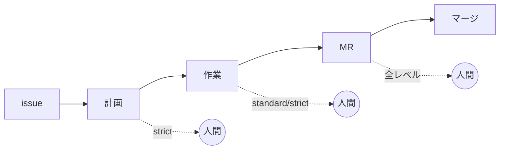

# 人間レビューを挟む段数は issue ごとに quick / standard / strict から選んでおくとよいはず

## 思いつき

issue-MR ベースのワークフローでは、エージェントが 計画 → 作業 → MR の順に進む。
このとき**人間がどこで止めて中身を読むか**を、その場の空気で決めていることが多い。

その場で決めると 2 方向に外れる。

- 1 行直すだけの issue でも計画レビューを待たせ、人間の応答待ちがフローの各所に散る
- 逆に、設計判断を含む変更が MR まで誰にも読まれずに進み、方針違いに気付くのが一番高い地点になる

止まる場所は変更の性質で変わるべきものなのに、その判断がセッションごとに揺れる。
なら**起票の時点で段数を決めて issue に書いておく**。エージェントは書かれた段数どおりに止まるだけになる。

## 3 段階

人間が読みうる地点は 計画 / 作業結果 / MR の 3 つ。マージゲート (MR) は常に人間が見るので、
違いは**その手前に何段積むか**だけになる。

| レベル | 計画 | 作業結果 | MR | 人間が止まる回数 |
|---|---|---|---|---|
| `quick` | — | — | 人間 | 1 |
| `standard` | — | 人間 | 人間 | 2 |
| `strict` | 人間 | 人間 | 人間 | 3 |

`quick` は「エージェントに任せ切って結果だけ見る」、`strict` は「方針の段階から握る」。
`standard` はその間で、計画は任せるが成果物は MR に載せる前に一度読む。

## 一律にしない理由

- **全部 `strict` にすると人間が枯れる。** レビューは人間側の有限資源で、計画レビューを毎回挟めば
  待ち時間が単純に増える。小さい issue の計画を読んでも捕まる間違いはほとんど無い
- **全部 `quick` にすると手戻りが最大化する。** 方針が違う計画のまま作業が完走し、MR で全部書き直しになる。
  計画レビューの価値は「間違いを一番安い地点で捕まえる」ことなので、設計判断を含む issue では省けない

レベルの選択は結局、**手戻りの期待コストと人間の待ち時間の交換**を issue 単位でやる話になる。

## `quick` を難しい issue に当てると暴走しやすい

`quick` の危うさはレビューが 1 回しか無いことだけではない。
**人間が止まる地点は、ユーザが文脈を切る地点でもある**というところにある。

`/compact` と `/clear` は built-in command で、エージェント自身は打てない
([タスクの切れ目で /compact と /clear をユーザに依頼させた方がよさそう](../hooks/22-PostToolUse/ask-user-to-reset-context-at-task-boundaries.md))。
文脈を切る操作は必ず人の手を経るので、**人間がレビューで止まらない限り、ユーザが明示的にクリアする機会そのものが来ない。**

難しい issue を `quick` で渡すと、計画から MR まで 1 つのセッションが途切れずに伸びる。すると、

- 自動圧縮が「閾値に達した時点」で走る。その時点はたいてい作業の最中で、進行中の細部が要約から落ちる
- 圧縮を挟むほど、最初に決めた方針と issue の制約が薄まる
- 薄まったまま作業が続くので、方針から外れたことに誰も気付かないまま MR まで到達する

`quick` はレビュー段数を削るだけでなく、**文脈をリセットする機会も同時に削っている。**
しかも難しい issue ほどセッションが長くなるので、段数を削る効果と希薄化の起きやすさが同じ方向に効く。
`standard` 以上を選ぶ理由は、レビューそのものより「セッションを 1 回切れること」の方が大きいかもしれない。

裏返すと、レベルを選ぶ材料に**そのセッションがどれだけ長くなりそうか**が入る。
影響範囲が広い、調査が要る、前例が無い、といった条件は手戻りの期待コストを上げると同時にセッション長も伸ばすので、
同じ材料が両方の理由から `quick` を外す方向に働く。

## 誰がいつ決めるか

起票時に**エージェントが提案し、人間が承認する**。レベルは変更の性質から見積もれるが、
見積もりには解釈が入るので機械的に決め切らず人間が 1 回見る
([意味理解を要する判定はエージェントへ委ねスクリプトには決定的な判定だけを置く](../skills/scripts/delegate-meaning-to-agent-keep-scripts-decidable.md) と同じ形)。

提案の材料になりそうなもの。

- 影響範囲が 1 ファイルに閉じるか、複数の仕様にまたがるか
- 前例のある作業か、新しい設計判断を含むか
- 外から取り消せるか (取り消せない副作用を含むなら段を増やす)

決まったレベルは issue 本文かラベルに書く。後続のセッションが同じ issue を拾ったとき、
どこで止まるかを再交渉しないで済む状態にしておくのが目的なので、チャットの中だけで決めない。

## 「誰がやるか」の線引きとは別の軸

[エージェントに任せる操作と人間承認が要る操作の線引きは可逆性で決めるべき](reversibility-decides-who-acts.md) は
**どの操作を人間が実行するか**を可逆性で決めていて、答えはマージと外部通知の 2 点に固定される。
こちらは操作ではなく**成果物をどこで読むか**の段数で、issue ごとに変わる。
2 つは衝突しない。可逆性の表が「マージは人間」と言っているので、`quick` でも人間が読む地点が 1 つ残る。

## 確かめていないこと

- **運用していない。** レベルを先に決めたことで手戻りが減った、待ち時間が減った、という実測を持っていない
- **3 段階が適切な数か分からない。** `quick` / `strict` の 2 値で足りるかもしれないし、
  「計画だけ見て作業は任せる」という 4 つ目が要るかもしれない
- **途中でレベルを変える運用が要るか分からない。** 計画を読んだら想定より大きかった、作業中に設計判断が出てきた、
  という場合に上げ下げできる必要があるか
- **宣言だけで守られるか分からない。** issue に `standard` と書いても、エージェントが読み落として MR まで走る可能性がある。
  [抜けを塞ぐのはルールの文言強化ではなく記録とゲートであるべき](../rules/close-gaps-with-mechanism-not-wording.md) に従うなら
  Stop hook などの機構でゲートにする形になるが、その形が要るかは回してみないと分からない
- **レビューと文脈リセットを分けられるか分からない。** 「人間は読まないがセッションだけ切る」段を置けば `quick` の希薄化だけ潰せるかもしれないが、
  読む理由の無い区切りをユーザが律儀に打つとは思えない
- **`quick` と `standard` の差が実際に出るか分からない。** 作業完了と MR 作成が同じ地点に潰れるフローだと、
  2 つのレビューが 1 回のレビューの深さの違いに吸収されてしまう

## 昇格の目安

(.claude/rules/knowledge-authoring.md「note を昇格させる」)。満たしたら type を変える。ファイルは動かさない。

- [ ] 粒度が type の定義に収まっている → 「課題と解決」の形なので `pattern` になる見込み
- [ ] sources に一次情報がある → 思いつきなので出典が無い。既存の段階的レビュー運用の記述を探す
- [ ] 実際に試して applies_to と verified_at を書ける → issue-MR フローで数件、レベルを決めてから回す
