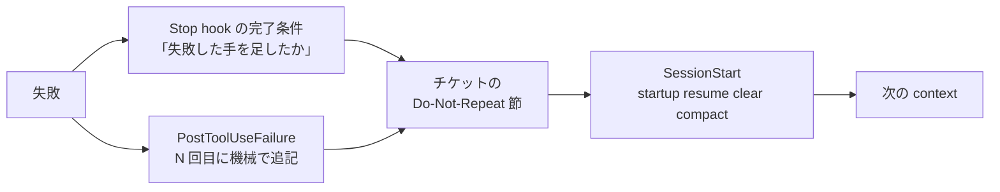

# 失敗した手は context ではなくチケットの Do-Not-Repeat 節に残して次の context に渡す

## 課題

エージェントが「この手は駄目だった」と学ぶのは context の中だけ。compact されれば要約の精度次第で消え、`/clear` や
fresh-context のループ (Ralph loop、Anthropic の長時間 harness) では毎回ゼロから始まるので、前の context が捨てた手を次の context がもう一度試す。
放置運用ではこれが堂々巡りの主因になる。同じセッション内の連続失敗は回数で止められるが
([同じコマンドの失敗は PostToolUseFailure で数えて段階的に介入した方がよさそう](../hooks/23-PostToolUseFailure/count-repeated-failures-then-escalate.md))、
context をまたいだ再試行はカウンタも一緒に消えるので止められない。

公式 best-practices も同じことを人の側の手順として書いている。「同じ件で 2 回直しても駄目なら `/clear` して、**学んだことを織り込んだ**プロンプトで始め直せ」。
織り込む先が人の頭にしか無いのが問題で、放置運用では人が居ない。

## 解決

「やってはいけない手」を context の外、チケットの固定節に 1 行ずつ残し、次の context の最初に渡す。



### 1. 節の形

チケット (`wip/tickets/<id>.md`) に「次にやること」と並べて置く。1 件 1 行、事実だけ、日付付き。

```markdown
## やってはいけない手 (Do-Not-Repeat)
- 2026-09-05 `pnpm test -- --filter lint` は vitest の filter 構文ではない。`Exit code 1 / No test files found`。`pnpm run t -- lint` を使う
- 2026-09-05 INDEX.md を手で直すのは無駄。pre-commit で `pnpm index` が上書きする
- 2026-09-04 `git stash` で作業を退避するとサブエージェントの worktree から見えなくなる。ブランチに commit する
```

「何を試したか」「観測したエラーの先頭行」「代わりに何をするか」の 3 点。理由の考察は書かない。次の context が読むのは判断材料であって物語ではない。
Ralph loop の progress.txt の learnings 節、Anthropic の harness の `claude-progress.txt` が同じ役目を持つ。

### 2. 誰が書くか

- **モデル**: Stop hook の差し戻しに「この turn で捨てた手があれば Do-Not-Repeat に足したか」を入れる
  ([完了時にやらせたい作業はチケットに置き Stop hook で 1 回だけ機械的に差し戻すべき](../hooks/11-Stop/return-once-with-the-ticket-checklist.md))。
  「なぜ駄目か」を書けるのはモデルだけ
- **hook**: PostToolUseFailure のカウンタが N 回目に達したとき、機械で分かる分 (`<コマンド> が N 回失敗、先頭行 <error>`) を節に追記する。
  モデルが書き忘れても事実だけは残る

### 3. 誰が読むか

SessionStart (`startup|resume|clear|compact`) の注入 hook が「次にやること」と一緒にこの節を注入する
([compact 後は SessionStart hook で作業コンテキストを再注入すべき](../hooks/00-SessionStart/reinject-work-context-after-compact.md))。
fresh-context のループなら、毎 iteration の起動がここを通る。

hook で照合はしない。cytostack の実装は PreToolUse(Write) で Do-Not-Repeat リストと突き合わせて遵守率 85〜90% と報告しているが、
自由文のリストとコマンド文字列の照合は当たり外れが大きく、外れたときに正当な操作を止める。まず注入だけで始め、回数ガードは PostToolUseFailure 側に任せる。

### 4. 増やしすぎない

毎セッション注入するので、節は 20 行程度で頭打ちにする。超えた分は解決済みならチケット本文の履歴に移すか消す。
チケットが終わったら節ごと閉じ、他のチケットにも通用するものだけ knowledge の pitfall に昇格させる。

## 適用条件

- 効く: 長いセッションで compact が起きる作業、`/clear` を挟む運用、fresh-context のループ、複数セッションで 1 チケットを渡す運用
- 1 セッションで終わる小さな作業には要らない。context の中で足りる
- 「次にやること」(やること) と「Do-Not-Repeat」(やらないこと) は分ける。混ぜると次の context が両方を TODO として読む
- 設計は公式 best-practices の手順と 3 つの harness の progress ファイルに基づく。このリポジトリで節を運用して再試行が減ったかは測っていない

## トレードオフ

- 得る: context を捨てても失敗の履歴が残り、次の context が同じ穴に落ちない。翌朝の人も「何を試して駄目だったか」をチケットで読める
- 失う: 毎セッション数百バイトの注入。モデルが書く分は Stop hook の差し戻し 1 回に頼るので、書き忘れは起きる (hook 側の機械追記が下限を保証する)
- 古い項目が残ると、直った手まで避け続ける。日付を付けて定期的に消す運用が要る

## 関連

- [セッションをまたぐ引き継ぎの流れ](../diagrams/ticket-handoff-across-sessions.dataflow.html)。Do-Not-Repeat を誰が書き誰が読むかを示した archify のデータフロー図
- [同じコマンドの失敗は PostToolUseFailure で数えて段階的に介入した方がよさそう](../hooks/23-PostToolUseFailure/count-repeated-failures-then-escalate.md)。同一セッション内の側。こちらは context をまたぐ側
- [完了時にやらせたい作業はチケットに置き Stop hook で 1 回だけ機械的に差し戻すべき](../hooks/11-Stop/return-once-with-the-ticket-checklist.md)。モデルに書かせる仕組み
- [compact 後は SessionStart hook で作業コンテキストを再注入すべき](../hooks/00-SessionStart/reinject-work-context-after-compact.md)。読ませる仕組み
- [SessionEnd の機械的な最終状態はチケットの固定節へ上書きし全量は logs に残した方がよさそう](../hooks/30-SessionEnd/write-final-state-into-ticket-section.md)。同じチケットに機械が書く別の節
- [設計書の隣に決定ログを置くとよいはず](decision-log-beside-design-docs.md)。採った手の記録はこちら。捨てた手はこの節
