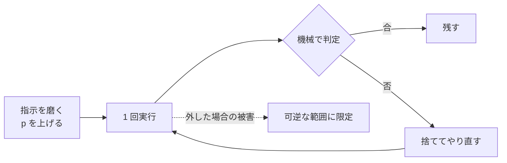

# エージェントの使い方は 1 回で正解が出る前提ではなく、必ず外す前提で組むべき

## 要点

エージェントの出力は確率的に選ばれるので、同じ指示を出しても同じ結果にはならない。
指示を磨く行為は出力の**分布を寄せる**ことであって、1 点に潰すことではない。
だから設計の目標を「1 回で正解を出させる」に置くと伸びない部分に労力が向く。
置くべき目標は「**外した回が安く見つかって安く戻せる**」で、正解率を上げる努力はその上に載せる。

## 仕組み

### 1 回で決まらない理由

**出力が選ばれ方の問題である。** モデルは次のトークンを分布から選ぶので、同じ入力でも回ごとに違う経路を通る。
加えてエージェントの実行では入力そのものが毎回違う。ツールの結果、リポジトリの状態、時刻、読み込む順序が前の回と同じにならないためで、
「同じプロンプト」であっても「同じ入力」ではない。再現しないのは異常ではなく既定の挙動。

**指示は要求であって保証ではない。** Claude Code の公式ドキュメントは、CLAUDE.md や skill に書いた文について
"a request, not a guarantee" と言い切っている (Security guidance)。
文言を強くしても従う確率が上がるだけで、外れる回は残る。
[context が伸びるほど指示が効かなくなる](../model/attention-dilutes-as-context-grows.md)ので、長い作業ほど後半の回で確率が下がる。

**確率を 1 と仮定した設計だけが壊れる。** 成功率 p が 0.9 でも、検査が無ければ 10 回に 1 回は誤りがそのまま下流に流れる。
壊れるのは p が低いからではなく、p を 1 として組んだ場所があるから。
「1 回で正解」を前提にすると、その仮定が設計のあちこちに暗黙に入り込む。

### 目標の置き換え

前提を変えると、設計で決めることが 3 つになる。

| 決めること | 中身 | 関連 |
|---|---|---|
| どう判定するか | 合否を人の読みではなくテスト・lint・終了コードで決める。判定できない形の依頼を減らす | [完了条件は達成型・収束型・判定型に分ける](three-types-of-completion-conditions.md) / [先に受入テストを書く](acceptance-test-before-agent-implementation.md) |
| やり直しをどれだけ安くするか | 1 回分を小さく切る、worktree で隔離する、外した手を次の context に渡す | [worktree で隔離する](../agents/parallel-agents-isolated-by-worktree.md) / [Do-Not-Repeat 節に残す](keep-do-not-repeat-list-outside-context.md) |
| 外した回の被害をどこで止めるか | 副作用の可逆性で権限を分け、戻せない操作は人に渡す | [線引きは可逆性で決める](reversibility-decides-who-acts.md) |

判定と被害限定は、指示側の文とは別の場所に置く。
片側だけでは守られないという形は[指示側の誘導と出力側の検査を対で置く](pair-steering-with-output-check.md)に書いた通りで、
本項はその一般化にあたる。「なぜ対で置くのか」の答えが「1 回で正解が出ないから」。

## 使いどころ

**効く場面。** 合否を機械で決められる作業 (実装、修正、移植、生成物の更新) で、
やり直しのコストが人の確認より安いもの。ここでは指示を磨くより検査を足す方が結果が安定する。

**判定が人手のものは形を変える。** 設計の良し悪しや要件の充足は機械で判定できないので、
やり直しの安さではなく[人が見る段数を先に決めておく](human-review-levels-per-issue.md)側で受ける。
[敵対的レビューを別コンテキストに切り出す](../agents/adversarial-review-in-isolated-subagent.md)のは、判定を機械に寄せられないときの次善策。

**指示を磨くのをやめる話ではない。** 期待コストは p に反比例するので、p を上げる価値は最後まで残る。
やめるのは「p を 1 にしようとすること」と「1 になった前提で下流を組むこと」の 2 つだけ。
やることは、指示を磨く努力と、外した回を拾う仕組みの**両方**を置くこと。

**間違える前提は雑さの許可証ではない。** 前提を受け入れた結果として増えるのは、検査・小さい単位・記録であって、
確認せずに投げる回数ではない。外した回が安く戻せない場所 (push、外部 API、破壊的操作) では、
回数ではなく権限で受けるのが元の判断。

**要件と仕様の書き方にも波及する。** 作る対象がエージェントなら、
個別の入出力ではなく[分布と失敗モードと前提の破れで書く](requirements-for-agent-as-the-target.md)ことになる。
これも「1 回で正解」を前提にできないことの帰結。

## 確かめていないこと

- **成功率も分散も測っていない。** ここに書いたのは Claude Code 2.1 (VS Code 拡張) を日常的に使った観察であって、実測値ではない。
  p の具体値を根拠にした主張はしていない
- サンプリングの温度など、Claude Code が内部で使う生成パラメータは確認していない。「出力が選ばれる」以上の内部挙動には踏み込んでいない
- Gemini CLI と Antigravity では確かめていない。確率的である点は同じはずだが、ここでは主張しない

## 関連

- [Ralph loop の反復が良い結果に近づくのは、失敗を捨てて成果だけを外に残しているから](ralph-loop-converges-by-ratcheting-progress.md)。本項の前提を受けて「では何回も回せばよいか」に答える側。回数が効く条件を書いている
- [本当に守らせたい内容は指示側の誘導と出力側の検査を対で置かないといけない](pair-steering-with-output-check.md)。判定を置く場所の具体
- [エージェントに任せる操作と人間承認が要る操作の線引きは可逆性で決めるべき](reversibility-decides-who-acts.md)。被害限定の具体
- [context が伸びるほど指示が効かなくなるのは注意が全トークンに配られるから](../model/attention-dilutes-as-context-grows.md)。p が下がる仕組み
- [実装対象がエージェントの要件書は個別の入出力ではなく分布と失敗モードと前提の破れで書くべき](requirements-for-agent-as-the-target.md)。同じ前提を要件書に持ち込んだ形
