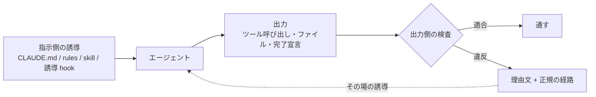

# 本当に守らせたい内容は指示側の誘導と出力側の検査を対で置かないといけない

## 課題

守らせたい規範を片側にだけ置くと、どちらの側に置いても外れる。

**指示側だけに置いた場合。** CLAUDE.md や rules に書いた文はエージェントが読める文であって、従うかどうかは確率的にしか決まらない。
公式ドキュメントも「An instruction like "never edit .env" in CLAUDE.md or a skill is a request, not a guarantee」と言い切っている (Extend Claude Code)。
文言を強くしても外れる回は残る。既に太字で書いてあるルールが飛ばされた実例が
[抜けを塞ぐのはルールの文言強化ではなく記録とゲートであるべき](../rules/close-gaps-with-mechanism-not-wording.md) にある。
とくに効かないのは「流れで進んでしまう瞬間」で、常時載っている文は他の文脈に埋もれる。

**出力側だけに置いた場合。** ガード hook やスクリプトのゲートは確実に止まるが、エージェントは止められた理由と正しい経路を知らないまま試行する。
拒否とやり直しの往復が増え、迂回路を探し始める。代替経路が無い強制は「hook を黙らせる」「状態ファイルを消す」で外され、規範ごと形骸化する
([ガード hook にするか誘導 hook にするかは特定可能性と代替経路で決める](../hooks/20-PreToolUse/block-vs-notice-hook-selection.md))。

出力が安定しないのは、指示が確率的で、検査が事後だから。片側だけではどちらの弱点も残る。

## 解決

1 つの規範につき置き場所を 2 つ用意する。**指示側の誘導**と**出力側の検査**で、検査の理由文を指示側へ戻して 1 本に繋ぐ。

- **指示側**は誘導機構に限る。常時 (CLAUDE.md、`paths` の無い rules)、呼ばれたとき (skill、`paths` 付きの rules)、契機 (hook の additionalContext) の 3 経路があり、
  流れで進む瞬間に効かせたいなら 3 つ目を選ぶ。経路の違いは
  [エージェントへの介入はガード・誘導・自動化の 3 機構で切るべき](../hooks/common/guard-steer-automate-mechanisms.md) の表にある
- **出力側は必ずしもガードではない。** 止められるならガード (PreToolUse の deny、スクリプトのゲート、Stop hook の exit 2)、
  既にツールが走った後なら差し戻しの誘導 (PostToolUse の exit 2 と stderr)、機械で判定できないなら人間レビュー。3 つのどれになるかは規範ごとに変わる
- **検査の理由文には違反の中身と正規の経路を書く。** これがあると、検査が同時にその場の誘導になる
  ([失敗メッセージには代替手段を名指しで埋め込むべき](../mcp/name-the-alternative-in-failure-message.md))。2 か所が別物に見えなくなるのはこの一手による
- **文言の正は 1 つに保つ。** 両側に別々の文を書くとずれる。rules を作成時とレビュー時の唯一の正にする案が
  [rules を固定フォーマットの唯一の正にする](../rules/rules-as-single-source-for-authoring-and-review.md) にある

このリポジトリで対になっている例。

| 規範 | 指示側 (誘導) | 出力側 (検査) |
|---|---|---|
| コミットは commit skill 経由 | CLAUDE.md の 1 行と skill の description | PreToolUse で生の `git commit` を deny し、理由文でラッパを名指しする ([生のコマンド実行は deny してラッパスクリプトへ誘導する](../hooks/20-PreToolUse/command-wrappers-instead-of-raw-bash.md)) |
| frontmatter の規約 | `.claude/rules/markdown-frontmatter.md` (`paths` で該当ファイルを触ったとき) | `pnpm lint` と PostToolUse の lint 差し戻し |
| 生成物を手で編集しない | CLAUDE.md の「INDEX.md と index.jsonl は生成物」 | PreToolUse のガード hook (`protect-generated.sh`) |
| 未返信スレッドを残さない | 手順書の確認項目 | 進捗を進めるスクリプトのゲート ([記録とゲート](../rules/close-gaps-with-mechanism-not-wording.md)) |
| 完了条件を満たしてから終える | skill の手順 | Stop hook に置いた達成型の判定 ([完了条件は 3 種に分ける](three-types-of-completion-conditions.md)) |

## 適用条件

- 効く: 規範の違反が出力から機械的に判定できるか、結果に痕跡が残るもの。上の表はすべてこの型
- 効かない: 違反を呼び出し文字列から一意に特定できないもの。この場合は出力側を人間レビューに置くか、指示側だけで妥協する。判定条件は block-vs-notice の 2 条件
- **全部の規範を対にしない。** 2 か所は 2 倍の維持費なので、CLAUDE.md は最小から始めて外したときだけ足す
  ([CLAUDE.md は最小から始めモデルが外したときだけ足す](../rules/claude-md-starts-minimal-and-grows-only-on-misses.md))。先に対を用意するのではなく、外した規範から対にする
- 敵対的な安全境界ではない。エージェントは settings.json も hook スクリプトも書き換えられる
  ([ガードの設定と hook スクリプト自身はエージェントから守るべき](../hooks/20-PreToolUse/protect-guard-config-from-the-agent.md))
- 確かめたのは Claude Code 2.1 (VS Code 拡張)。Gemini CLI では同じ対を組んでいない

## トレードオフ

- 得る: 指示を読み飛ばした回でも出力側で止まる。指示側が薄くても回るので、CLAUDE.md を膨らませずに済む
- 失う: 1 つの規範に実装が 2 つ増える。ずれると検査だけが正になり、エージェントには理由の分からない拒否として届く。理由文に経路を書く一手はこのずれを軽くするだけで、無くしはしない
- 却下した案: 指示側を厚くして検査を置かない (外れる回が残る)。検査だけ置いて指示を書かない (拒否の往復と迂回が増える)

## 関連

- [エージェントへの介入はガード・誘導・自動化の 3 機構で切るべき](../hooks/common/guard-steer-automate-mechanisms.md)。ここで使う「誘導」「ガード」の定義。この pattern は 3 機構のうち誘導とガードを対で使う置き方
- [抜けを塞ぐのはルールの文言強化ではなく記録とゲートであるべき](../rules/close-gaps-with-mechanism-not-wording.md)。出力側の検査を足す具体例
- [ガード hook にするか誘導 hook にするかは特定可能性と代替経路で決めた方がよさそう](../hooks/20-PreToolUse/block-vs-notice-hook-selection.md)。出力側をガードにできるかの判定
- [hook は注入系とガード系に分かれ失敗時の既定は逆であるべき](../hooks/common/injecting-vs-guarding-hooks.md)。対にした両側が落ちたときの既定
- [失敗メッセージには代替手段を名指しで埋め込むべき](../mcp/name-the-alternative-in-failure-message.md)。検査の理由文を誘導に変える
- [完了条件は達成型・収束型・判定型に分けて達成型だけを Stop hook に置いた方がよさそう](three-types-of-completion-conditions.md)。出力側の検査をターンの終わりに置く場合
