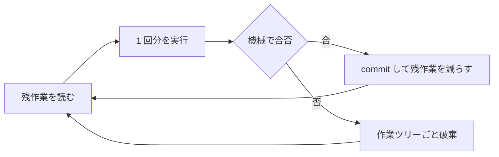

# Ralph loop の反復が良い結果に近づくのは、失敗を捨てて成果だけを外に残しているから

## 要点

「エージェントは確率的だが良い方向に進むので、十分な回数繰り返せば信頼できる結果になる」は、**条件付きで**正しい。
条件は 2 つで、(1) 1 回ごとの結果を機械で合否判定できること、(2) 合格した回の成果だけが context の外に残ることだ。
この 2 つが揃うと反復は**ラチェット** (逆流しない爪車) になり、揃わないとただのランダムウォークになって回数が効かない。

## 仕組み

Ralph loop は Geoffrey Huntley が 2025 年に名付けた技法で、同じ指示でエージェントを新しいコンテキストから何度も起動し直す。
本人の説明は「Ralph は bash のループ」で、仕掛けは無い。効く理由は次の 2 つに分解できる。

### 独立試行の側 (回数が効く部分)

1 回の成功率を p とすると、n 回のうち少なくとも 1 回成功する確率は 1 - (1-p)^n。p が 0.3 でも 10 回で 97% を超える。
ただしこれが意味を持つのは、**成功した回を見分けて拾える場合だけ**。
合否が分からなければ n 個の候補から 1 個選ぶ精度は上がらないので、確率は上がっても手元の結果は良くならない。

毎回コンテキストを捨てて始めるのは、試行を独立に近づけるため。
同じセッションで「もう一度やって」を繰り返すと直前の失敗が条件付けとして残り、同じ失敗を引き直しやすい。
加えて[context が伸びるほど指示が効かなくなる](../model/attention-dilutes-as-context-grows.md)ので、後の回ほど p が下がる。

### 累積の側 (回数が積み上がる部分)

現実のタスクは 1 回で終わらないので、実際に回っているのは「進捗の確率的な増分」の足し算になる。
1 回の増分を Δ とすると、素朴な読みは E[Δ] > 0 なら足し続ければ着く、というもの。これが外れるのは後退が起きるときで、
分散が大きければ E[Δ] > 0 でもいくらでも戻る。だから足すのは Δ ではなく **max(Δ, 0) にする**。負の回を捨てる仕掛けがラチェット。

爪にあたるものは道具の側にある。

| 役割 | 実体 |
|---|---|
| 合否の判定 | テストと lint の終了コード。[達成型の完了条件](three-types-of-completion-conditions.md)だけがここに置ける |
| 成果の保存 | 合格した回だけ commit する。context ではなくリポジトリが状態を持つ |
| 残作業の記録 | 計画ファイルやチケットを毎回更新し、終わった項目を消す。次の回は消えた分だけ短い問題を解く |
| 逆流の防止 | テストと計画ファイルを消させない。指示だけでは外れるので[出力側の検査と対にする](pair-steering-with-output-check.md) |

判定と保存が無いループは、良い回を引いても次の回がそれを踏み潰す。回数を増やしても近づかないのはこの形。

## 使いどころ

**効くのは、合否が終了コードで決まる反復作業。** lint の error を 0 にする、落ちているテストを潰す、機械的な移植、
生成物の一括更新。1 回分が 1 コンテキストに収まる大きさに切れているほど p が上がる。

**効かないもの。**

- **判定が人手のもの。** 「良い設計か」「要件を満たすか」は判定型なので爪がかからない。人が毎回見るなら、それは反復ではなくレビュー
- **期待値が 0 か負のもの。** 必要な情報がリポジトリの外 (人の合意、外部仕様、資格情報) にあると、何回回しても同じ壁に当たる。
  回数ではなく入力を変える。[同じ失敗が続くなら段階的に介入する](../hooks/23-PostToolUseFailure/count-repeated-failures-then-escalate.md)側の判断
- **1 回の失敗が高いもの。** push、外部 API、破壊的な操作。可逆性が低い操作は[誰が実行するかを分ける](reversibility-decides-who-acts.md)
- **ゴールハック。** テストを直すより書き換える方が安いと、ラチェットが逆に効いて「緑だが壊れている」に収束する。
  判定器を書き換えさせない側に倒して初めて反復が信頼できる

**コストは回数に比例する。** 期待コストは p に反比例するので、回数を 3 倍にするより p を上げる方が安い。
p を上げる手は[先に受入テストを書く](acceptance-test-before-agent-implementation.md)、
[1 回分を context に収まる大きさに切る](features-split-to-protect-the-context-window.md)、必要な情報をリポジトリ内に置く、の 3 つ。

**人の仕事は回すことではなくラチェットを設計すること。** 合否をどう機械で決めるか、成果をどこに残すかを先に決めれば、
回す部分は bash のループでよい。ここを決めずに回数だけ増やすのが、この考えの一番ありがちな誤用。

**並列に引くのも同じ話。** 独立試行を同時に引くだけなので、
[worktree で隔離して](../agents/parallel-agents-isolated-by-worktree.md)合格した枝だけ残せば、待ち時間をコストで買ったことになる。

## 確かめていないこと

- **収束回数も p も測っていない。** このリポジトリで Ralph loop を長時間回した実測は無い。上の式は形の説明であって実測値ではない
- Claude Code 2.1 には `/loop` skill があり、間隔を省くとモデルが自分で間隔を決める。ただしこれは**同じセッションに戻ってくる**形なので、
  毎回新しいコンテキストで始める Ralph とは別物。ここは skill の説明文を読んだだけで、回して確かめていない
- 出典の一次情報 (Huntley の記事) はこのセッションの実行環境から取得できず、内容は既知の範囲で書いている。読み直したら本文を直す
- 確かめるなら対象は Claude Code 2.1 の VS Code 拡張。Gemini CLI では考えていない

## 関連

- [エージェントの使い方は 1 回で正解が出る前提ではなく、必ず外す前提で組むべき](one-shot-correctness-is-the-wrong-premise.md)。反復を考える前提にあたる、1 回で正解が出ないことの側
- [完了条件は達成型・収束型・判定型に分けて達成型だけを Stop hook に置いた方がよさそう](three-types-of-completion-conditions.md)。ラチェットの爪に置けるのが達成型だけ、という部分の元
- [エージェントに実装させる前に外から観測できる受入テストを書くとよいはず](acceptance-test-before-agent-implementation.md)。合否判定を先に作る側の手順
- [本当に守らせたい内容は指示側の誘導と出力側の検査を対で置かないといけない](pair-steering-with-output-check.md)。ゴールハックを塞ぐ形
- [context が伸びるほど指示が効かなくなるのは注意が全トークンに配られるから](../model/attention-dilutes-as-context-grows.md)。毎回コンテキストを捨てる理由
- [並列で走らせるエージェントは git worktree で隔離すべき](../agents/parallel-agents-isolated-by-worktree.md)。同じ試行を横に並べるときの隔離
