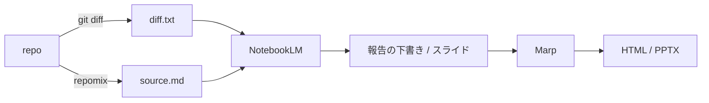

# 変更の報告スライドは diff と repomix の全量を NotebookLM に渡して作らせるとよいはず (未検証)

## 思いつき

変更内容を人に報告するスライドを作るとき、いまは作業していたセッションにそのまま「スライドにして」と頼む形になる。
これは 2 点で不安定になる。

- **入力がセッションの残り物になる。** compact を挟むと何が context に残っているか分からない。
  同じ変更でも回によって報告の粒度が変わり、作り直しても同じ材料から作り直したことにならない
- **報告に context を使う。** 作業で埋まった context の上に報告作成を積むので、
  [質が落ち始める帯](../model/context-quality-drop-thresholds-vary-by-source.md) に入りやすい

なら報告の入力を**セッションから切り離してファイルにする**。材料は 2 つで足りるはず。

| 入力 | 作り方 | 担う情報 |
|---|---|---|
| 変更点 | `git diff <base>...<head>` | 何が変わったか |
| コード全量 | repomix (リポジトリを 1 ファイルに畳む) | 変わった行がどういう仕組みの中にあるか |

diff だけだと周りが見えず「なぜその変更が要るのか」が書けない。全量だけだと今回の話がどこなのか分からない。
2 つ揃えて初めて「どこが、何の中で、どう変わったか」が言える。

## なぜ NotebookLM に渡すか

- 与えたソースに閉じて答え、引用が付く。報告という用途では「渡していないことを書かない」性質がそのまま効く
- 大きな入力を投げる先を作業エージェントの外に置ける。全量を読ませる負荷を作業セッションが負わない
- 聞き方を変えて何度も出し直す作業が、作業セッションと独立に回せる

## 形

材料を作るところ (diff と repomix) はエージェントで自動化できる。
NotebookLM への投入と取り出しをどうするかで、経路が人手と自動の 2 通りに割れる。

## 投入と取り出しをどうするか

個人向け NotebookLM に公開 API は無い。法人向けの Enterprise には API があるが、そちらは前提が変わる。
残るのは次の 3 経路で、**どれを選ぶかがこの案の性格を決める**。

| 経路 | 人手 | 壊れ方 | 持つ秘密 |
|---|---|---|---|
| web UI に人が投入する | 毎回 | 壊れない | 無し |
| 非公式クライアント (notebooklm-py) | 初回の認証だけ | 予告なく壊れる | Google のセッション |
| Enterprise API | 初回の設定だけ | 版の変更で壊れる | クラウドの資格情報 |

notebooklm-py は Google の内部 RPC (batchexecute) を叩く非公式ライブラリで、CLI・Python API・MCP サーバー・
REST サーバーの 4 つの入口を持つ。README によれば slide deck を PDF / PPTX で生成でき、
認証は Playwright での対話ログイン、ブラウザの cookie 取り込み、ヘッドレス向けの master token の 3 通り。
MIT ライセンス、調べた時点で 0.8.2 (2026-09-02)。

つまり**自動化はできる**。ただし交換しているものがある。

- **未文書の RPC に乗る。** メソッド ID が難読化された内部 API なので、Google 側の変更で予告なく壊れる。
  README 自身が「プロトタイプと個人利用向け」と書いている。報告のような定例作業の経路がある日黙って止まる
- **Google の資格情報をエージェントの手元に置く。** cookie か master token をどこかに保存することになる。
  外部にデータを送れる経路を [出どころに関わらず止める](../hooks/20-PreToolUse/deny-data-egress-regardless-of-origin.md)
  ようにしている手元に、読めば他人の Google アカウントとして動ける鍵を置く形になる
- **規約の判断が要る。** 個人アカウントを自動で操作することの可否は自分で確かめる

自動化で消えるのは「毎回 web UI を開く」という**1 回の手作業**で、代わりに増えるのは
**壊れる経路と鍵の管理**。報告が週 1 回なら割に合わないかもしれないし、
CI で毎 MR 回すなら話が変わる。頻度を決めずにこの選択はできない。

MCP サーバーがある点は別の意味を持つ。エージェントが直接 NotebookLM を触れるなら、
「材料を作って人に渡す」ではなく「エージェントが投げて結果を受け取る」形にできる。
ただしその形は、作業セッションの context に報告作成が戻ってくることでもある。
context を分けたくてこの案を考えたのだから、投げる役は別のセッションかサブエージェントにする必要がある。

## 気になるところ

- **外部サービスにコード全量を送る。** 業務のコードなら、この一手だけで採れない案になる。
  自動化するとこの送信が人の目を通らなくなるので、判断の地点が消える
- **全量が本当に要るか分からない。** diff が触ったファイルの全文だけで足りる可能性がある。
  repomix には include / ignore があるので、全量と部分の間で刻める
- **成果物が repo に残らない経路になりうる。** NotebookLM 側で完結させると、報告だけが外にある状態になる。
  スライドを PPTX で取り出せるなら repo に戻せるが、[Marp から作る経路](marpx-editable-pptx-from-marp.md) と
  どちらを正にするかは決めておく

## 確かめていないこと

- **一度も動かしていない。** 以下は全部それに含まれるが、先に潰すべき順に並べる
- **NotebookLM のソース上限。** 1 ソースあたりの上限とノートあたりのソース数の上限があるはずで、
  中規模リポジトリの repomix 出力が 1 ソースとして入るか分からない。入らないなら分割か絞り込みが要る
- **スライドの中身が報告として使えるか。** notebooklm-py の README に slide deck 生成があることは読んだだけで、
  出てきた PPTX が変更報告の体裁になるか、章立てを指示で制御できるかは見ていない
- **notebooklm-py が動くか。** 認証 3 通りのどれが手元 (Windows / WSL / web) で通るか、
  ヘッドレスで回せるか、どのくらいの頻度でレート制限に当たるか
- **diff の渡し方。** テキストファイルとして受け付けるか、拡張子や貼り付けの制約があるか
- **全量を足した効果があるか。** diff だけを渡した場合と比べて報告の質が上がるのかを比べていない。
  上がらないなら、この案の半分は要らない
- **repomix が拾ってはいけないものを拾わないか。** `.env` や鍵が既定の ignore で落ちるかを確かめずに投入しない
- **外したときの縮退を書いていない** ([実測の前に外れたときの縮退が書かれているべき](write-fallback-condition-before-measuring.md))。
  上限に入らなかったとき、非公式 API が壊れたとき、それぞれ何に落とすかまで決めておく

## 昇格の目安

(.claude/rules/knowledge-authoring.md「note を昇格させる」)。満たしたら type を変える。ファイルは動かさない。

- [ ] 粒度が type の定義に収まっている → 材料の作り方と投入手順の形なので `how-to` になる見込み。
      人手経路と自動経路は手順が別なので、書くときに 2 つに割れる可能性がある
- [x] sources に一次情報がある → notebooklm-py の README と PyPI。NotebookLM 側のソース上限の文書はまだ
- [ ] 実際に試して applies_to と verified_at を書ける → 1 リポジトリで通し、repomix と notebooklm-py の版を残す
