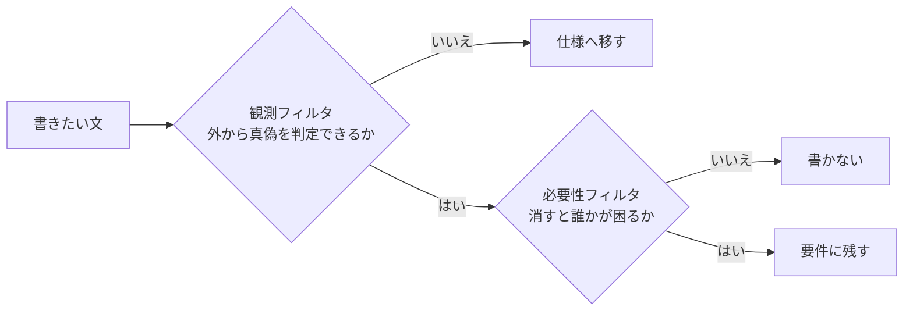

# 要件書は外から観測できて消すと困る文だけに絞るとよさそう

## 課題

要件を書き始めると 2 方向に崩れる。

**内側に崩れる。** 「なぜそうするか」を説明したくなって、ライブラリの都合や処理の順序が要件に混ざる。
混ざると要件が実装に固定され、実装を変えるたびに要件のほうが嘘になる。要件は動かない基準のはずなのに、いちばんよく動く文書になる。

**外側に膨らむ。** 工程を追って書くので文が増える。「1 文が assertion 1 個に対応する」と聞くと、
このままではテストが手に負えないと思って書く手が止まる。

どちらも「何を書かないか」を決めていないことから来る。

## 解決

フィルタを 2 段に分けて直列にかける。**観測フィルタ**が置き場所を決め、**必要性フィルタ**が量を決める。
段ごとに落ちた文の行き先が違うのが要点で、観測フィルタで落ちた文は仕様へ移し、必要性フィルタで落ちた文はどこにも書かない。

### 1 段目 観測フィルタ

**利用者がその道具の中身を一切知らなくても、この文が正しいか判定できるか。** 判定できないなら仕様側に移す。

| 書く | 書かない |
|---|---|
| 入口のコマンドと引数 | 実装言語とライブラリの選定理由 |
| 入力に受け付けるもの、出力に出るもの | 依存の導入方法、実行環境の用意 |
| 成功と失敗の判定、終了コード、利用者に見えるメッセージ | 処理の順序、走査方法、正規表現、定数値 |
| 出力物が満たす性質 (書式、置き場所、辿れること) | 子プロセスの起動方法、内部で呼ぶコマンド |
| 外部通信の有無 | 作り方の手順 |
| やらないこと (適用範囲外) | |

判定に迷う例を 2 つ。「出力ブックは数式を含まない」は外側なので要件に残る。
「openpyxl が数式の値をキャッシュしないから」は内側なので仕様の設計判断に移す。
後者が要件に居ると、ライブラリを差し替えた瞬間に要件のほうが揺らぐ。

### 2 段目 必要性フィルタ

- **削除テスト。** その 1 文を消して困る人がいなければ要件ではない。困るのが自分だけで、実装を読めば分かる話なら仕様に落とす
- **工程ではなく成果物の性質で書く。** 「表を拾う」「シート名を整える」「書式を当てる」「数式を書かない」は、
  どれも「出力ブックが満たす性質」で、1 文と表 1 枚にまとまる。工程を追うと実装の手順に張り付いて増える
- **上限を決める。** 道具 1 つにつき 8 文まで、のように先に決める。入らないなら要件を削るのではなく、
  その道具が 2 つ分の仕事をしている合図として読む

膨らみを心配して要件を削る必要はない。**要求の数はテストの本数を決めない。**
1 本の通し確認の中に assertion が何個入ってもよく、本数を決めるのは別の入力を用意しないと引けない条件の数。
利くのは fixture の設計で、複数の入力形式を同時に渡し、境界値を仕込んだ入力を 1 つ作れば、
正常系の要求はまとめて 1 回の実行で引ける。詳細は [エージェントに実装させる前に外から観測できる受入テストを書くとよいはず](acceptance-test-before-agent-implementation.md)。

### サンプル

markdown の表を xlsx に変換する道具を例にする。EARS の型は「ユビキタス」「イベント駆動」「状態駆動」「望ましくない挙動」「オプション」の 5 つ。

工程を追って書いた形。4 文とも内側に寄っていて、実装を変えると全部書き直しになる。

| ID | 型 | 要求 |
|---|---|---|
| REQ-01 | イベント駆動 | markdown を渡されたとき、変換は、`\|` を含む行の次が区切り行なら表の開始とみなすこと |
| REQ-02 | イベント駆動 | 表を見つけたとき、変換は、直近の見出しをシート名の候補にすること |
| REQ-03 | イベント駆動 | シート名を作るとき、変換は、`[` `]` `:` `*` `?` を空白に置換し 28 文字で切ること |
| REQ-04 | ユビキタス | 変換は、ヘッダー行に Arial 太字を設定すること |

成果物の性質で書き直した形。2 文に減り、実装を差し替えても文が生き残る。

| ID | 型 | 要求 |
|---|---|---|
| REQ-01 | イベント駆動 | markdown を渡されたとき、変換は、本文中の表をすべて拾い、表ごとに 1 シートを作ること |
| REQ-02 | ユビキタス | 出力ブックは、Excel が開ける一意なシート名と、読める書式 (Arial、太字ヘッダー、先頭行固定) を持つこと |

区切り行の判定も禁則文字の置換も 28 文字も消えていない。仕様側に移って、REQ-02 が外から縛っている。
「適切に」「必要に応じて」のような曖昧語は判定できないので使わない。主語は道具の名前で固定し、1 要求 1 文にする。

## 適用条件

- 要件と仕様を別に持つ場合に効く。1 ファイルにまとめる場合でも節が分かれていれば同じ判定が使える
- 実装をエージェントに任せる場合に効きが大きい。受け入れを判定する側に要件だけを渡せば、実装の理屈を読まずに済む
- 実装が 1 通りしか無く、読み手が自分だけで、仕様が実質コードの言い換えになる道具では、分けること自体が二重管理になる

## トレードオフ

- 絞ると「やらないこと」が要件からしか復元できなくなる。テストにならないので、適用範囲外の節は削る対象から外す
- 8 文に収める判断は主観が入る。上限は考えるきっかけであって、超えたら機械的に削ってよいものではない
- 観測フィルタは境界の判定を毎回要求する。判定表と実例を規約側に持たないと、書く人ごとにぶれる

## 関連

- [要件書は背景・外部要求・ハッピーパス・適用範囲外・受け入れ条件の 5 節で書くべき](write-requirements-in-five-sections.md) — 要件書を書く手順の全体。このフィルタはその最後の工程
- [エージェントに実装させる前に外から観測できる受入テストを書くとよいはず](acceptance-test-before-agent-implementation.md) — 要件から受入テストへの落とし方と粒度
- [横断で決めた規則は個別の仕様まで降ろすべき](push-cross-cutting-decisions-down-to-individual-specs.md) — 要件と仕様に分けたときに起きる食い違い
- [設計書の隣に決定ログを置くとよいはず](decision-log-beside-design-docs.md) — 要件から外した理由の置き場
