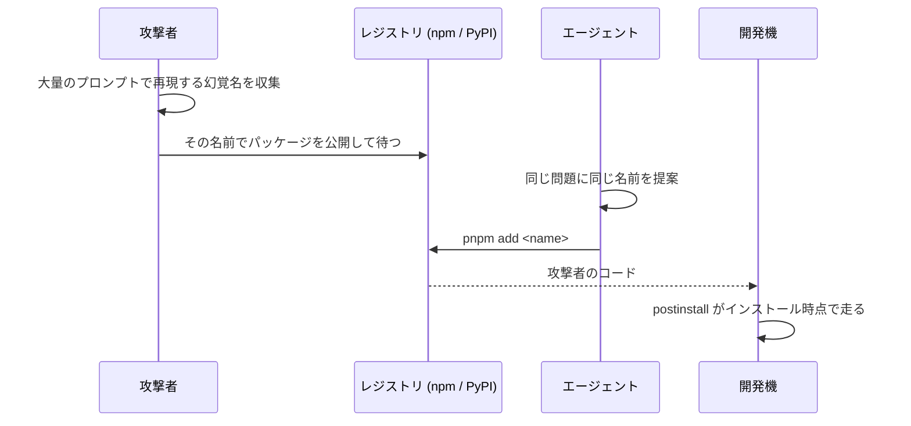

# スロップスクワッティングは幻覚したパッケージ名を攻撃者が先回りして登録する攻撃

## 要点

- コード生成 LLM は存在しないパッケージ名を一定の率で出す。しかもその名前は同じ問いを繰り返すと**再現する**
- 攻撃者は再現する名前をレジストリに登録して待つだけでよい。タイポスクワッティングと違い、人の打ち間違いを待つ必要が無い
- エージェントは提案から `pnpm add` の実行までを同じターンで回すので、人が名前を目にする瞬間が無い

## 仕組み

### なぜ幻覚を狙えるのか

USENIX Security 2025 の Spracklen ら (Distinguished Paper) が、Python と JavaScript のコード生成 223 万件を
16 モデルで測っている。攻撃可能性に効くのは幻覚率そのものではなく、**再現率**の方。

| 観測 | 値 |
|---|---|
| 幻覚パッケージ名を 1 つ以上含むサンプル | 19.7% |
| 一意な幻覚パッケージ名 | 約 205,000 |
| オープンモデルの平均幻覚率 | 21.7% |
| 商用モデルの平均幻覚率 | 5.2% |
| 同じプロンプトを 10 回繰り返して**毎回**同じ名前が出た割合 | 43% |
| 2 回以上出た割合 | 58% |

幻覚が毎回違う名前ならレジストリを埋めようがない。43% が決め打ちできるので、攻撃者の手順は
「モデルに大量の質問を投げ、繰り返し出る存在しない名前を集め、それを登録する」だけになる。
論文のデータセットは公開されていて、集めた名前がそのまま候補一覧になる。

商用モデルの方が低いが 0 ではない。「良いモデルを使っているから関係ない」にはならない。

### 名前の形

幻覚名の分類では**混成 (conflation、実在する 2 つの名前が混ざる) が 38%** を占める。
以下は名前の作られ方を示すための**作例**で、実在するかどうか・悪性かどうかとは無関係。

| 形 | 作例 | 何が起きているか |
|---|---|---|
| 混成 | `requests-toolkit` | 実在の `requests` と `requests-toolbelt` が混ざる |
| 単複・区切りの揺れ | `python-dateutils` | 実在名の末尾の `s` や `.` / `-` が入れ替わる |
| 命名規約からの推測 | `@types/<型を同梱しているパッケージ>` | 「`@types/` があるはず」という規約の当てはめ |
| 完全な捏造 | `langchain-retry` | それらしい機能名を組み立てただけ |

どれも見た目には正しい。**綴りを目で見て弾く防ぎ方は成立しない。**
タイポスクワッティングが「実在名に 1 文字近い名前」を狙うのに対し、こちらは実在名と似ている必要すらない。

### エージェント経由の流れ



人がコピペするなら `pnpm add` を打つ前に名前を一度は目にする。エージェントは提案と実行が同じターンの中で連続するので、
その瞬間が無い。permissions で `Bash(pnpm add:*)` を許していれば承認プロンプトも出ない。
名前が実在しなければコマンドが失敗して気付けるが、攻撃者が登録済みなら**成功する**ので、失敗が知らせてくれることもない。

### 入ったあとに何が走るか

npm はインストール時にスクリプトが走る。中身を import しなくても `pnpm add` した時点で実行される。

```json
{
  "name": "requests-toolkit",
  "version": "1.0.0",
  "scripts": { "postinstall": "node ./scripts/setup.js" }
}
```

PyPI 側も同じ形が作れる (`setup.py` の実行、`pyproject.toml` の build backend が `uv sync` 時に走る)。
**「入れたが import しなかったから大丈夫」は成り立たない。**

エージェントの実行環境には `~/.claude/.credentials.json`、`.env`、git の資格情報、クラウドのトークンが揃っている。
被害の大きさはここで決まるので、[秘密はエージェントが動かす環境に本物を置かない](no-real-secrets-in-the-agent-runtime.md) 側の話につながる。

### レジストリ側に出る印

名前では判定できないが、メタデータには差が出る。

```console
$ pnpm view <name> time.created repository.url maintainers versions
$ uv pip index versions <name>
```

| 印 | 正規のパッケージ | 先回り登録 |
|---|---|---|
| `time.created` | 数年前 | 数日〜数か月前 |
| バージョン | 複数あり履歴が続く | `1.0.0` が 1 つだけ |
| `repository.url` | 実在し名前が一致する | 無い、または別プロジェクトを指す |
| メンテナ | 既知で他にも公開物がある | 新規でそのパッケージだけ |
| README | 独自 | 本家のコピー |

ただしどれも決定打ではない。新しい正規パッケージは同じ印を持つ。
判定を「怪しいか」ではなく「**その名前を人が意図して選んだか**」で切る方が確実で、それを機構にしたのが
[パッケージの追加は手元で裏の取れない名前を PreToolUse hook で止めるべき](../hooks/20-PreToolUse/verify-package-name-before-install.md)。

## 使いどころ

- エージェントに依存の追加を任せる全ての場面。とくに `pnpm add` / `uv add` を permissions で許している設定
- **lockfile があっても最初の 1 回は防げない。** lockfile が守るのは「2 回目以降に中身を差し替えられないこと」で、幻覚名が最初に入るのは止められない。CI での `--frozen-lockfile` も同じ
- 効かない場面: 社内ミラーだけを向いたレジストリ設定。未登録の名前は解決自体が失敗するので、この攻撃の射程外になる
- サンドボックスで egress を閉じられるならそちらが上。postinstall が走っても外に出られない

## 関連

- [パッケージの追加は手元で裏の取れない名前を PreToolUse hook で止めるべき](../hooks/20-PreToolUse/verify-package-name-before-install.md) — 対策側
- [秘密は Read の deny ではなくエージェントが動かす環境に本物を置かないことで守るべき](no-real-secrets-in-the-agent-runtime.md) — 入られたあとの被害を下げる側
- [外部にデータを送れるコマンドは要求の出どころに関わらず PreToolUse hook で止めるべき](../hooks/20-PreToolUse/deny-data-egress-regardless-of-origin.md) — 送信の形を止める層。ただし postinstall は Bash ツールを通らないので、この hook では拾えない
- [エージェントに任せる操作と人間承認が要る操作の線引きは可逆性で決めるべき](reversibility-decides-who-acts.md)
