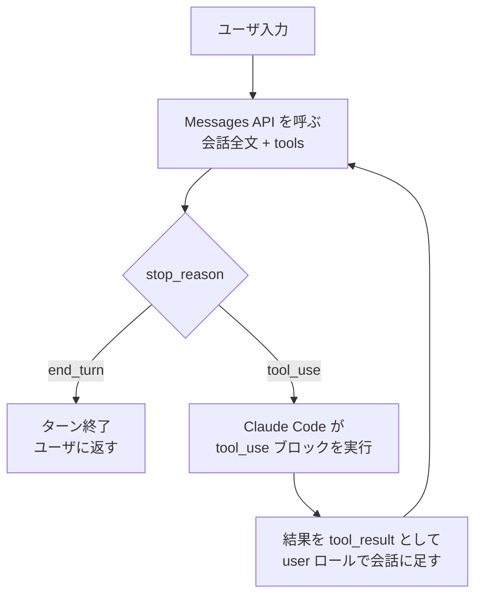

# Claude Code の 1 ターンは end_turn まで回る tool use ループである

## 要点

Claude Code に特別なエージェント機構があるわけではなく、Messages API の tool use の往復をそのまま `while` で回している。
モデルが `stop_reason: "tool_use"` を返す間はツールを実行して結果を返し、`stop_reason: "end_turn"` で 1 ターンが終わる。
何往復するかはモデルが決めるので、ユーザ入力 1 回あたりの API 呼び出し回数は固定されない。

## 仕組み

役割の分かれ方は Claude API のクライアントツールの規約そのものである。モデルは呼ぶツールと引数を決めるだけで実行はせず、
実行するのは Claude Code 側。実行結果は必ず次の user メッセージの `tool_result` ブロックとして返す。

| やること | どこ |
|---|---|
| ツールを呼ぶ判断と引数の生成 | モデル (API) |
| ツールの実行 (Read / Bash / Edit など) | Claude Code (ローカル) |
| 実行結果を `tool_result` にして会話へ足す | Claude Code |
| ループを続けるか終えるかの判断 | モデル (`stop_reason`) |

Messages API の `web_search` のようなサーバツールは Anthropic 側で実行されるので、その分の往復にローカルの実行が挟まらない。

### transcript で見える形

このリポジトリの VS Code 拡張のセッションで `~/.claude/projects/<project>/<session>.jsonl` を読むと、上の往復がそのまま残っている。

- **1 回の API 応答が複数行になる。** `thinking` / `text` / `tool_use` の content block ごとに 1 行が書かれ、同じ `requestId` と同じ `stop_reason` を持つ。
  同じ `requestId` に `tool_use` が 2 つ並ぶのが並列ツール呼び出し
- **ツール結果は user 行で戻る。** `type: "user"` で `message.content` が `tool_result` の配列になる。人が打った入力は `message.content` が文字列なので、この形で見分けられる
  ([transcript の user content は文字列のこともある](transcript-user-content-may-be-string.md))
- 行数を数えるなら「assistant 行の数」ではなく「`requestId` の異なり数」が API の往復回数になる

### 往復ごとに会話全文が送られる

公式ドキュメントは「Claude Code はリクエストごとに会話全文を送り、ツールを使うたびにそのツール結果を載せた別のリクエストを送る」と書いている。
prompt cache が効くので古い部分はキャッシュ読みの料金になるが、**往復のたびに context は伸びる**。
ツール結果が context を最も食うのはこの構造による。1 回の Read で数千トークン入り、それが往復のたびに全部再送される。

## 使いどころ

- **hook イベントの位置がこのループで決まる。** PreToolUse と PostToolUse はループの内側で往復ごとに発火し、Stop はループを抜けるときに 1 回だけ発火する。
  「1 ターンで N 回まで」のような回数の上限を数えるなら、数える場所は PreToolUse しかない
  ([1 ターンのツール実行回数を数えて機械的に止める](../hooks/common/cap-tool-calls-per-turn.md))
- **完了条件をループの外に置くか中に置くか。** 達成型の条件はループを抜けた Stop で差し戻せるが、収束型の条件はループの中でしか見えない
  ([完了条件は達成型・収束型・判定型に分ける](three-types-of-completion-conditions.md))
- **ターンの途中で効かせたい誘導は hook に置く。** CLAUDE.md はループが始まる前に載るだけで、往復の途中には入らない。
  往復の途中に文を差し込めるのは hook の `additionalContext` だけ
  ([介入はガード・誘導・自動化の 3 機構で切る](../hooks/common/guard-steer-automate-mechanisms.md))
- **往復回数は指示で減らせない前提で見る。** ループの回数を決めるのはモデルなので、「調べすぎるな」と書いても確率的にしか効かない。
  確実に止めるなら回数を数えるガードにする

効かない場面もある。サブエージェントは自分のループを別の transcript で回すので、親の `requestId` を数えても子の往復は入らない
([サブエージェントの transcript は別ファイル](subagent-transcript-is-separate-file-with-every-tool-call.md))。

## 関連

- [Claude Code の機能が分かれているのは context を守るため](features-split-to-protect-the-context-window.md) — このループが context を伸ばすことへの対策側
- [Claude Code の transcript JSONL は /compact を挟んでも追記専用である](transcript-jsonl-is-append-only-across-compact.md)
- [transcript の usage のトークンは実際より少なく出る](transcript-usage-tokens-undercount.md)
- [context が増えると質が落ち始める閾値は 40% から 400k トークンまで諸説ある](../model/context-quality-drop-thresholds-vary-by-source.md)
