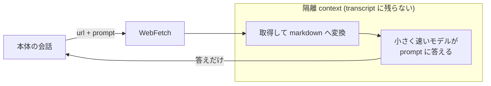

# WebFetch はページを別 context で読んで prompt への答えだけを返す

## 要点

WebFetch は「ページを取ってくるツール」ではなく、**取ってきて読ませるツール**である。
ページ本文は本体の会話とは別の context window に入り、そこで小さく速いモデルが渡した `prompt` に答える。
本体の会話に戻るのはその答えだけで、ページ全文は一度も本体に入らない。

## 仕組み

公式ドキュメントはこれを
`Web fetch uses a separate context window to avoid injecting potentially malicious prompts` と説明している。
設計の狙いは間接プロンプトインジェクション対策だが、副作用として使い勝手の性質がいくつも決まる。

| | 本体の context に入るか |
|---|---|
| 渡した `url` と `prompt` | 入る |
| ページ全文 | **入らない** |
| 小さいモデルが書いた答え | 入る |

### 隔離されているのは context であって実行場所ではない

取得そのものは**手元のマシンから出ていく**。Anthropic 側のサーバが代わりに取りに行くのではない。実測で確かめた (下記)。

つまり「隔離」はネットワークの隔離ではない。手元から到達できるホストには WebFetch も接続を試みる。
`127.0.0.1` を渡すと自分のマシンのリスナーに繋ぎに来る。社内ネットワークのホストも同様に対象になりうる。
外から来た URL をそのまま WebFetch に渡すと、外部からは触れないはずのホストへ手元経由で接続を試みさせられる形になる。
守られているのは**取ってきた本文が本体の会話に流れ込まないこと**だけで、どこへ繋ぐかは守られていない。
## 使うときに効いてくる性質

- **`prompt` が結果を決める。** 隔離側のモデルは `prompt` を頼りに取捨選択するので、「要約して」とだけ書くと欲しい細部が落ちる。
  抜き出してほしい項目を具体的に並べる方が確実になる
- **全文は取れない。** 原文をそのまま引用したいときや、細かい表記を確かめたいときには向かない。
  返るのは常に読んだ結果であって、ページそのものではない
- **ホストをまたぐリダイレクトは追わない。** リダイレクト先の URL が返ってくるので、その URL で呼び直す。
  `http` は `https` に上げられる
- **URL ごとに一定時間キャッシュされる。** 同じ URL を続けて叩いても取り直しにはならない。
  更新を見たい用途には向かない
- **認証が要る URL は取れない。** 私的なページや API は失敗する。`gh` や `glab` のような CLI に寄せる
- **隔離側の context は transcript に残らない。** 残るのは戻ってきた答えだけで、元のページのどこを読んだかは後から検証できない

最後の 1 点は観測の話として効く。ページの内容を根拠に何かを書くとき、**根拠そのものは記録に残らない**。

## Bash の curl / wget との差分

同じ URL を取っても、この 2 つは別物として扱った方がよい。ページを読むという目的が同じでも、性質がほぼ全部違う。

| | WebFetch | Bash の `curl` / `wget` |
|---|---|---|
| ページ本文の行き先 | 隔離 context。本体には入らない | `tool_result` に生のまま入る |
| 返ってくるもの | `prompt` への答え | 取得したバイト列そのもの |
| 本体 context の消費 | 答えの分だけ | 取得した全量 |
| 既定の承認 | 不要 | Manual mode では毎回。読み取り専用コマンドの例外に入らない |
| 全文がほしいとき | 取れない | 取れる |
| リダイレクト | ホストをまたぐものは追わず URL を返す | `-L` で追える |
| 同じ URL の再取得 | 一定時間キャッシュされる | 毎回取りに行く |
| 認証が要る URL | 失敗する | ヘッダやトークンを付けられる |
| ファイルへの保存 | できない | `-o` / `-O` でできる |
| POST や任意のメソッド | できない | できる |
| transcript に残る証跡 | 戻ってきた答えだけ。読んだページは残らない | 取得した本文がそのまま残る |

読むだけなら WebFetch、**取得したものを加工したり保存したりする必要があるとき**だけ `curl` を考える、という切り分けになる。
`curl` を選ぶ理由が「全文がほしい」だけなら、たいてい `prompt` の書き方で足りる。

差分のうちセキュリティに効くのは上 2 行と承認の行で、そこは
[同じ URL でも curl で取ると危ないのは WebFetch だけが別 context で読むから](../hooks/20-PreToolUse/curl-bypasses-web-fetch-context-isolation.md)
が扱っている。証跡の行だけは向きが逆で、**記録が残るのは `curl` の方**になる。
何を読んだかを後から確かめたい場合に限れば、`curl` の出力が transcript に残ることが利点として働く。

## 使いどころ

- **調べ物の既定はこれにする。** ページ全文が context に積まれないので、費用の面でも本体を汚さない
  ([Claude Code の機能が分かれているのは context を守るため](features-split-to-protect-the-context-window.md))
- **prompt には質問ではなく抽出項目を書く。** 「この記事について教えて」ではなく、確かめたい値やフィールド名を並べる
- **後から効く根拠は自分で書き写す。** 引用を残したいなら、戻ってきた答えのうち必要な部分を明示的にファイルへ落とす。
  次のセッションからは transcript を遡っても元ページは出てこない
- **CLI があるものは CLI を使う。** 認証が要るページは取れないし、構造化された出力が欲しいなら CLI の方が向く
  ([失敗メッセージには代替手段を名指しで埋め込むべき](../mcp/name-the-alternative-in-failure-message.md))

## 再現条件

Claude Code 2.1 を VS Code 拡張で動かして確かめた。出どころは 3 つに分かれる。

- 隔離 context を使うという設計は公式ドキュメントの記述
- 小さく速いモデルが `prompt` に答える形、リダイレクトを追わない挙動、`http` から `https` への昇格、
  URL ごとのキャッシュ、認証付き URL が失敗することは、Claude Code 2.1 が提示する WebFetch のツール定義の記述
- ホストをまたぐリダイレクトでリダイレクト先 URL が返り呼び直しになることと、
  隔離側が transcript に残らないことは、このセッションで実際に起きたものを確認した

- **取得が手元から出ていくことは実測した。** 手順は次の通り

### 取得元を測る手順

`127.0.0.1` の高位ポートに生 TCP のリスナーを立て、接続元と最初のバイト列を記録する。
ループバックにしか bind しないので外部からは到達できない。Anthropic 側から到達する経路も無い。

1. リスナーを起動する (Node の `net.createServer` で `127.0.0.1` に bind し、接続を追記する)
2. **対照実験**として Bash から `curl http://127.0.0.1:<port>/probe-curl` を叩き、ログに残ることを確かめる
3. 同じ URL を WebFetch に渡す

結果はこうなった。

| 叩いた側 | ログに残ったか | 最初のバイト列 |
|---|---|---|
| Bash の `curl` | 残った | `GET /probe-curl HTTP/1.1` (平文) |
| WebFetch | **残った** | TLS の ClientHello |

WebFetch の呼び出しは `SSL routines:OPENSSL_internal:WRONG_VERSION_NUMBER` で失敗したが、
これは平文のリスナーに TLS で繋ぎに行ったためで、ツール定義にある `http` から `https` への昇格と一致する。
**失敗の種類より、接続が手元のリスナーに届いたことが結論を決める。**
Anthropic 側のサーバはこのポートに到達できないので、取得は手元で走っている。

読む側 (小さく速いモデル) が API 経由なのは変わらない。ローカルなのは取得だけで、
本文はそこからモデルへ送られる。分かれているのは本体の会話と読む側の context であって、実行場所ではない。

`WebSearch` については同じ手法が使えないので測っていない。
## 関連

- [同じ URL でも curl で取ると危ないのは WebFetch だけが別 context で読むから](../hooks/20-PreToolUse/curl-bypasses-web-fetch-context-isolation.md) — 同じ隔離をセキュリティ側から見たもの
- [Claude Code の機能が分かれているのは context を守るため](features-split-to-protect-the-context-window.md)
- [Claude Code の 1 ターンは end_turn まで回る tool use ループである](turn-is-a-tool-use-loop-until-end-turn.md) — サーバツールとクライアントツールの違い
